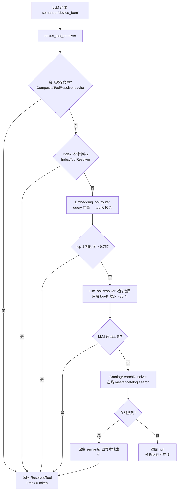
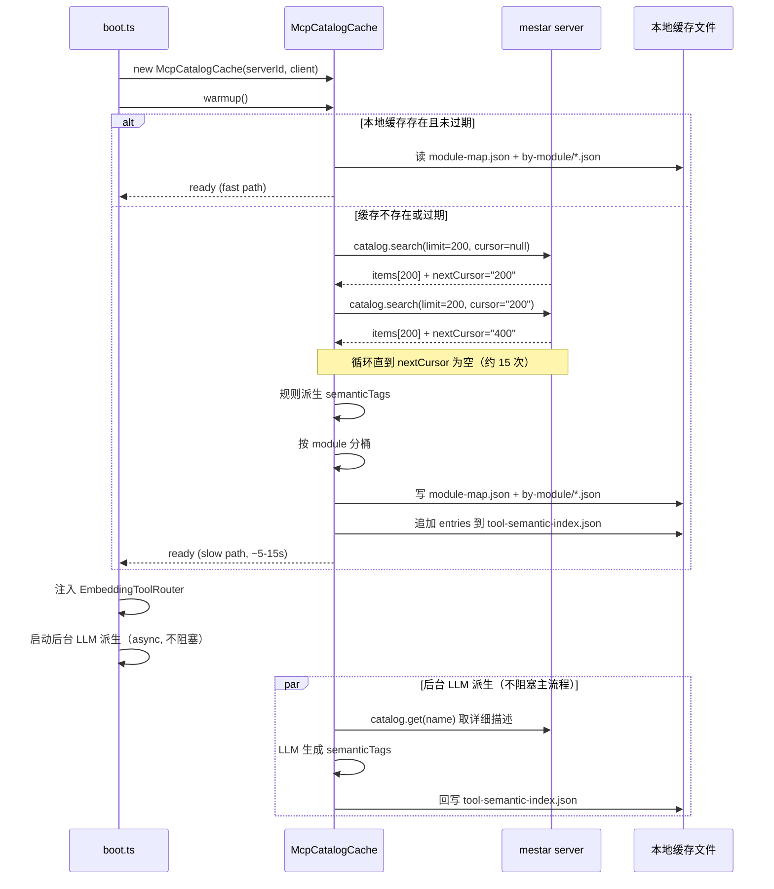
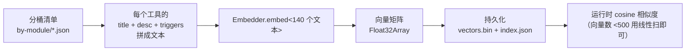
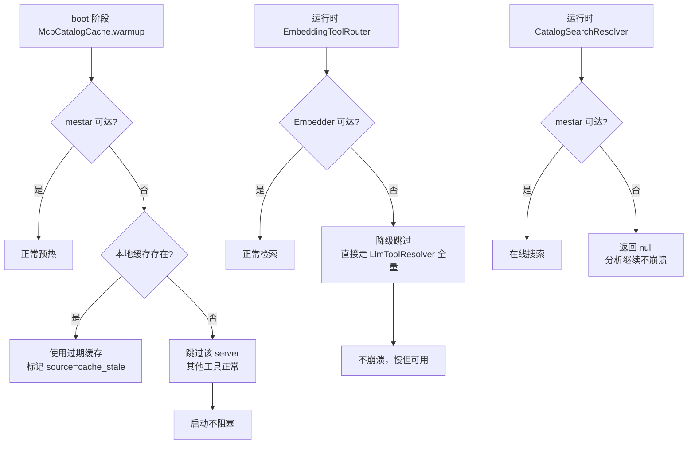
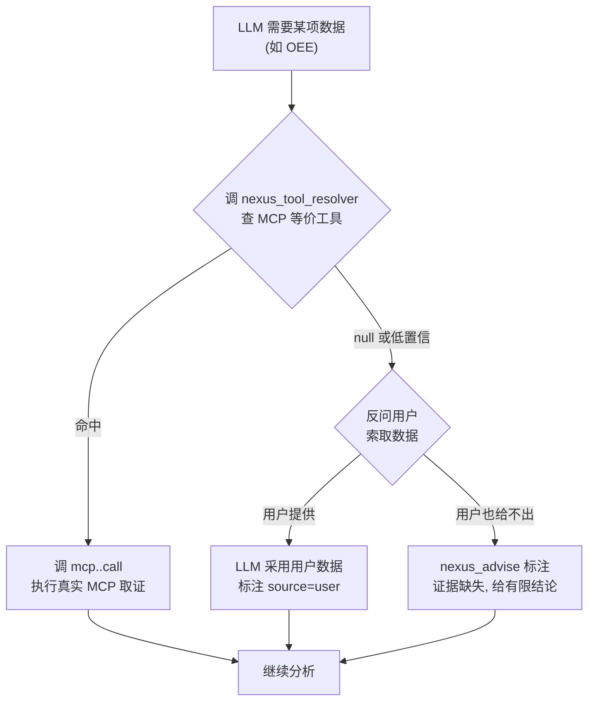

# 07 - Mestar MCP 接入规范

> 本文档定义 NexusOps 接入"大目录型 MCP server"的完整规范。首个实例为 `mestar-mcp-server`（MES 业务平台网关，含 2850 个 catalog 候选工具）。
>
> **核心问题**：mestar 采用"目录驱动"设计，自身只暴露 8 个元工具（catalog.search / catalog.activate / query.build_params 等），背后是 2850 个按需生成的业务工具。如果走现有 `registerMcpServerTools` 全量注册，会把 2850 个工具的 schema 全部注入 LLM context（估算 50 万+ token），直接超出模型窗口且工具选择准确率断崖式下降。
>
> **目标**：让 LLM 看到"有哪些业务域"，按需定位具体工具，而非把全量 catalog 灌入 prompt。

---

## 1. 接入概述

### 1.1 mestar 服务画像

| 维度 | 内容 |
|---|---|
| 服务名 | `mestar-mcp-server` v0.2.0 |
| 传输协议 | Streamable HTTP（需 `Accept: application/json, text/event-stream`） |
| 协议版本 | MCP `2024-11-05` |
| 能力 | tools / resources（listChanged）/ logging / completions |
| 暴露的元工具 | 8 个（见下表） |
| catalog 规模 | 2850 个候选工具（按 module / menu / templateGroup 组织） |

**mestar 暴露的 8 个元工具**

| 元工具 | 作用 | 读/写 |
|---|---|---|
| `mestar.catalog.search` | 搜索 catalog 候选工具（分页 + cursor） | 只读 |
| `mestar.catalog.get` | 读取单个候选的完整元数据 | 只读 |
| `mestar.catalog.activate` | 把候选工具发布到 `tools/list` | 写 |
| `mestar.query.build_params` | 根据 catalog 模型构建立台/控制器调用参数 | 只读 |
| `mestar.query.template.list` | 列出某查询工具的命名模板 | 只读 |
| `mestar.query.option.search` | 为某查询字段解析下拉选项 | 只读 |
| `mestar.template.scan` | 扫描 Flyway SQL 源生成 catalog 候选 | 只读 |
| `mestar.call_raw` | 紧急裸调用（默认禁用） | 写/破坏性 |

**catalog 项的核心字段**（来自 `mestar.catalog.search` 的 item）：

```jsonc
{
  "name": "mestar.query.uempEquipBomView_FORM_Tree...platform.select",
  "title": "设备BOM",
  "description": "platformController platform#select",
  "kind": "platformController",      // platformController / templateAction
  "risk": "readOnly",                // readOnly / businessCritical
  "executable": true,                // ★ 关键：false 的工具不可直接调
  "route": { "adapter": "platformController", "bean": "platform", "method": "select", "entity": "com.epichust.entity.UempEquipBom" },
  "menu": { "name": "设备BOM", "rel": "uempEquipBomView_FORM_Tree", ... },
  "module": { "name": "Uemp", "source": "entityPrefix" },
  "templateGroup": { "code": "uempEquipBOM", "name": "设备BOM", ... },
  "query": { "hasQueryModel": true, "fieldCount": 4, "requiredFields": [] }
}
```

### 1.2 为何不能全量注册

对 2850 个 catalog 项走现有 `registerMcpServerTools`（`src/tools/mcp/mcp-action-tool.ts:126`）会：

1. **Context 爆炸**：每工具平均 200 token schema，2850 × 200 ≈ **57 万 token**，远超模型窗口。
2. **工具选择降级**：行业经验（Anthropic 公开数据）显示工具数 > 50 时 LLM 选错率显著上升；> 200 时基本靠猜。
3. **成本爆炸**：每个 ReAct step 都重复发送全量 schema 计费。

### 1.3 接入策略：目录检索 + Embedding 路由 + 三份缓存

```
全量 2850 个 catalog 项
    │ boot 阶段预热（McpCatalogCache）
    ▼
┌──────────────────────────────────────────────────┐
│ 三份缓存（按消费场景分离，避免一份喂所有人）          │
│                                                    │
│ A. 模块地图 → 注入 LLM prompt（<2K token）         │
│ B. 语义索引 → 本地 O(1) 查表（不进 prompt）         │
│ C. 分桶清单 → 域内 LLM 选择时按需加载               │
└──────────────────────────────────────────────────┘
    │ 运行时解析
    ▼
五层解析管道（会话缓存 → Index → Embedding 路由 → 域内 LLM → 在线 catalog）
```

---

## 2. 五层解析管道



### 2.1 效率特征

| 层 | 预期命中率 | 成本 | 延迟 |
|---|---|---|---|
| ① 会话缓存（`CompositeToolResolver.cache`） | ~40% | 0 | <1ms |
| ② Index 本地（`IndexToolResolver`） | ~50% | 0 | <1ms |
| ③ Embedding 路由（`EmbeddingToolRouter`） | ~7% | 1 次 embedding 调用 | 50-200ms |
| ④ 域内 LLM（`LlmToolResolver` 限定 module） | ~2% | ~2K token | 0.5-1s |
| ⑤ 在线 catalog（`CatalogSearchResolver`） | ~1% | 1 次工具调用 + 2K token | 1-2s |

**累计效果**：约 90% 解析走本地零成本命中；约 10% 走 LLM 但只看 ~30 个候选（而非 2850 个）。

### 2.2 与现有架构的衔接

- **不改** `CompositeToolResolver`：复用其会话缓存（`composite-resolver.ts:19` 的 `Map<string, ResolvedTool | null>`）
- **不改** `IndexToolResolver`：mestar 工具的语义条目直接追加到 `data/tool-semantic-index.json`（默认读路径），格式不变
- **不改** `ToolResolver` 接口：新增的 `EmbeddingToolRouter` / `CatalogSearchResolver` 都是 `ToolResolver` 实现，按优先级插入 `CompositeToolResolver` 的 resolver 数组

---

## 3. 三份缓存数据结构

### 3.1 A. 模块地图（喂 LLM，<2K token）

**文件**：`data/mcp-catalog-cache/<serverId>/module-map.json`

```jsonc
{
  "serverId": "mestar",
  "generatedAt": "2026-07-03T08:40:00.000Z",
  "totalTools": 2850,
  "totalExecutable": 285,
  "modules": [
    {
      "name": "Mbb",
      "desc": "项目/产品基本档案（新增/编辑/审批）",
      "toolCount": 240,
      "executableCount": 24
    },
    {
      "name": "Uemp",
      "desc": "设备BOM/设备档案（查询为主）",
      "toolCount": 180,
      "executableCount": 30
    }
  ]
}
```

**消费方式**：在 `boot.ts` 拼接 `systemPrompt` 时，把这份地图渲染成 markdown 注入（替代把 2850 个工具描述注入）。

### 3.2 B. 语义索引（本地查表，不进 prompt）

**文件**：追加到现有 `data/relos-mock/tool-index.json`（`IndexToolResolver` 默认读取路径，`syncToolIndex` 写出格式）

现有格式是 `tools` 数组（每项含 `name` + `semanticTags`），IndexToolResolver 会反推 `semantic → toolName`。mestar 工具按同格式追加：

```jsonc
{
  "version": "1.0",
  "enterprise": "nexusops-mock",
  "syncedAt": "...",
  "tools": [
    // ... 现有手写工具 ...
    {
      "name": "mestar.query.uempEquipBomView_FORM_Tree.uempEquipBomform.platform.select",
      "description": "设备BOM platformController platform#select",
      "whenToUse": { "triggers": ["设备BOM", "设备清单"], "notFor": [] },
      "semanticTags": ["device_bom_query"]
    }
  ]
}
```

**写入规则**：
- 只写入 `executable=true` 且 `risk=readOnly` 的工具（写动作通过 `LazyMcpActionTool` 单独路径处理）
- semantic 由规则派生（见 §5.2）或后台 LLM 派生（见 §5.3）

### 3.3 C. 分桶清单（域内 LLM 选择用）

**目录**：`data/mcp-catalog-cache/<serverId>/by-module/<Module>.json`

每个 module 一个文件，只存 `executable=true` 的工具的精简字段：

```jsonc
[
  {
    "name": "mestar.query.uempEquipBomView_FORM_Tree.uempEquipBomform.platform.select",
    "title": "设备BOM",
    "desc": "platformController platform#select",
    "triggers": ["设备BOM", "设备清单", "BOM查询"],
    "semanticTags": ["device_bom_query"],
    "risk": "readOnly"
  }
]
```

**消费方式**：`LlmToolResolver` 在 Index 未命中时，先由 `EmbeddingToolRouter` 路由到 module，再读取该 module 的 JSON（~30 个工具），喂给 LLM 选择。

---

## 4. 配置注册规范

### 4.1 McpServerConfig 扩展

在 `src/tools/mcp/mcp-client.ts` 的 `McpServerConfig` 接口新增可选 `catalog` 字段：

```typescript
export interface McpServerConfig {
  id: string;
  transport: "stdio" | "http";
  command?: string;
  args?: string[];
  env?: Record<string, string>;
  url?: string;
  timeoutMs?: number;
  /** 新增：catalog 模式配置（大目录型 server 启用预热缓存）。 */
  catalog?: {
    /** 是否启用 catalog 模式（启用后走 McpCatalogCache 预热，而非全量注册）。 */
    enabled: boolean;
    /** 预热时每次 catalog.search 的 pageSize（缺省 200）。 */
    pageSize?: number;
    /** 缓存刷新间隔 ms（缺省 24 小时）。 */
    refreshMs?: number;
    /**
     * Embedding 模型标识（用于 EmbeddingToolRouter）。
     * 缺省走 nexus_review 模型配置；可指定 "openai:text-embedding-3-small" 等。
     */
    embeddingModel?: string;
  };
}
```

向后兼容：`catalog` 字段缺省时，server 走现有 `registerMcpServerTools` 全量注册路径（行为不变）。

### 4.2 .env 配置示例

```bash
# .env
NEXUS_MCP_SERVERS='[{"id":"mestar","transport":"http","url":"http://10.1.9.19:7331/mcp","catalog":{"enabled":true,"pageSize":200,"refreshMs":86400000}}]'
```

### 4.3 配置解析

现有 `parseMcpConfigs`（`apps/nexusops/server/boot.ts:56`）已解析 `NEXUS_MCP_SERVERS` JSON 数组，`catalog` 字段作为对象属性会自动随配置进入 `McpRouter`。boot 装配时按 `catalog.enabled` 分流：

```typescript
for (const serverId of mcpRouter.listServerIds()) {
  const client = mcpRouter.getClient(serverId)!;
  const cfg = parseMcpConfigs().find(c => c.id === serverId);

  if (cfg?.catalog?.enabled) {
    // catalog 模式：预热缓存，不注册全部工具
    const cache = new McpCatalogCache({ serverId, client, ...cfg.catalog });
    await cache.warmup();
    catalogCaches.set(serverId, cache);
  } else {
    // 普通模式：全量注册（现有路径）
    const n = await registerMcpServerTools(toolRegistry, mcpRouter, serverId);
    if (n > 0) console.log(`[nexusops] MCP server "${serverId}" 注册 ${n} 个动作工具`);
  }

  // 读桥：resources → KB provider（两种模式都做）
  const mcpKb = new McpKnowledgeProvider({ serverId, client });
  if (mcpKb.ready()) knowledgeProviders.push(mcpKb);
}
```

---

## 5. boot 启动预热流程

### 5.1 启动时序



### 5.2 规则派生 semanticTags（启动时同步）

mestar 的 catalog 项天然带 `module.name` / `menu.name` / `route.bean` / `route.method` / `title`。规则派生用启发式映射表把中文字段映射到现有 semantic 体系：

```typescript
// src/tools/mcp/mcp-catalog-cache.ts 内部
const MODULE_SEMANTIC_MAP: Record<string, string[]> = {
  // module.name → 派生 semantic 前缀
  Uemp: ["device_", "equipment_"],
  Mbb: ["product_", "project_"],
  // ... 其他 module 按需扩展
};

const METHOD_SEMANTIC_SUFFIX: Record<string, string> = {
  select: "query",        // platformController#select → 查询
  commonSave: "save",     // ehDynamicFormController#commonSave → 写入
};

function deriveSemantic(item: CatalogItem): string | null {
  if (item.risk !== "readOnly" || !item.executable) return null;
  const prefix = MODULE_SEMANTIC_MAP[item.module?.name ?? ""]?.[0];
  if (!prefix) return null;
  const suffix = METHOD_SEMANTIC_SUFFIX[item.route?.method ?? ""] ?? "query";
  // 用 menu.name 拼业务语义（如 设备BOM → device_bom_query）
  const bizKey = transliterateMenuName(item.menu?.name ?? item.title);
  return `${prefix}${bizKey}_${suffix}`;
}
```

**覆盖率预期**：规则派生可覆盖高频只读查询工具（约 60-70%），未覆盖的标 `unknown` 由后台 LLM 派生补全。

### 5.3 后台 LLM 派生（boot 后异步）

对 `semanticTags` 为 `unknown` 或 `null` 的工具，用便宜模型（`nexus_review` 调用点）批量打标签：

```typescript
async refreshSemanticTagsWithLlm(model: LanguageModel): Promise<void> {
  const unknownItems = this.getUnknownItems();
  if (unknownItems.length === 0) return;

  // 批量处理：每次喂 20 个工具描述，让 LLM 返回 semanticTags 数组
  for (const batch of chunk(unknownItems, 20)) {
    const prompt = `给以下业务工具打语义标签（snake_case，对齐既有词表如 oee/defect_rate/process_capability）：
${batch.map((it, i) => `${i}. ${it.title}（${it.description}, module=${it.module?.name}）`).join("\n")}
返回 JSON 数组：[{"index":0,"semantic":"device_bom_query"}]`;
    const result = await generateText({ model, prompt, temperature: 0 });
    // 解析并回写 tool-semantic-index.json + by-module/*.json
    this.applyLlmDerivedTags(batch, result.text);
  }
}
```

**触发时机**：boot 完成后 fire-and-forget，不阻塞用户请求。失败不崩溃（unknown 工具仍可通过 Embedding/在线 catalog 兜底）。

---

## 6. EmbeddingToolRouter 实现规范

### 6.1 职责

把"semantic 需求"或"自然语言描述"向量化，在 catalog 缓存里检索 top-K 最相似的候选工具，供下游 LLM 在小集合里精选。

### 6.2 接口

```typescript
// src/orchestrator/embedding-router.ts
export interface EmbeddingToolRouterOptions {
  /** catalog 缓存目录（data/mcp-catalog-cache/<serverId>）。 */
  cacheDir: string;
  /** embedding 客户端（注入便于测试）。 */
  embedder: Embedder;
  /** top-K 相似度阈值（高于此值直接返回，不触发 LLM）。 */
  directHitThreshold?: number;  // 缺省 0.75
  /** 检索候选数。 */
  topK?: number;                // 缺省 5
}

export interface Embedder {
  /** 把文本转向量（OpenAI API / transformers.js / DeepSeek）。 */
  embed(texts: string[]): Promise<number[][]>;
}

export class EmbeddingToolRouter implements ToolResolver {
  /** 启动时构建向量索引（持久化到 vectors.bin）。 */
  async buildIndex(): Promise<void>;

  /** retrieve 供 LlmToolResolver 调用：返回 top-K 候选。 */
  async retrieve(query: string, topK?: number): Promise<CandidateTool[]>;

  /** ToolResolver 接口实现：top-1 高于阈值直接返回，否则返回 null（交下游 LLM）。 */
  async resolve(need: SemanticNeed, ctx: BizContext): Promise<ResolvedTool | null>;
}
```

### 6.3 向量索引构建



**实现简化**：catalog 的 executable 工具约 285 个，向量维度 1536，矩阵约 285×1536×4 ≈ 1.7MB。这个规模**不需要向量数据库**，线性扫 cosine 相似度足够快（<10ms）。

### 6.4 Embedding 实现选型（决策点）

| 方案 | 优点 | 缺点 | 适用 |
|---|---|---|---|
| OpenAI `text-embedding-3-small` | 业界标准、质量高 | 需 OpenAI key（与 DeepSeek 主力模型不同 provider） | 已有 OpenAI key |
| 本地 `transformers.js` | 离线、零成本 | 包体积大（~50MB）、首次下载模型 | 内网部署 |
| DeepSeek embedding（若提供） | 与主力模型同 provider | 需确认 DeepSeek 是否提供 embedding 端点 | 待用户确认 |

**决策**：在 Phase M2 实施时由用户确认。`Embedder` 接口抽象让选型不影响上层逻辑。

---

## 7. LazyMcpActionTool 按需激活协议

### 7.1 问题

catalog 模式下，工具不在 `ToolRegistry` 里（避免全量注入）。LLM 通过 `nexus_tool_resolver` 拿到 toolName 后，需要一个执行入口。

### 7.2 设计

注册一个**单一代理工具** `mcp.mestar.call`（每个 catalog server 一个），LLM 调用时由它内部完成"激活 → 构参 → 调用"三步：

```typescript
// src/tools/mcp/lazy-mcp-action-tool.ts
export function createLazyMcpActionTool(opts: {
  serverId: string;
  client: McpClient;
}): FlowConnector {
  return {
    name: `mcp.${opts.serverId}.call`,
    tier: "custom",
    description: `调用 ${opts.serverId} catalog 工具。先用 nexus_tool_resolver 查到 toolName，再调本工具执行。`,
    inputSchema: {
      type: "object",
      properties: {
        toolName: { type: "string", description: "nexus_tool_resolver 返回的 toolName" },
        args: { type: "object", description: "工具参数（可用 mestar.query.build_params 构造）" },
      },
      required: ["toolName"],
    },
    whenToUse: { triggers: ["调用 mestar 工具"], notFor: ["直接调本地 domain 工具"] },
    risk: "safe",  // 运行时按 catalog 风险评级动态判定

    async *execute(params) {
      const { toolName, args = {} } = params as { toolName: string; args?: Record<string, unknown> };

      // 1. 激活（幂等，已激活则 no-op）
      await opts.client.callTool("mestar.catalog.activate", { toolNames: [toolName] });

      // 2. 构参（若 args 缺失，尝试 build_params）
      let finalArgs = args;
      if (Object.keys(args).length === 0) {
        const built = await opts.client.callTool("mestar.query.build_params", { toolName });
        finalArgs = (built.structuredContent as { params?: Record<string, unknown> })?.params ?? {};
      }

      // 3. 调用真实工具
      const result = await opts.client.callTool(toolName, finalArgs);
      const envelope = wrapMcpResultAsEvidence(result, {
        system: opts.serverId,
        provenance: `mcp.${opts.serverId}.call(${toolName})`,
      });
      // ... emit tool_call/tool_result events ...
      return { output: envelope, summary: `mestar ${toolName} 完成` };
    },
  };
}
```

### 7.3 风险评级动态判定

`LazyMcpActionTool` 自身标 `risk: "safe"`，但执行时根据 catalog 缓存里的 `risk` 字段动态决定是否走 HITL：

- `readOnly` → 直接执行
- `businessCritical` 且 `executable=false` → 拒绝执行（mestar 端不允许）
- 写动作（通过元数据判定）→ 触发 HITL 确认门

---

## 8. systemPrompt 模块目录地图注入

### 8.1 注入位置

在 `apps/nexusops/server/boot.ts` 拼接 `systemPrompt` 处（约 285 行），追加从 `module-map.json` 渲染的模块目录：

```typescript
function buildMcpCatalogPrompt(caches: Map<string, McpCatalogCache>): string {
  if (caches.size === 0) return "";
  const sections: string[] = [];
  for (const [serverId, cache] of caches) {
    const map = cache.getModuleMap();
    const moduleList = map.modules
      .map(m => `- ${m.name}：${m.desc}（${m.executableCount} 个可查询工具）`)
      .join("\n");
    sections.push(`### ${serverId} catalog（已缓存 ${map.totalTools} 个工具，按模块组织）
${moduleList}

不确定具体工具时，调 nexus_tool_resolver(semantic="xxx") 按语义查找，
或调 mcp.${serverId}.call(toolName=...) 执行已解析的工具。`);
  }
  return `\n\n## 可用的 MCP 业务系统\n${sections.join("\n\n")}`;
}
```

### 8.2 注入效果

LLM 看到的不是 2850 个工具描述，而是约 30 个模块的目录（<2K token）。LLM 的行为模式变为"我知道有设备BOM 这个域 → 用 resolver 找具体工具"。

---

## 9. 错误处理与降级链

### 9.1 被动降级（mestar/embedding 不可达时自动降级）



**核心原则**（对齐现有架构）：所有 MCP 相关失败都不阻塞主流程，降级到下一层。

### 9.2 主动降级（`NEXUS_MOCK_TOOLS=0` 关闭本地 mock，强制走 mestar）

与"mestar 不可达时被动降级"对应，这里是**主动配置**让全链路走真实 MCP，跳过本地 mock 工具注册。

| 配置组合 | 路径 A（取证） | 路径 B（动作） | 适用场景 |
|---|---|---|---|
| `NEXUS_MOCK_TOOLS` 未设 + 无 mestar | mock 域工具 | mock MCP 动作 | 纯本地 demo |
| `NEXUS_MOCK_TOOLS` 未设 + 有 mestar | mock 域工具 | mock MCP 动作（mestar 动作工具因命名冲突不生效） | 旧配置，**不推荐** |
| `NEXUS_MOCK_TOOLS=0` + 有 mestar | 走 mestar 三档降级链 | 走 mestar 三档降级链 | **生产推荐** |

**三档降级链**（`NEXUS_MOCK_TOOLS=0` 且 mestar 已接入）：

1. **nexus_tool_resolver 查等价工具** → `mcp.mestar.call(toolName, args)` 执行真实 MCP
2. **找不到等价工具** → LLM 反问用户索取数据（如手工输入 OEE 数值）
3. **用户也给不出** → `nexus_advise` 标注证据缺失，给有限结论（不强答）

> 设计意图：mestar 未覆盖的能力不静默失败，而是显式暴露数据缺口，让用户感知"这块数据系统还没接入"。这与"mestar 不可达"的被动降级不同——被动降级是临时故障，主动降级是明确的生产配置。

#### 9.2.1 三档降级链运行时流程



#### 9.2.2 实现落地点（与代码对齐）

| 环节 | 实现位置 | 关键函数/字段 |
|---|---|---|
| 开关解析 | `apps/nexusops/server/boot.ts` `resolveMockMode()` | 优先级 NEXUS_MOCK_TOOLS > NEXUS_MOCK_ACTIONS（向后兼容）> 缺省 "all"；返回 `"all" \| "off" \| "actions" \| "evidence"` |
| 工具注册分流 | `apps/nexusops/server/boot.ts`（includeEvidence / includeMockActions） | `buildNexusTools({includeEvidence:false})` 跳过域工具；`registerMcpActionTools()` 在 `includeMockActions=false` 时跳过 |
| 降级纪律注入 | `apps/nexusops/server/boot.ts` `buildMockModePrompt()` | 非 all 模式时把三档降级纪律写入 `systemPromptParts`，全开模式返回空（向后兼容） |
| 证据门双模式 | `apps/nexusops/server/preconditions.ts` `checkEvidenceGate()` | mock 全开 → `gate.mockHasEvidence(called)`（要求域前缀）；关闭取证 → `hasAttemptedMcpEvidence(called)`（`mcp.*.call` 或 `nexus_tool_resolver` 任一即算"已尝试"） |
| 缺证提示文案 | `apps/nexusops/server/preconditions.ts` `checkEvidenceGate` 224-228 行 | 关闭模式追加："调 `nexus_tool_resolver(semantic=...)` 查 MCP 等价工具，再调 `mcp.<server>.call` 取证；找不到则反问用户或标注证据缺失" |

**EvidenceGate 覆盖 10 个业务域**：OEE / 设备停机 / 质量 / 工艺 / 能耗 / 排产 / 物料 / 人员 / 成本 / 精益。每个域在 `ALL_GATES`（`preconditions.ts`）里声明 `keywords` + `mockHasEvidence` 判定，`on_finalize` 与 `every_step` 各注册一份（提前拦截，prepare-step 注入提示）。

**多 MCP server 兼容**：开关逻辑与 mestar 解耦——降级链中的 `mcp.<server>.call` 是泛化代理（LazyMcpActionTool 每 server 一个），未来接 erp/plm 等 MCP 时无需改开关代码，自动走同一套三档降级链。

**测试隔离**：单元测试的 `beforeEach` 需显式 `delete process.env.NEXUS_MOCK_TOOLS` 与 `NEXUS_MOCK_ACTIONS`，避免 `.env` 加载污染导致测试默认行为漂移（mock-on 是测试缺省）。

---

## 10. 决策追溯表

| 决策 | 内容 | 出处 |
|---|---|---|
| **D12** | catalog 模式 vs 全量注册：大目录 server（>100 工具）必须用 catalog 模式，避免 context 爆炸 | 本文 §1.2；用户确认 |
| **D13** | Embedding 路由 vs 关键词路由：catalog 项含中文业务术语，关键词匹配不稳；Embedding 兼顾语义相似度，对中英文混合描述更鲁棒 | 本文 §6；用户选 embedding |
| **D14** | 规则派生 + 后台 LLM 派生：启动时规则派生覆盖高频项不阻塞；后台 LLM 派生补全长尾，兼顾启动速度与覆盖率 | 本文 §5；用户确认 |
| **D15** | 三份缓存分离：LLM/本地查表/域内选择三个消费场景对数据粒度需求不同，一份缓存喂不全 | 本文 §3；架构推导 |
| **D16** | LazyMcpActionTool 单代理：每个 catalog server 注册一个代理工具，而非按需动态注册 N 个 FlowConnector（避免 registry 状态频繁变更） | 本文 §7；架构推导 |
| **D17** | Embedding 实现延后选型：通过 Embedder 接口抽象，OpenAI/transformers.js/DeepSeek 任一可选，不阻塞架构落地 | 本文 §6.4；待用户确认 |
| **D18** | Mock 统一开关 + 三档降级链：用 `NEXUS_MOCK_TOOLS` 单变量 4 档（all/off/actions/evidence）管理两类 mock（取证 + 动作）；关闭后走 resolver→mcp.call→反问用户→标缺失的运行时降级链，不静默失败 | 用户确认（Phase K）；本文 §9.2 |

---

## 附：与 06-relos-integration-spec 的关系

| 维度 | relos（06） | mestar（07） |
|---|---|---|
| 层次 | 知识层（Orchestrator） | 工具层（ToolResolver + FlowConnector） |
| 接入对象 | Neo4j 知识图谱 | MCP server（业务工具网关） |
| 替换关系 | MockOrchestrator → RelosOrchestrator | registerMcpServerTools → McpCatalogCache + LazyMcpActionTool |
| 共用组件 | ToolResolver（消费 relos 的 suggestedTool） | ToolResolver（消费 mestar 的 catalog 工具） |

两者**正交**：relos 提供"该用什么方法论/需要什么语义数据"，mestar 提供"该语义数据用哪个具体工具获取"。未来 relos 的 `suggestedTool` 字段可以直接指向 mestar 的 toolName，两者协同工作。
