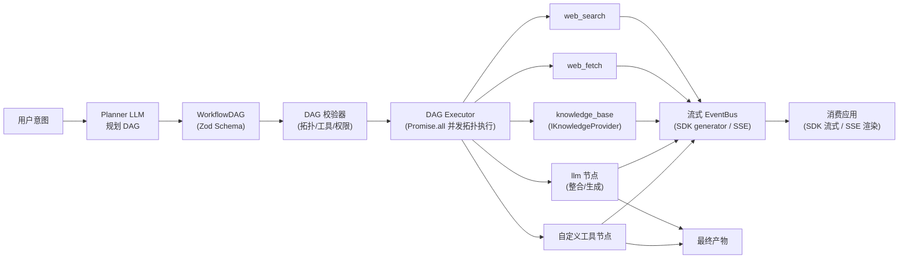

# 01 - 项目定位与核心范式

## 1.1 一句话定位

**let-it-flow 是一个面向开发者的、以意图为导向的流式任务编排中间件框架**。它接收一段自然语言意图，由 LLM 把它"编译"为 DAG 工作流图（Intent-to-DAG Compiler），平台校验后确定性执行，全程通过流式（SDK generator 或 SSE）反馈进度与产物。

项目核心定位为 **"意图到 DAG 编译器（Intent-to-DAG Compiler）"**——它在重型低代码平台（如 Dify、Coze）的僵硬与底层框架（如 LangGraph、CrewAI）的高开发成本之间取得平衡，专注于提供确定性、高可控、且具备极致流式会话穿透能力的工作流引擎。

> **"Not another chatbot, not a black-box Agent. It's an Intent-to-DAG Compiler."**
> 不是又一个聊天机器人，也不是黑盒 Agent。它把用户意图编译为确定性任务图，让链路可流式穿透、可缓存、可人工干预。

## 1.2 协议驱动的通用平台

要实现从 LitPilot 的垂直功能到通用平台的跃迁，let-it-flow 从硬编码逻辑转向**协议驱动**：

- **意图解析层（Intent Router）**：不试图用一个巨大 Prompt 解决所有问题。用户输入意图后，第一步是用 LLM 生成 TaskDAG（有向无环图），规划阶段可流式反馈给用户"我计划先搜索 X，再检索笔记 Y，最后生成报告"。
- **标准化工具接口（FlowConnector）**：所有可执行能力（web_search/web_fetch/知识库/LLM/自定义）统一抽象为 `FlowConnector` 接口，三层分层（core/domain/custom）避免 Context Window Stuffing（见 [04-tool-protocol.md](04-tool-protocol.md)）。
- **知识提供者模式（IKnowledgeProvider / Provider Pattern）**：知识库不是被动数据库，而是"知识提供者"。平台定义 `IKnowledgeProvider` 接口，消费应用只需实现 `query()` 即可接入（见 [05-kb-mcp-protocol.md](05-kb-mcp-protocol.md)）。ObsidianProvider 作为内置示例存在于内核，演示如何实现该接口。
- **状态机与流式引擎**：链路中每个环节的中间状态（如"正在读取网页 A..."）都实时推送前端；Flow 中间可插入用户干预（Human-in-the-loop），见 [12-hitl-and-control.md](12-hitl-and-control.md)。

## 1.3 解决什么问题

它旨在将传统 AI Agent 的单点循环优化（Loop Engineering）升级为多代理/多工具链条的流式工程（Flow Engineering）。

核心能力是通用的：

- **网络检索**（web_search）：多 provider 并行搜索
- **网页抓取**（web_fetch）：多段降级抓取
- **本地知识库**（knowledge_base）：可扩展为 Obsidian / 笔记库 / 数据库，通过 `IKnowledgeProvider` 接入
- **LLM 整合**（llm 节点）：把多源内容融合成最终产物
- **自主研究**（autonomous_research，domain 层）：需要反复追踪线索的深度调研，作为 Agent-as-Tool 在局部释放探索

这些能力组合起来，能覆盖大量"先收集信息、再整合产出"的场景。let-it-flow 把这些能力抽象为一个**通用平台**，让消费应用只需声明意图、提供知识库实现，就能获得完整的工作流编排能力。

## 1.4 典型场景

| 场景 | Web 侧（Search/Fetch） | 知识库侧（Obsidian/Local） | 产出工具 |
|------|----------------------|--------------------------|---------|
| 股票/行业分析 | 实时搜索财报、新闻 | 调取交易记录/策略笔记 | 撰写投资建议书 |
| 播客音频制作 | 抓取热门话题趋势 | 调取灵感库/写作风格指南 | 自定义 TTS 工具 |
| 学术文献综述 | 多源学术搜索 + 全文抓取 | — | 分章综述 + 引用 |
| 竞品调研 | web_search + web_fetch | 内部资料库 | 对比矩阵 |
| 知识问答 | — | knowledge_base 检索 | llm 生成答案 |
| 代码辅助 | 搜索最新库文档 | 调取本地项目架构文档 | 符合规范的代码 PR |

## 1.5 五个已确认的关键决策

| 决策点 | 选择 | 理由 |
|--------|------|------|
| 编排范式 | **LLM 动态规划 DAG + 平台确定性执行** | 兼顾灵活性（LLM 拆解意图）和可控性（DAG 可视化、可缓存、可预测）；非 agent loop 的无限自主 |
| 技术栈 | **TypeScript + Vercel AI SDK v6** | 靠拢 TS/Vercel 生态，`Output.object` 结构化输出原生契合 DAG 生成；详见 [02-architecture.md](02-architecture.md) |
| 消费形态 | **SDK 为主，HTTP 为薄封装** | 核心是进程内可调用引擎；SDK 形态提供 `LetItFlow` 类 + async generator 流式消费；HTTP 形态仅做协议适配 |
| 与 LitPilot 关系 | **全新独立项目**，LitPilot 仅作设计理念参照 | `reference/` 目录的 Python 代码仅保留作设计参考，不复用代码；内核保持纯净 |
| 知识库接口 | **HTTP/MCP 线协议 + `IKnowledgeProvider` 接口抽象** | 跨语言、跨进程隔离、可远程部署；平台侧类型安全；ObsidianProvider 作为内置接口示例 |

## 1.6 核心数据流



**执行流程**：

1. 消费应用通过 SDK（`flow.execute(intent)`）或 HTTP（`POST /api/workflows`）提交用户意图
2. Planner LLM 根据意图 + 可用工具清单，通过 AI SDK `generateText` + `Output.object` 规划出 WorkflowDAG
3. Validator 校验 DAG（拓扑无环、工具已注册、参数合法）
4. Executor 按拓扑分层并发执行 DAG，每个节点产出事件；命中 `requireConfirmation` 的节点触发 HITL 暂停
5. 事件经 EventBus 落库，通过 SDK async generator 或 `GET /api/tasks/{id}/stream` 推送给消费应用
6. 最终产物（报告/脚本/音频）落在 deliver 节点

### SDK 使用示例（进程内，主形态）

```typescript
import { LetItFlow } from "let-it-flow";
import { ObsidianProvider } from "let-it-flow/knowledge";

const flow = new LetItFlow({
  plannerModel: "openai/gpt-4o",
  knowledge: new ObsidianProvider({ vaultPath: "~/my-second-brain" }),
  tools: [/* 自定义 FlowConnector */],
});

const stream = await flow.execute("分析 Nvidia 财报并对比我的行业笔记，生成播客脚本");

for await (const chunk of stream) {
  if (chunk.type === "workflow_node") console.log("规划完成:", chunk.payload.graph);
  if (chunk.type === "tool_call") console.log("执行工具:", chunk.payload.toolName);
  if (chunk.type === "confirmation_required") {
    // HITL：等待用户确认后调用 flow.confirm(taskId, decision)
  }
  if (chunk.type === "text") process.stdout.write(chunk.payload.delta);
}
```

## 1.7 与传统 Agent Loop 的区别

| 维度 | Agent Loop（如 Cursor） | let-it-flow（DAG 执行） |
|------|----------------------|----------------------|
| 范式 | Loop Engineering（每步循环） | Flow Engineering（流式工程） |
| 决策时机 | 每一步都问 LLM 下一步做什么 | LLM 一次性规划完整 DAG，之后确定性执行 |
| 可视化 | 难（执行路径不可预测） | 强（DAG 天然可绘制流程卡） |
| 质量稳定性 | 依赖 LLM 每步决策质量 | 规划集中一次，执行确定 |
| Token 成本 | 高（每步都调 LLM） | 低（规划一次，执行阶段 LLM 只用于生成节点） |
| 中间产物缓存 | 难（路径不确定） | 易（节点结果可缓存复用，支持断点续传） |
| 容错策略 | 失败即重试整轮 | onNodeError 可配置（abort/skip/retry）+ 局部修复预留（见 [07-executor.md](07-executor.md) §7.4） |
| 输入边界 | 依赖模型自我判断 | Guardrail 护栏（可行/澄清/拒绝，见 [06-planner-and-templates.md](06-planner-and-templates.md) §6.7） |
| 人工干预 | 每步可干预但路径不确定 | HITL 暂停点可控（见 [12-hitl-and-control.md](12-hitl-and-control.md)） |
| 适用场景 | 开放式探索、代码编辑 | 明确的"收集→整合→产出"类任务 |

## 1.8 不做什么（边界）

- **不做对话式交互的 UI 壳**：UI 由消费应用自己开发，平台只提供流式能力（SDK generator 或 SSE）
- **不做知识库的存储实现**：知识库的检索逻辑（embedding/全文/混合）由消费应用通过 `IKnowledgeProvider` 决定。平台内核**只内置 `IKnowledgeProvider` 接口与 `ObsidianProvider` 接口示例**（演示如何实现该接口），不实现平台自身的知识存储——平台自身的任务/产物存储走 `src/storage/`，与此无关
- **不做 LLM 训练/微调**：纯调用层，复用 AI SDK 的 provider 抽象
- **不做向量数据库**：知识库的向量化由 provider 实现负责

## 1.9 相关文档

- [02-architecture.md](02-architecture.md) - 整体架构与 SDK/HTTP 双形态模块边界
- [03-dag-schema.md](03-dag-schema.md) - WorkflowDAG 完整规范（含 HITL 字段）
- [04-tool-protocol.md](04-tool-protocol.md) - FlowConnector 工具协议
- [05-kb-mcp-protocol.md](05-kb-mcp-protocol.md) - IKnowledgeProvider 与 ObsidianProvider
- [12-hitl-and-control.md](12-hitl-and-control.md) - Human-in-the-loop
- [10-litpilot-migration-guide.md](10-litpilot-migration-guide.md) - 与 LitPilot 的关系（设计参考）
