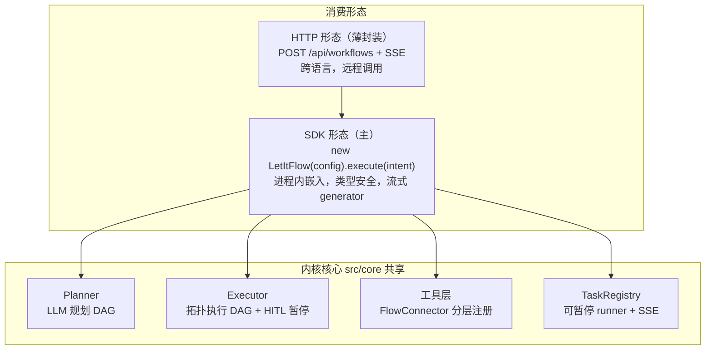
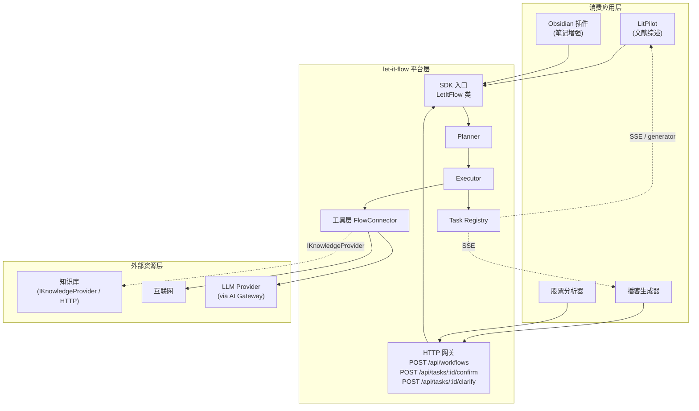
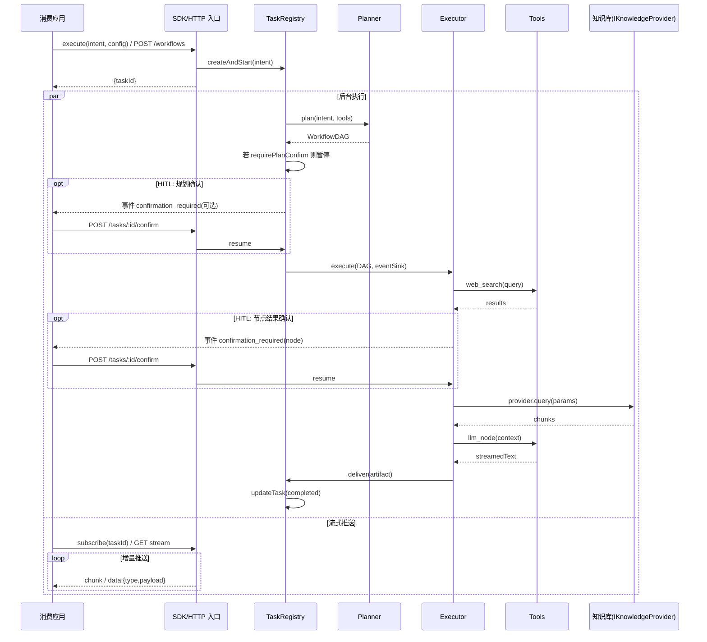

# 02 - 整体架构与模块边界

## 2.1 双形态架构（SDK 为主，HTTP 为薄封装）

let-it-flow 的核心是一个**进程内可调用的引擎内核**，对外暴露两种等价形态：



| 形态 | 适用场景 | 特点 |
|------|---------|------|
| **SDK**（主） | 单进程嵌入、TS 消费应用、库形式分发 | `execute()` 返回 async generator，直接消费流式 chunk；强类型；无需起 HTTP 服务 |
| **HTTP**（薄封装） | 跨语言消费、远程部署、微服务 | Hono 路由内部装配 `LetItFlow` 实例，SSE 推送与 SDK generator 等价 |

**关键原则**：HTTP 层不包含业务逻辑，仅做协议适配（HTTP ↔ SDK）。所有核心能力（planner/executor/tools/tasks）都先在 SDK 层实现，HTTP 层只是 SDK 的远程代理。这保证两种形态行为完全一致。

### 2.1.1 整体三层（内核 / 形态层 / 资源层）



> 消费应用既可通过 SDK 进程内调用（LitPilot / Obsidian 插件），也可通过 HTTP 远程调用（播客生成器 / 股票分析器）。两条路径共享同一内核。

## 2.2 模块边界

代码位于 `src/`，模块划分严格遵循单一职责：

| 模块 | 职责 |
|------|------|
| `sdk/` | SDK 入口：`LetItFlow` 类装配，进程内调用入口 |
| `api/` | HTTP 路由层（薄封装）：workflow 创建、task SSE 订阅、HITL 确认 |
| `core/` | 配置、统一响应、SSE 协议、流式事件构造 |
| `llm/` | LLM 抽象层：provider 注册表、AI Gateway 封装 |
| `tools/` | 工具协议层：FlowConnector 接口、分层注册表、内置工具 |
| `planner/` | DAG 规划：Zod schema、planner、模板库、校验 |
| `executor/` | DAG 执行：拓扑分层、并发执行、上下文传递、HITL 暂停点 |
| `tasks/` | 任务管理：TaskStore、可暂停 Registry、SSE 合并 |
| `storage/` | 存储后端：file/可扩展切换 |

## 2.3 技术栈

### 后端

| 类别 | 选型 | 说明 |
|------|------|------|
| 运行时 | **Node.js 22 LTS** | 原生 fetch、原生 SSE 友好；可选 Bun |
| Web 框架 | **Hono 4.x** | 轻量、Edge 友好、SSE 流式原生支持；仅 HTTP 形态使用 |
| 语言 | **TypeScript 5.7+ (strict)** | 全链路类型安全 |
| 数据模型 / 校验 | **Zod 3.x** | DAG schema、API 请求响应校验；与 AI SDK 结构化输出原生契合 |
| LLM 调用 | **Vercel AI SDK v6 (`ai` + `@ai-sdk/*`)** | 结构化输出 (`generateText` + `Output.object`)、流式 (`streamText`)、多 provider 统一 |
| 模型路由 | **Vercel AI Gateway**（推荐） | 统一鉴权、provider failover、成本可观测；无 Gateway 时回退直连 provider 包 |
| HTTP 客户端 | **原生 `fetch` + undici Agent** | 进程级共享 keep-alive 连接池 |
| HTML 解析 | **cheerio** | web_fetch 内容提取 |
| JSONPath 解析 | **jsonpath-plus** | 节点间数据流转引用（`$.tasks[id].output.field`） |
| 日志 | **pino** | 高性能结构化日志 |
| 测试 | **vitest** | 原生 TS、ESM、并发、Watch 模式 |
| Lint | **eslint + prettier** | 代码门禁 |

### 前端（最小演示用）

| 类别 | 选型 |
|------|------|
| 框架 | Next.js 15 + React 19 |
| 流式消费 | EventSource API / `@ai-sdk/react` |

### 部署

| 类别 | 选型 |
|------|------|
| 平台 | **Vercel**（前后端同站） |
| 后端入口 | `src/index.ts` 导出 Hono app，经 `vercel.json` 桥接；SDK 形态可直接 `import { LetItFlow }` |
| 存储后端 | 本地 File（开发）/ Vercel KV / Postgres（生产，可选） |

## 2.4 目录结构

```
let-it-flow/
├── package.json                    # 依赖 + scripts
├── tsconfig.json                   # strict 模式
├── vitest.config.ts
├── eslint.config.mjs
├── vercel.json                     # 部署配置
├── src/
│   ├── index.ts                    # 导出 Hono app（HTTP）+ LetItFlow（SDK）双入口
│   ├── sdk/
│   │   └── let-it-flow.ts          # SDK 主入口：LetItFlow 类装配 planner/executor/tools
│   ├── api/
│   │   ├── workflows.ts            # POST /api/workflows（薄封装 SDK）
│   │   ├── tasks.ts                # GET /api/tasks/:id/stream + POST /:id/confirm + POST /:id/clarify
│   │   └── schemas.ts              # 请求/响应 Zod schema
│   ├── core/
│   │   ├── config.ts               # DATA_DIR / 环境变量
│   │   ├── response.ts             # ok()/err() 统一响应
│   │   ├── streaming.ts            # SSE v1.0 协议
│   │   └── stream-events.ts        # 事件构造 helper
│   ├── llm/
│   │   ├── index.ts                # provider 注册表 + 按角色注入
│   │   ├── gateway.ts              # AI Gateway 封装（推荐路径）
│   │   ├── http-client.ts          # 进程级共享 fetch dispatcher (undici)
│   │   ├── robust-output-guard.ts  # 结构化输出鲁棒守卫：Prompt 脚手架注入 + 平衡括号解析 + 兜底（见 §2.8）
│   │   └── json-repair.ts          # 鲁棒 JSON 解析：提取 {}、修尾逗号、补未闭合括号
│   ├── services/
│   │   └── llm-service.ts          # 按角色注入（planner/integrator）
│   ├── tools/
│   │   ├── base.ts                 # FlowConnector 接口 + ToolResult + StreamEvent 类型
│   │   ├── registry.ts             # 分层 ToolRegistry（core/domain/custom）
│   │   ├── providers/              # web 检索/抓取 provider 实现
│   │   │   ├── tavily.ts
│   │   │   ├── brave.ts
│   │   │   ├── native-search.ts
│   │   │   ├── native-fetch.ts
│   │   │   └── jina.ts
│   │   ├── http-tool-provider.ts  # flow-manifest 自描述外部工具接入（见 04 §4.9）
│   │   ├── knowledge/              # 知识库接口与内置 provider
│   │   │   ├── provider.ts         # IKnowledgeProvider 接口 + KnowledgeChunk schema
│   │   │   ├── http-provider.ts    # HttpKnowledgeProvider（默认，走 REST 线协议）
│   │   │   ├── mcp-provider.ts     # McpKnowledgeProvider（内置 MCP 桥接适配器，零代码接入 MCP 生态）
│   │   │   └── obsidian-provider.ts # ObsidianProvider（内置示例，本地 Markdown vault）
│   │   └── builtin/
│   │       ├── web-search.ts       # 实现 FlowConnector
│   │       ├── web-fetch.ts
│   │       ├── knowledge-base.ts   # 包装 IKnowledgeProvider 为工具
│   │       ├── llm-node.ts         # 通用 LLM 生成节点
│   │       ├── autonomous-research.ts # Agent-as-Tool（domain 层，内部 ReAct 循环）
│   │       └── deliver.ts          # 产物聚合
│   ├── planner/
│   │   ├── dag-schema.ts           # WorkflowDAG/Task Zod schema（含 requireConfirmation/contentPipeline）
│   │   ├── planner.ts              # planner + prompt 装配
│   │   ├── tool-router.ts          # 两阶段动态工具检索（粗筛分层 + 精排向量 top-K，见 04 §4.7）
│   │   ├── guardrail.ts            # Guardrail 可行性判断（见 06 §6.7）
│   │   ├── fallback.ts             # Fallback DAG 降级（见 06 §6.6）
│   │   ├── templates.ts            # 模板库（research/content/qa）
│   │   ├── validator.ts            # DAG 校验
│   │   └── prompts/
│   │       ├── system-prompt.md
│   │       └── few-shots/          # 黄金示例（可维护资产）
│   ├── executor/
│   │   ├── executor.ts             # 拓扑分层 + Promise.all 并发 + HITL 暂停点
│   │   ├── context.ts              # ExecutionContext blackboard
│   │   └── node-runner.ts          # 单节点执行 + 事件发射 + 确认等待
│   ├── tasks/
│   │   ├── task-store.ts           # TaskStore 接口 + FileTaskStore
│   │   ├── registry.ts             # TaskRegistry（可暂停 runner + iterStream + 快照恢复）
│   │   ├── latch.ts                # AsyncLatch 进程内异步闩锁（见 12 §12.4）
│   │   ├── state-snapshot.ts       # 暂停点状态快照持久化 + 冷启动恢复（见 12 §12.5）
│   │   └── coalescer.ts            # 流式合并
│   └── storage/
│       ├── backend.ts              # file/kv 切换
│       └── file-store.ts           # task + artifact 存储
├── tests/                          # vitest 测试
│   ├── helpers/
│   ├── test-dag-schema.ts
│   ├── test-executor.ts
│   ├── test-planner.ts
│   ├── test-sdk.ts                 # SDK 入口测试
│   ├── test-hitl.ts                # HITL 流程测试
│   └── test-task-streaming.ts
├── eval/                           # 自动化评测基准线（见 11-benchmark-and-eval.md）
│   ├── cases/                      # 50 个评测用例 JSON
│   ├── runner.ts                   # 断言评分引擎
│   └── report.ts                   # 报告生成
├── docs/                           # 设计文档集
├── reference/                      # LitPilot 设计理念参照（只读，不复用代码）
├── examples/                       # 示例消费应用
│   ├── stock-analysis/             # HTTP 形态示例
│   ├── podcast-generator/          # HTTP 形态示例
│   ├── obsidian-kb-server/         # ObsidianProvider 远程部署示例（HTTP 线协议）
│   └── sdk-embedded/               # SDK 形态示例（进程内 LetItFlow）
└── scripts/
    └── test-gates.sh               # 测试门禁
```

## 2.5 数据流详图（含 HITL 暂停点）



## 2.6 API 契约

### 统一响应结构

所有 HTTP API 遵循统一响应格式：

```json
{
  "status": "success | error",
  "data": {},
  "message": "可选"
}
```

对应 Zod schema：

```typescript
import { z } from "zod";

export const ApiResponse = z.object({
  status: z.enum(["success", "error"]),
  data: z.unknown().nullable(),
  message: z.string().optional(),
});
```

### 核心端点

| 方法 | 路径 | 说明 |
|------|------|------|
| POST | `/api/workflows` | 提交意图，创建任务 |
| GET | `/api/tasks/{id}` | 查询任务状态 |
| GET | `/api/tasks/{id}/stream?since=N` | SSE 订阅事件流（支持断线续传） |
| POST | `/api/tasks/{id}/confirm` | **HITL 确认**：确认规划/确认节点结果（见 [12-hitl-and-control.md](12-hitl-and-control.md)） |
| POST | `/api/tasks/{id}/clarify` | **意图澄清**：Guardrail 判定模糊后用户补充信息，重跑 planner（见 [06-planner-and-templates.md](06-planner-and-templates.md) §6.7） |
| DELETE | `/api/tasks/{id}` | 取消任务 |
| GET | `/api/tools` | 列出可用工具与 schema |

### POST /api/workflows 请求体

```typescript
// src/api/schemas.ts
import { z } from "zod";

export const WorkflowCreateBody = z.object({
  intent: z.string().min(1),
  config: z.object({
    plannerModel: z.string().optional(),      // 如 "openai/gpt-4o"
    embedModel: z.string().optional(),         // 工具检索精排用嵌入模型（见 04 §4.7），缺省走 BM25
    searchProvider: z.string().optional(),     // 如 "tavily"
    knowledgeBase: z.union([
      z.object({                              // 形态一：HTTP 远程知识库（REST 线协议）
        endpoint: z.string().url(),
        token: z.string().optional(),
      }),
      z.object({                              // 形态二：MCP Server 桥接（零代码接入生态）
        type: z.literal("mcp"),
        serverUrl: z.string().url(),
        token: z.string().optional(),
      }),
      z.object({                              // 形态三：SDK 注入进程内 provider
        providerName: z.string(),             // 如 "obsidian-vault"
        providerConfig: z.record(z.string(), z.unknown()),
      }),
    ]).optional(),
    requirePlanConfirm: z.boolean().default(false),  // HITL: 规划后需确认
    structuredSupport: z.enum(["native", "weak"]).optional(),  // 模型结构化输出能力（见 §2.8）；弱模型走鲁棒解析
    maxFetchUrls: z.number().int().positive().default(8),
    defaultMaxTokens: z.number().int().positive().default(4000),  // Content Pipeline 默认截断阈值（见 07 §7.6）
  }).partial().default({}),
});
```

请求示例（HTTP 远程知识库）：

```json
{
  "intent": "分析宁德时代(300750)的新能源电池行业地位",
  "config": {
    "plannerModel": "openai/gpt-4o",
    "searchProvider": "tavily",
    "knowledgeBase": {
      "endpoint": "http://127.0.0.1:7878",
      "token": "optional-bearer"
    },
    "requirePlanConfirm": true,
    "maxFetchUrls": 8
  }
}
```

### SDK 形态示例（进程内）

```typescript
import { LetItFlow } from "let-it-flow";
import { ObsidianProvider } from "let-it-flow/knowledge";

const flow = new LetItFlow({
  plannerModel: "openai/gpt-4o",
  knowledge: new ObsidianProvider({ vaultPath: "~/my-second-brain" }),
  tools: [/* 自定义工具 */],
  requirePlanConfirm: false,
});

const stream = await flow.execute("分析 Nvidia 财报并对比我的行业笔记，生成播客脚本");

for await (const chunk of stream) {
  if (chunk.type === "stage") console.log("阶段:", chunk.payload.label);
  if (chunk.type === "tool_result") console.log("工具结果:", chunk.payload.result);
  if (chunk.type === "confirmation_required") {
    // HITL: 等待用户确认后调用 flow.confirm(taskId, decision)
  }
  if (chunk.type === "text") process.stdout.write(chunk.payload.delta);
}
```

## 2.7 关键架构约定

1. **SDK 优先**：所有核心能力先在 SDK 层（`src/sdk/`、`src/core/` 等）实现，HTTP 层（`src/api/`）仅做协议适配。禁止在 HTTP 层写业务逻辑。

2. **连接池复用**：所有 HTTP 调用必须走 `src/llm/http-client.ts` 的进程级共享 `undici.Agent`（keep-alive）。开发期用全局 `fetch` 默认 dispatcher；生产期显式注入 `undici.Agent({ keepAliveTimeout })`。

3. **LLM 调用统一走 AI SDK**：禁止直接 `import` 各家 provider 原生 SDK。统一通过 `ai` 包 + `@ai-sdk/*` provider 或 AI Gateway 调用。

4. **结构化输出用 v6 模式 + 鲁棒守卫**：planner 生成 DAG 时使用 `generateText` + `output: Output.object({ schema: WorkflowDAGSchema })`（而非已废弃的 `generateObject`），并经 `RobustOutputGuard` 守护以支持多模型平替（见 §2.8、[06-planner-and-templates.md](06-planner-and-templates.md)）。

5. **流式落库合并**：连续 token 增量经 coalescer 合并后再落库，禁止逐 token 写文件（见 [08-task-streaming.md](08-task-streaming.md)）。

6. **存储后端可切换**：FileStore / KVStore 实现同一接口，通过环境变量切换。

7. **DAG 校验前置**：planner 输出的 DAG 必须经 validator 校验通过后才进入执行。

8. **工具注册表统一且分层**：所有工具必须实现 FlowConnector 接口并注册到 registry；registry 按 tier（core/domain/custom）分层加载（见 [04-tool-protocol.md](04-tool-protocol.md)）。

9. **HITL 通过暂停点实现**：runner 在规划后、节点执行前可暂停等待确认；暂停/恢复通过 TaskStore 状态机驱动，不阻塞事件循环（见 [12-hitl-and-control.md](12-hitl-and-control.md)）。

10. **路径规范**：禁止硬编码绝对路径；统一使用 `node:path` 或 `import.meta.url` 构造。

11. **换行符 LF / 编码 UTF-8**：`.gitattributes` 强制 `* text=auto eol=lf`。

## 2.8 多模型平替与结构化输出鲁棒性（Model Agnostic）

### 痛点

只有少数顶尖商业模型（GPT-4o 等）完美支持 `response_format: { type: "json_schema" }`。大部分开源模型（DeepSeek-V3、Qwen2.5、Llama3 经 Ollama/OpenRouter）即便 Prompt 强约束，仍会偶尔吐出 ```` ```json ```` 包裹、前导废话、尾逗号、未闭合括号，导致 DAG 编译器崩溃。Let-it-Flow 须在框架底层守护，而非依赖单一模型。

### 双层守护架构（不绕开 AI SDK）

**关键约束**：守护层是包在 AI SDK `generateText({output: Output.object})` **外的一层薄守卫**，**不是**替代 provider 调用。provider 差异由 AI SDK 的 `@ai-sdk/openai` / `@ai-sdk/openai-compatible` 处理；本层只在"弱结构化模型"上额外注入 Prompt 脚手架 + 鲁棒解析 + 兜底 DAG。

```typescript
// src/llm/robust-output-guard.ts
import { generateText, Output } from "ai";

/**
 * 统一的结构化输出守卫：按模型能力声明走原生强约束或弱模型适配。
 * 绝不直接 import 各家 provider SDK（遵守 §2.7 约定3），model 实例由 provider 包构造。
 */
export async function guardedGenerateObject<T>(
  model: LanguageModel,                   // AI SDK 的 LanguageModel（由 @ai-sdk/* 构造）
  schema: ZodSchema<T>,
  messages: ModelMessage[],
  config: { structuredSupport: "native" | "weak" },
): Promise<{ data: T | null; rawText: string }> {
  if (config.structuredSupport === "native") {
    // 第一层·原生强约束：AI SDK Output.object 直接约束，provider 层保证 100% 合法
    const { output } = await generateText({ model, messages, output: Output.object({ schema }) });
    return { data: output ?? null, rawText: "" };
  }
  // 弱模型平替模式：Prompt 注入 JSON 约束 + 走鲁棒解析器
  const injected = injectJsonConstraints(messages, schema);   // 把 schema 摘要 + "只输出 JSON" 注入 system
  const { text } = await generateText({ model, messages: injected });
  return { data: robustJsonParse<T>(text, schema), rawText: text };
}
```

### 第二层：鲁棒 JSON 解析器（Robust Parser）

开源模型输出的 JSON 常带瑕疵，`robustJsonParse` 在 `JSON.parse` 前预处理（**注意：用平衡括号栈扫描，不用贪婪正则 `\{[\s\S]*\}`**——后者遇嵌套会截错）：

```typescript
// src/llm/json-repair.ts
export function robustJsonParse<T>(raw: string, schema: ZodSchema<T>): T | null {
  // 1) 平衡括号栈扫描提取最外层 {...}，无视前后 ```json 标记与废话
  const jsonStr = extractBalancedObject(raw);
  if (!jsonStr) return null;
  // 2) 修复常见格式错误
  const repaired = repair(jsonStr);   // 去尾逗号 / 补未闭合 } ] / 修单引号
  try {
    const parsed = JSON.parse(repaired);
    const result = schema.safeParse(parsed);
    return result.success ? result.data : null;
  } catch {
    return null;
  }
}
```

| 修复项 | 机制 |
|--------|------|
| 提取包裹内容 | 平衡括号栈扫描抠出最外层 `{...}`，无视 ```` ```json ```` 与前后废话 |
| 尾逗号 | 正则去 `,\s*]` / `,\s*}` |
| 未闭合括号 | 栈匹配补齐末尾 `}` / `]` |
| schema 复核 | `schema.safeParse` 兜底，结构不符返回 null（触发上层降级） |

> **为何不用贪婪正则 `\{[\s\S]*\}`**：嵌套对象会被一次性吞掉或从首个 `{` 误匹配到末尾 `}`，提取错位。栈扫描按深度精确界定最外层对象边界。

### 降级保障（Fallback DAG）

解析失败**不抛底层 Crash**，而是接入 planner 现有的重试循环（见 [06-planner-and-templates.md](06-planner-and-templates.md) §6.6）：

- 解析失败计为一次重试，反馈"输出非合法 JSON / schema 不符"让 LLM 重规划（最多 3 次）
- **3 次重试耗尽**才降级：返回固定的单节点 Fallback DAG（`llm_synthesis`，入参："抱歉，我在规划工作流时遇到格式解析错误，请尝试简化意图描述"），让流程仍能流式走完，保证确定性体验
- Fallback DAG 与 Guardrail 的 `rejected`（越界拒绝）语义区分：**前者是"想规划但解析失败"的兜底**，**后者是"根本不该规划"的拒绝**，两者事件类型与状态不同（见 [08-task-streaming.md](08-task-streaming.md) §8.7）

### Provider 能力声明

模型的能力（强/弱结构化）在 `src/llm/index.ts` 注册时声明，planner 按声明自动选守护路径：

| 模型 | structuredSupport | 守护路径 |
|------|-------------------|---------|
| GPT-4o / Claude 3.5+ | `native` | AI SDK `Output.object` 原生约束 |
| DeepSeek-V3 / Qwen2.5 / Llama3（Ollama/OpenRouter） | `weak` | Prompt 脚手架 + 鲁棒解析 + 重试降级 |

## 2.9 AI SDK v6 关键约定

由于项目深度依赖 Vercel AI SDK v6，以下为必须遵守的版本约定（避免踩已废弃 API）：

| 场景 | v6 正确用法 | 禁止（已废弃） |
|------|------------|---------------|
| 结构化输出 | `generateText({ model, output: Output.object({ schema }), messages })` | `generateObject` |
| 流式结构化输出 | `streamText({ ..., output: Output.object({ schema }) })` | `streamObject` |
| 工具定义 | `tool({ inputSchema: zodSchema, execute })` | `tool({ parameters })` |
| 消息类型 | `ModelMessage` | `CoreMessage` |
| Agent 循环上限 | `stopWhen: stepCountIs(N)` | `maxSteps` |
| 流式响应 | `toUIMessageStreamResponse()` / `toTextStreamResponse()` | `toDataStreamResponse()` |

`Output` 与 `stepCountIs` 从 `ai` 包导入。Agent-as-Tool（`AutonomousResearchTool`）内部使用 `stepCountIs(N)` 限制 ReAct 循环步数（见 [04-tool-protocol.md](04-tool-protocol.md) §4.6）。

> 多模型平替的结构化输出守卫（`RobustOutputGuard`）见 §2.8，它包在上述 `generateText({output})` 外，不替代 AI SDK 调用。

## 2.10 相关文档

- [01-overview.md](01-overview.md) - 项目定位
- [03-dag-schema.md](03-dag-schema.md) - DAG 规范
- [04-tool-protocol.md](04-tool-protocol.md) - 工具协议（FlowConnector）
- [06-planner-and-templates.md](06-planner-and-templates.md) - planner 与 Fallback DAG 降级
- [08-task-streaming.md](08-task-streaming.md) - 任务与流式
- [12-hitl-and-control.md](12-hitl-and-control.md) - Human-in-the-loop
