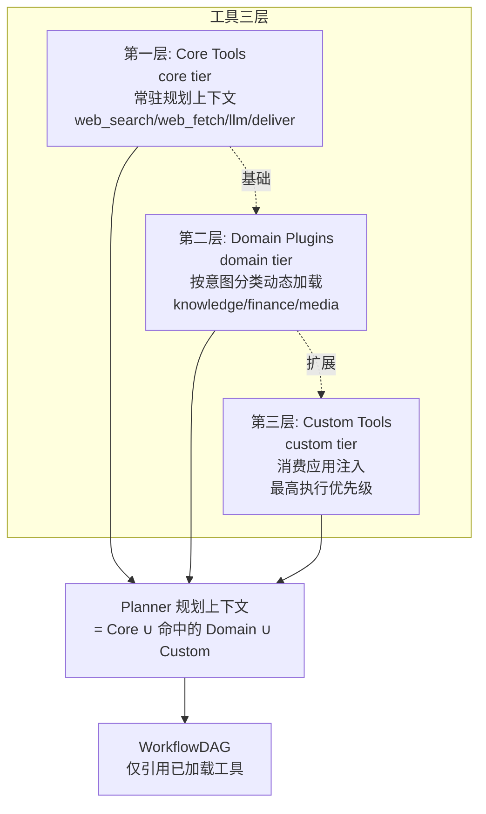

# 04 - 工具协议契约（FlowConnector）

工具是 let-it-flow 执行 DAG 节点的最小单元。所有节点类型（web_search/web_fetch/knowledge_base/llm/tool/deliver）背后都对应一个实现 `FlowConnector` 接口的工具实例。

`FlowConnector` 是平台对所有可执行能力（内置工具、领域插件、自定义工具、知识库 provider）的统一抽象。无论是 Tavily 搜索、Obsidian 笔记检索，还是内部跑 ReAct 循环的自主研究工具，对 planner 和 executor 而言都是同一个接口。

## 4.1 设计来源

参考 LitPilot 的 `web_providers.py`（`reference/tools/web_providers.py`）的 async 函数式契约，将其统一抽象为 TS 接口。LitPilot 的工具是裸 async 函数（`webSearchQuery`/`webFetchUrl`），let-it-flow 增加了 schema 声明、事件流产出、分层注册表管理，并把"工具"概念统一命名为 `FlowConnector`，体现 Flow Engineering 中"连接器"的定位。

## 4.2 核心类型定义

```typescript
// src/tools/base.ts

/** 工具执行完成后的最终结果。 */
export interface ToolResult<T = unknown> {
  ok: boolean;
  data: T;                       // 符合 outputSchema 的结构化数据
  error?: string;
  meta?: Record<string, unknown>;
}

/** 工具执行过程中产出的事件（用于 SSE 推送）。 */
export interface StreamEvent {
  type:
    | "stage"
    | "tool_call"
    | "progress"             // 工具内细粒度进度（子步骤/百分比）
    | "tool_result"
    | "text"
    | "think"
    | "artifact"
    | "confirmation_required"   // HITL：见 12-hitl-and-control.md
    | "clarification_required"  // Guardrail：见 06-planner-and-templates.md §6.7
    | "rejected"                // Guardrail 优雅拒绝：见 06 §6.7
    | "error";
  payload: Record<string, unknown>;
  channel?: "content" | "status" | "meta";  // coalescer 合并策略依据，见 08-task-streaming.md §8.6
}

/**
 * FlowConnector：所有可执行能力的统一接口。
 * 用 interface 而非 abstract class：TS interface 支持结构性类型，
 * 消费应用可用任意形式（class / object literal / async generator 工厂）实现。
 *
 * 命名说明：历史称 Tool，现统一为 FlowConnector，体现 Flow Engineering
 * 中"连接器"定位——它是 Flow 链路与外部能力（web/KB/LLM/自定义）的连接点。
 *
 * 工具契约（Tool Contract，见 §4.6.0）：description/whenToUse/outputExample
 * 是面向 planner LLM 的"工具手册"，决定 planner 能否选对工具、填对参。
 */
export interface FlowConnector {
  /** 工具唯一标识，如 "builtin/web_search" */
  readonly name: string;
  /** 对应 NodeKind（web_search/web_fetch/...） */
  readonly kind: string;
  /** 工具分层：core | domain | custom（见 §4.6） */
  readonly tier: ToolTier;

  // ── 面向 planner LLM 的工具手册（Tool Contract）──
  /**
   * 功能描述（必填）。像 API 文档一样精确，说明这个工具能干什么。
   * 不是感性描述，而是面向 planner 的契约说明。
   */
  readonly description: string;
  /**
   * 调用时机（必填）。结构化 Trigger：何时调用此工具。
   * 让 planner 明确在什么意图下选这个工具，避免乱猜。
   * 例：{ "triggers": ["最新新闻", "财报", "实时客观事实"], "notFor": ["已有 URL 的内容"] }
   */
  readonly whenToUse: ToolTrigger;
  /** JSON Schema（Zod schema 转），描述 params 的合法结构，每个字段含 description + required 标注 */
  readonly inputSchema: Record<string, unknown>;
  /** JSON Schema（Zod schema 转），描述 ToolResult.data 的结构，字段含 description */
  readonly outputSchema: Record<string, unknown>;
  /**
   * 输出示例（必填）。给 planner 看的真实输出样例，让它知道
   * "下一步能引用哪些字段"。例：{ chunks: [{ content: "...", source: "..." }] }
   */
  readonly outputExample: Record<string, unknown>;

  /**
   * 执行工具。
   *
   * @param params - 已解析的节点参数（JSONPath 引用已替换为实际值）
   * @param context - 执行上下文，可读取上游节点输出、DAG variables
   * @returns 事件流的异步生成器（实时反馈），最后一个事件携带最终结果
   *
   * 约定: yield 的最后一个 StreamEvent 若 type="tool_result"，
   *       其 payload["result"] 即为 ToolResult.data。
   */
  execute(
    params: Record<string, unknown>,
    context: ExecutionContext,
  ): AsyncIterable<StreamEvent>;
}

/** 结构化调用时机：帮助 planner 判断何时选这个工具。 */
export interface ToolTrigger {
  /** 触发关键词/场景：意图涉及这些时优先选此工具 */
  triggers: string[];
  /** 不适用场景：意图属于这些时不要选此工具 */
  notFor?: string[];
}

/** Tool 为 FlowConnector 的类型别名，保持向后兼容。 */
export type Tool = FlowConnector;

export type ToolTier = "core" | "domain" | "custom";
```

## 4.3 ExecutionContext

工具执行时可访问的上下文，提供上游节点输出和 DAG 变量：

```typescript
// src/executor/context.ts

/** DAG 执行上下文（blackboard 模式）。 */
export interface ExecutionContext {
  /** 获取某节点的输出（工具可通过解析 inputRefs 后访问）。 */
  getNodeOutput(nodeId: string): Record<string, unknown> | undefined;
  /** 获取 DAG 顶层 variables 中的值。 */
  getVariable(key: string): unknown;
  /**
   * 解析 JSONPath 引用（$.tasks[id].output.field 或 $.variables.key）。
   * 返回 undefined 表示引用未找到。
   */
  resolveRef(ref: string): unknown;
}

/** 默认实现，基于 jsonpath-plus。 */
export class ExecutionContextImpl implements ExecutionContext {
  constructor(
    private readonly variables: Record<string, unknown>,
    private readonly nodeOutputs: Map<string, Record<string, unknown>> = new Map(),
  ) {}

  recordOutput(nodeId: string, output: Record<string, unknown>): void {
    this.nodeOutputs.set(nodeId, output);
  }

  getNodeOutput(nodeId: string) {
    return this.nodeOutputs.get(nodeId);
  }

  getVariable(key: string) {
    return this.variables[key];
  }

  resolveRef(ref: string): unknown {
    // 构造可被 JSONPath 查询的根对象：$.tasks.<id>.output / $.variables.<key>
    const root = {
      variables: this.variables,
      tasks: Object.fromEntries(
        Array.from(this.nodeOutputs.entries()).map(([id, output]) => [id, { output }]),
      ),
    };
    const result = JSONPath({ path: ref, json: root });
    return Array.isArray(result) ? result[0] : result;
  }
}
```

> JSONPath 查询通过 `jsonpath-plus` 库完成（见 [03-dag-schema.md](03-dag-schema.md) §3.4）。相比旧版手写 `${}` 分割解析，JSONPath 表达力更强且经过充分测试。

## 4.4 内置工具清单

> 所有内置工具均遵循 §4.6 工具契约规范，含 `whenToUse`/`outputExample`。以下以 `web_search` 为完整契约示例，其余工具仅列关键字段。

### builtin/web_search

网络检索工具。

| 字段 | 值 |
|------|-----|
| name | `builtin/web_search` |
| kind | `web_search` |
| tier | `core` |
| description | 实时网络搜索引擎，返回标题/URL/摘要列表 |
| whenToUse | `{ triggers: ["最新新闻", "财报", "股票", "行情", "实时客观事实", "未知事实"], notFor: ["已有 URL 的网页（走 web_fetch）", "本地笔记（走 knowledge_base）"] }` |

inputSchema:
```json
{
  "type": "object",
  "properties": {
    "query": { "type": "string", "description": "搜索关键词，尽量精简且具象" },
    "provider": { "type": "string", "enum": ["tavily", "brave", "native", "multi_academic"], "default": "tavily", "description": "搜索后端" },
    "maxResults": { "type": "integer", "default": 8, "description": "返回最大条数" },
    "includeDomains": { "type": "array", "items": { "type": "string" }, "description": "限定域名" },
    "excludeDomains": { "type": "array", "items": { "type": "string" }, "description": "排除域名" }
  },
  "required": ["query"]
}
```

outputSchema:
```json
{
  "type": "object",
  "properties": {
    "results": {
      "type": "array",
      "description": "搜索结果数组，供 web_fetch 节点引用其 url 字段",
      "items": {
        "type": "object",
        "properties": {
          "url": { "type": "string", "description": "结果页 URL" },
          "title": { "type": "string", "description": "页面标题" },
          "snippet": { "type": "string", "description": "内容摘要" }
        }
      }
    }
  }
}
```

outputExample: `{ "results": [{ "url": "https://example.com/report", "title": "Q1 财报", "snippet": "营收同比增长..." }] }`

产出的 StreamEvent：`stage`（开始/完成）、`tool_call`（调用记录）、`tool_result`（最终结果）。

### builtin/web_fetch

网页抓取工具。

inputSchema 关键字段：
- `urls`: URL 列表（若未提供，则从 `inputRefs` 的 results 中提取 url 字段）
- `provider`: `"native"` | `"jina"`
- `maxConcurrent`: 并发数，默认 4

output: `{ contents: [{ url, text, finalUrl?, error? }] }`

### builtin/knowledge_base

HTTP/MCP 客户端，详见 [05-kb-mcp-protocol.md](05-kb-mcp-protocol.md)。

inputSchema:
```json
{
  "type": "object",
  "properties": {
    "endpoint": { "type": "string", "description": "知识库服务地址" },
    "token": { "type": "string", "description": "Bearer 鉴权 token（可选）" },
    "action": { "type": "string", "enum": ["search", "retrieve", "upsert"] },
    "query": { "type": "string", "description": "search 时必填" },
    "ids": { "type": "array", "items": { "type": "string" }, "description": "retrieve 时必填" },
    "topK": { "type": "integer", "default": 10 }
  },
  "required": ["endpoint", "action"]
}
```

### builtin/llm

通用 LLM 生成节点。`toolName` 字段指定 LLM 角色（对应 `src/services/llm-service.ts`）。

inputSchema:
```json
{
  "type": "object",
  "properties": {
    "systemPrompt": { "type": "string" },
    "userPromptTemplate": { "type": "string", "description": "可选，拼接 inputRefs 内容" },
    "maxTokens": { "type": "integer", "default": 4096 },
    "temperature": { "type": "number", "default": 0.3 }
  }
}
```

output: `{ text: string }`

执行时：把 `inputRefs` 解析出的内容按顺序拼接，配合 `systemPrompt` 调用 LLM 流式生成（`streamText`），每个 token chunk 产出 `text` 类型 StreamEvent。

### builtin/deliver

产物聚合节点。把 `inputRefs` 的内容聚合为 artifact。

output: `{ artifactId, content, format }`，触发 `artifact` 类型 SSE 事件。

## 4.5 工具注册表（分层）

注册表按三层架构管理工具，避免大模型上下文污染（Context Window Stuffing）及决策干扰：

```typescript
// src/tools/registry.ts
import type { FlowConnector, ToolTier } from "./base";

export class ToolRegistry {
  private readonly tools = new Map<string, FlowConnector>();

  register(tool: FlowConnector): void {
    if (this.tools.has(tool.name)) {
      throw new Error(`工具已注册: ${tool.name}`);
    }
    this.tools.set(tool.name, tool);
  }

  get(name: string): FlowConnector | undefined {
    return this.tools.get(name);
  }

  /** 返回所有工具的 schema 摘要（供 planner LLM 和 /api/tools 使用）。 */
  list(): Array<FlowConnector & { tier: ToolTier }> {
    return Array.from(this.tools.values());
  }

  /**
   * 按分层过滤。planner 调用此方法构造规划上下文：
   * - 始终包含 core 层
   * - 按意图分类器动态加入 domain 层（如意图涉及知识库则加入 Knowledge 域）
   * - 始终包含调用方注入的 custom 层（最高优先级）
   */
  listByTier(...tiers: ToolTier[]): FlowConnector[] {
    return this.list().filter((t) => tiers.includes(t.tier));
  }

  /**
   * 构造传入 planner 的工具清单（仅 metadata，不含 execute）。
   * 这是控制 Context Window Stuffing 的关键入口。
   *
   * 返回的契约对象包含 whenToUse 与 outputExample——这两个字段让 planner
   * 知道"何时选这个工具"和"下一步能引用哪些字段"，是规划成功率的关键。
   */
  forPlanner(tiers: ToolTier[]): Array<{
    name: string;
    kind: string;
    description: string;
    whenToUse: ToolTrigger;
    inputSchema: Record<string, unknown>;
    outputSchema: Record<string, unknown>;
    outputExample: Record<string, unknown>;
  }> {
    return this.listByTier(...tiers).map((t) => ({
      name: t.name,
      kind: t.kind,
      description: t.description,
      whenToUse: t.whenToUse,
      inputSchema: t.inputSchema,
      outputSchema: t.outputSchema,
      outputExample: t.outputExample,
    }));
  }
}

/** 全局单例 */
export const registry = new ToolRegistry();

export function registerBuiltinTools(): void {
  // 应用启动时注册所有内置工具
  registry.register(new WebSearchTool());
  registry.register(new WebFetchTool());
  registry.register(new KnowledgeBaseTool());
  registry.register(new LLMNodeTool());
  registry.register(new DeliverTool());
  // domain 层（按需，可延迟注册）
  registry.register(new AutonomousResearchTool());
}
```

## 4.6 工具契约（Tool Contract）

planner 的成功率取决于它对工具的理解程度。把工具当成"新员工"，给他一本精确的 API 手册，而不是感性描述。这是 §4.2 中 `description`/`whenToUse`/`outputExample` 三个字段的填写规范。

### 契约字段要求

| 字段 | 要求 | 反例（禁止） |
|------|------|------------|
| `name` | `namespace_action` 格式，如 `builtin/web_search`、`domain/kb_search`、`custom/podcast_tts` | `"search"`（无命名空间，易冲突） |
| `description` | 像 API 文档：能干什么 + 调用后果 | `"搜索网络"`（太感性） |
| `whenToUse.triggers` | 何时调用：意图涉及这些关键词/场景时优先选 | 省略（planner 会乱猜） |
| `whenToUse.notFor` | 不适用场景：避免误选 | 省略（易误选） |
| `inputSchema` | 每个参数有 `description`，标注 `required` | 无字段说明 |
| `outputSchema` | 描述返回结构，字段含说明 | 仅 `{ type: "object" }`（planner 不知道能引用什么） |
| `outputExample` | 真实输出样例，让 planner 知道下一步可引用的字段 | 省略（planner 凭空想象下游参数） |

### 完整契约示例

```typescript
// 契约式工具描述：面向 planner 的精确手册
export const knowledgeBaseContract = {
  name: "builtin/knowledge_base",
  kind: "knowledge_base",
  tier: "domain" as const,
  description: "检索用户的本地知识库（Obsidian/笔记/文档库）。返回相关文本片段，供下游 LLM 节点整合。",
  whenToUse: {
    triggers: ["我的笔记", "本地知识", "知识库", "之前的研究", "Obsidian"],
    notFor: ["实时新闻", "财报（走 web_search）", "已知 URL 的网页（走 web_fetch）"],
  },
  inputSchema: {
    type: "object",
    properties: {
      query: { type: "string", description: "用于语义/关键词检索的自然语言查询词" },
      tags: { type: "array", items: { type: "string" }, description: "可选标签过滤" },
      limit: { type: "integer", description: "返回最大条数，默认 5" },
    },
    required: ["query"],
  },
  outputSchema: {
    type: "object",
    properties: {
      chunks: {
        type: "array",
        description: "知识片段数组",
        items: {
          type: "object",
          properties: {
            content: { type: "string", description: "片段文本" },
            source: { type: "string", description: '来源，如 "Obsidian/AI-Native.md"' },
            score: { type: "number", description: "相关性评分 0~1" },
          },
        },
      },
    },
  },
  outputExample: {
    chunks: [
      { content: "Agent 设计模式的核心是规划与执行解耦...", source: "Obsidian/agent-patterns.md", score: 0.92 },
    ],
  },
  async *execute(params, context) { /* ... */ },
};
```

> **关键**：`outputExample` 让 planner 在设计下游 `llm` 节点时，准确知道可以用 `$.tasks[kb_id].output.chunks[].content` 作为输入。这是减少"参数乱填"的核心手段。

## 4.7 工具三层分层架构（微内核）

采纳自详细设计文档 §3.2，是相比扁平注册表的关键工程化改进。分层的目标是**控制 planner 规划上下文的规模**——大模型不需要在每次规划时看到全部工具。



### 第一层：Core Tools（`tier: "core"`）

默认常驻规划上下文，是任何意图都会用到的原子能力：

| 工具 | 用途 |
|------|------|
| `builtin/web_search` | 网络检索 |
| `builtin/web_fetch` | 网页抓取 |
| `builtin/llm` | LLM 生成/整合 |
| `builtin/deliver` | 产物聚合 |

### 第二层：Domain Plugins（`tier: "domain"`）

按领域组织，根据意图分类器（见 [06-planner-and-templates.md](06-planner-and-templates.md) 的模板路由）动态按需加载。仅当意图命中某领域时，该领域的工具才进入规划上下文：

| 领域 | 典型工具 | 触发关键词 |
|------|---------|-----------|
| Knowledge | `domain/kb_search`（知识库领域特化） | 笔记、知识、文档、库 |
| Finance | `domain/finance_lookup` | 股票、财报、行情 |
| Media | `domain/tts`、`domain/image_gen` | 音频、播客、图片、TTS |
| **Autonomy** | **`domain/autonomous_research`**（Agent-as-Tool） | **深度、探底、追踪、反复** |

> 注意：第二层是"领域特化工具"，与第一层 `builtin/knowledge_base`（通用 HTTP/MCP 客户端）不同。第二层是封装了特定领域逻辑的工具，底层仍可调用第一层能力。

### 第二层特例：Agent-as-Tool（`domain/autonomous_research`）

采纳自"将 Agent Loop 降级为普通工具节点"的设计：在全局确定性的 DAG 中，于局部释放 LLM 的探索能力。

`AutonomousResearchTool` 实现标准 `FlowConnector` 接口，对 planner 和 executor 而言与普通工具无异；但其 `execute` 内部跑一个**受限的 ReAct 循环**（用 AI SDK v6 的 `ToolLoopAgent` + `stopWhen: stepCountIs(N)`），在固定步数内自主搜索/抓取/整合。

这样实现了"全局确定性 + 局部自主"的调和：DAG 顶层流程可流式跟踪、可缓存、可 HITL，而需要反复追踪线索的深度调研（如股票深度探底）由单个节点内部的受限循环承担。

```typescript
// src/tools/builtin/autonomous-research.ts
import { ToolLoopAgent, stepCountIs } from "ai";
import type { FlowConnector, StreamEvent, ExecutionContext } from "../base";

export class AutonomousResearchTool implements FlowConnector {
  readonly name = "domain/autonomous_research";
  readonly kind = "tool";
  readonly tier = "domain" as const;
  readonly description = "自主研究工具：在固定步数内反复搜索/抓取/整合，适用于需要追踪线索的深度调研";
  readonly whenToUse = {
    triggers: ["深度", "探底", "追踪", "反复", "多轮调研"],
    notFor: ["一次性检索", "已知来源的整合"],
  };
  readonly inputSchema = {
    type: "object",
    properties: {
      query: { type: "string", description: "研究问题" },
      maxLoops: { type: "integer", default: 3, description: "最大 ReAct 循环步数" },
    },
    required: ["query"],
  };
  readonly outputSchema = {
    type: "object",
    properties: { findings: { type: "string", description: "调研发现综述" } },
  };
  readonly outputExample = { findings: "经多轮追踪，该赛道头部三家企业..." };

  async *execute(
    params: Record<string, unknown>,
    context: ExecutionContext,
  ): AsyncIterable<StreamEvent> {
    yield { type: "stage", payload: { status: "running", tool: this.name } };

    // 内部受限 ReAct 循环（AI SDK v6）
    const agent = new ToolLoopAgent({
      model: "openai/gpt-4o",
      tools: {
        web_search: tool({
          description: "搜索互联网",
          inputSchema: z.object({ query: z.string() }),
          execute: async ({ query }) => { /* 调用 builtin/web_search */ },
        }),
        web_fetch: tool({
          description: "抓取网页",
          inputSchema: z.object({ url: z.string() }),
          execute: async ({ url }) => { /* 调用 builtin/web_fetch */ },
        }),
      },
      stopWhen: stepCountIs(params.maxLoops as number ?? 3),  // 限制步数，防止失控
    });

    const result = await agent.generate({
      messages: [{ role: "user", content: params.query as string }],
    });

    // 把内部循环的思考/工具调用作为 think/tool_call 事件透传，保持流式可观测
    yield { type: "tool_result", payload: { result: { findings: result.text } } };
  }
}
```

> **关键约束**：`stopWhen: stepCountIs(N)` 是硬上限，确保局部自主不会演变为无限循环。N 默认 3，可由 params 配置但不超过平台上限（防滥用）。

### 第三层：Custom Tools（`tier: "custom"`）

消费应用自行开发并注入的个性化工具，享有最高执行优先级。由调用方在提交 workflow 时通过 `config` 注册，planner 必须将其纳入规划上下文。

### 两阶段动态工具检索（Hierarchical Tool Routing）

**痛点**：随社区贡献的第三方工具和 MCP Server 增长，registry 可能累积上百个 API。若全塞给 planner，会引发严重幻觉（选错工具）和响应极慢。需在用户输入意图的几毫秒内，过滤出最相关的 5-10 个工具图谱。

**机制：粗筛（分层）+ 精排（向量召回）两阶段**，前者用 tier 硬约束快速收敛域，后者用意图嵌入做 top-K 精排。

```typescript
// src/planner/tool-router.ts
import { embed } from "ai";

/**
 * 两阶段工具检索：
 *  阶段1 粗筛 —— 按 tier + 关键词命中快速收敛候选域（毫秒级，确定性）
 *  阶段2 精排 —— 用意图嵌入对候选工具的 whenToUse/description 做余弦相似度 top-K（~10 个）
 */
export async function selectToolsForPlanner(
  intent: string,
  config: WorkflowConfig,
  registry: ToolRegistry,
): Promise<FlowConnector[]> {
  // ── 阶段1：粗筛（分层，复用既有逻辑）──
  const tiers: ToolTier[] = ["core"];
  if (mentionsKnowledge(intent) || config.knowledgeBase) tiers.push("domain");
  if (mentionsFinance(intent)) tiers.push("domain");
  if (mentionsMedia(intent)) tiers.push("domain");
  if (mentionsDeepResearch(intent)) tiers.push("domain");  // autonomous_research
  tiers.push("custom");
  const candidates = registry.listByTier(...tiers);

  // ── 阶段2：精排（向量召回 top-K）──
  // 候选 ≤ TOP_K 时跳过精排，直接返回（小 registry 零成本）
  const TOP_K = 10;
  if (candidates.length <= TOP_K) return candidates;
  return await vectorTopK(intent, candidates, TOP_K);
}

/** 用意图嵌入对候选工具做余弦相似度 top-K。 */
async function vectorTopK(
  intent: string,
  candidates: FlowConnector[],
  k: number,
): Promise<FlowConnector[]> {
  const intentVec = await embed({ model: config.embedModel, value: intent });
  const scored = await Promise.all(candidates.map(async (t) => {
    const toolText = `${t.name} ${t.description} ${t.whenToUse?.for?.join(" ")}`;
    const toolVec = toolIndex.get(t.name) ?? await embed({ model: config.embedModel, value: toolText });
    toolIndex.set(t.name, toolVec);   // 工具向量缓存（注册时预计算，运行时命中缓存）
    return { tool: t, score: cosine(intentVec, toolVec) };
  }));
  return scored.sort((a, b) => b.score - a.score).slice(0, k).map((s) => s.tool);
}
```

**关键设计**：

| 要点 | 说明 |
|------|------|
| **两阶段必要性** | 粗筛用 tier 硬约束（确定性、毫秒级、零 token），把上百工具收敛到几十；精排用向量（语义、~10ms + 1 次 embed 调用）从几十取 top-K。单靠任一阶段都不够：纯粗筛粒度太粗（domain 层仍可能几十个），纯向量太贵（上百 embed 调用） |
| **工具向量预计算缓存** | 工具注册时（`registry.register`）预计算 `whenToUse/description` 的嵌入并缓存到 `toolIndex`；运行时只需 1 次意图 embed + 余弦比较，不重复 embed 工具 |
| **top-K 默认 10** | 平衡 planner 上下文与覆盖面。Core tier（web_search/web_fetch/llm/deliver）常驻不参与精排，TOP_K 只作用于 domain+custom |
| **降级**：embed 服务不可用 | 回退到 BM25/TF-IDF 关键词召回（用 `whenToUse.for` 关键词匹配）；再降级则返回粗筛全集（不精排） |

**与传统 RAG 的区别**：这里检索的是"工具描述"而非"知识文档"，目的是给 planner 一个收敛、低噪的工具菜单，降低幻觉与延迟。工具图谱（`whenToUse` 结构化触发条件）同时喂给 planner 作为决策依据（见 §4.6 工具契约）。

> 此机制在 M3 工具层实装。小 registry（<10 工具）阶段2 自动跳过，零额外成本；registry 膨胀后才体现价值。

## 4.8 消费应用如何注册自定义工具

消费应用有三种方式提供自定义工具：

### 方式一：TS 插件（同进程，仅限 TS/JS 消费应用，SDK 形态）

实现 FlowConnector 接口（含完整契约字段）并注入 `LetItFlow` 实例：

```typescript
// 消费应用代码（SDK 形态）
import { LetItFlow } from "let-it-flow";
import type { FlowConnector, StreamEvent } from "let-it-flow";

export const podcastTtsTool: FlowConnector = {
  name: "custom/podcast_tts",
  kind: "tool",
  tier: "custom",
  description: "把播客脚本转为音频文件，返回可播放 URL。",
  whenToUse: { triggers: ["播客", "音频", "TTS", "配音"], notFor: ["纯文本输出"] },
  inputSchema: {
    type: "object",
    properties: {
      text: { type: "string", description: "待合成音频的脚本文本" },
      voice: { type: "string", description: "音色标识" },
    },
    required: ["text"],
  },
  outputSchema: {
    type: "object",
    properties: { audioUrl: { type: "string", description: "生成的音频文件 URL" } },
  },
  outputExample: { audioUrl: "https://cdn.example.com/podcast-001.mp3" },
  async *execute(params, context): AsyncIterable<StreamEvent> {
    yield { type: "stage", payload: { status: "running" } };
    const script = params.text as string;
    const audioUrl = await synthesize(script, params.voice as string);
    yield { type: "tool_result", payload: { result: { audioUrl } } };
  },
};

const flow = new LetItFlow({ tools: [podcastTtsTool], /* ... */ });
```

### 方式二：flow-manifest 自描述服务（跨语言，HTTP 形态，推荐）

消费应用起一个 HTTP 服务，提供 `GET /flow-manifest.json`（工具自描述）+ `POST /execute`（统一执行入口）。平台通过拉取 manifest 自动注册工具。详见 §4.9。

### 方式三：MCP Server 桥接（零代码接入生态）

任何现成的 MCP Server（GitHub MCP、PostgreSQL MCP、Obsidian MCP 等），通过平台内置的 MCP 适配器直接接入，消费应用不需写代码。详见 [05-kb-mcp-protocol.md](05-kb-mcp-protocol.md) §5.x。

## 4.9 外部工具自描述协议（flow-manifest）

为让任何语言的第三方工具集都能接入 Let-it-Flow，定义一套 MCP 风格的自描述协议。外部工具集提供一个 HTTP 服务，暴露两个端点：

### GET /flow-manifest.json

返回所有工具的契约描述（对应 §4.2 的 Tool Contract 字段）：

```json
{
  "version": "1.0",
  "tools": [
    {
      "name": "github/search_repos",
      "kind": "tool",
      "tier": "custom",
      "description": "搜索 GitHub 仓库，返回仓库名/星标/描述。",
      "whenToUse": { "triggers": ["GitHub 仓库", "开源项目", "星标"], "notFor": ["代码内容"] },
      "inputSchema": {
        "type": "object",
        "properties": { "query": { "type": "string", "description": "搜索关键词" } },
        "required": ["query"]
      },
      "outputSchema": {
        "type": "object",
        "properties": { "repos": { "type": "array", "items": { "type": "object" } } }
      },
      "outputExample": { "repos": [{ "name": "vercel/ai", "stars": 8000 }] }
    }
  ]
}
```

### POST /execute

统一执行入口，通过 `toolName` 路由具体逻辑：

```json
// 请求
{ "toolName": "github/search_repos", "params": { "query": "ai sdk" } }

// 响应（统一响应结构）
{ "status": "success", "data": { "repos": [...] } }
```

### 平台侧适配

平台用 `HttpToolProvider` 拉取 manifest 并注册到 registry（tier=custom）：

```typescript
// src/tools/http-tool-provider.ts（伪代码）
export async function registerHttpTools(endpoint: string): Promise<void> {
  const manifest = await fetch(`${endpoint}/flow-manifest.json`).then((r) => r.json());
  for (const contract of manifest.tools) {
    registry.register({
      ...contract,
      execute: async function* (params, context) {
        const result = await fetch(`${endpoint}/execute`, {
          method: "POST",
          body: JSON.stringify({ toolName: contract.name, params }),
        });
        yield { type: "tool_result", payload: { result: (await result.json()).data } };
      },
    });
  }
}
```

> **设计要点**：flow-manifest 让第三方工具"自描述"，平台无需为每个外部服务写适配代码。这与 MCP 桥接（§方式三/05 §5.x）互补——manifest 是自定义 HTTP 工具的接入方式，MCP 是已有 MCP 生态的零代码接入方式。

## 4.10 StreamEvent 类型规范

工具产出的 StreamEvent 遵循 SSE v1.0 协议（参考 `reference/core/streaming.py` 的设计理念）：

| type | 用途 | payload 关键字段 |
|------|------|-----------------|
| `stage` | 节点状态变更 | `{ nodeId, status, label, progress?, subStep? }` |
| `tool_call` | 工具调用记录 | `{ toolName, paramsSummary }` |
| `progress` | 工具内细粒度进度 | `{ nodeId, ratio, subStep, label }` |
| `tool_result` | 工具结果（末尾事件） | `{ result }` |
| `text` | LLM 流式 token | `{ delta, delivery: "chat" \| "process" }` |
| `think` | 思考链 | `{ delta }` |
| `artifact` | 产物增量 | `{ id, delta, lang, done }` |
| `confirmation_required` | HITL 确认请求 | `{ kind, nodeId?, dag?, result?, options? }`（见 [12-hitl-and-control.md](12-hitl-and-control.md)） |
| `clarification_required` | Guardrail 反向追问 | `{ questions: [{field, prompt, required}] }`（见 [06-planner-and-templates.md](06-planner-and-templates.md) §6.7） |
| `rejected` | Guardrail 优雅拒绝 | `{ reason, suggestRetry }`（见 [06-planner-and-templates.md](06-planner-and-templates.md) §6.7） |
| `error` | 错误 | `{ message, nodeId }` |

> 完整事件协议（含通道 channel、SDK 友好别名）见 [08-task-streaming.md](08-task-streaming.md) §8.7。

## 4.11 相关文档

- [03-dag-schema.md](03-dag-schema.md) - DAG 中如何引用工具
- [05-kb-mcp-protocol.md](05-kb-mcp-protocol.md) - 知识库协议、IKnowledgeProvider 与 MCP 桥接（McpKnowledgeProvider）
- [06-planner-and-templates.md](06-planner-and-templates.md) - planner 如何消费分层工具清单与契约
- [07-executor.md](07-executor.md) - Executor 如何调用工具
- [12-hitl-and-control.md](12-hitl-and-control.md) - HITL 与 confirmation_required 事件
