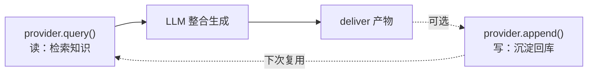
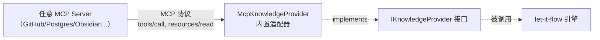

# 05 - 知识库 HTTP/MCP 协议规范

知识库（Knowledge Base）是 let-it-flow 与消费应用之间的关键解耦点。消费应用自行实现知识库服务（可以是 Obsidian vault、SQLite 数据库、向量库等），通过标准 HTTP 协议暴露给 let-it-flow 调用；平台侧用 `IKnowledgeProvider` 接口做客户端抽象。

## 5.1 设计目标

- **跨语言**：Obsidian 插件（TS）、笔记应用（Rust）、Web 服务（Python）都能实现
- **跨进程**：消费应用与 let-it-flow 独立运行，通过本地或远程 HTTP 通信
- **协议最小化**：只定义检索/读取/写入三类操作，实现简单
- **MCP 平滑升级**：当前用 REST，未来可升级为 MCP server
- **类型安全**：平台侧用 `IKnowledgeProvider` 接口抽象，封装底层 HTTP 调用

## 5.2 平台侧抽象（IKnowledgeProvider）

采纳自详细设计文档 §3.1 的 TS 接口，作为平台访问知识库的统一抽象。在 Flow Engineering 中，知识库不是被动数据库，而是"知识提供者（Knowledge Provider）"——需同时支持语义搜索、全文检索、元数据过滤，并支持流式检索与读写分离。

```typescript
// src/tools/knowledge/provider.ts
import { z } from "zod";

/** 知识库返回的单条内容块。 */
export const KnowledgeChunk = z.object({
  id: z.string().describe("唯一标识（如 Obsidian 相对路径或块 ID）"),
  content: z.string().describe("文本内容（建议 500-1000 字，见 §5.4 Chunking）"),
  source: z.string().describe('来源说明（如 "Obsidian/AI-Native.md"）'),
  score: z.number().min(0).max(1).optional().describe("检索相关性评分 0~1"),
  metadata: z.object({
    tags: z.array(z.string()).optional().describe('标签，如 ["#agent", "#knowledge"]'),
    mtime: z.number().optional().describe("修改时间（epoch ms）"),
  }).catchall(z.unknown()).optional(),
});
export type KnowledgeChunk = z.infer<typeof KnowledgeChunk>;

export const KnowledgeQueryParams = z.object({
  query: z.string().describe("检索关键词或自然语言问题"),
  limit: z.number().int().positive().optional().describe("返回的最大数量，默认 5"),
  tags: z.array(z.string()).optional().describe("按标签过滤（非常适合 Obsidian 的 frontmatter tags）"),
  threshold: z.number().min(0).max(1).optional().describe("相似度阈值，低于此值的结果被过滤"),
});
export type KnowledgeQueryParams = z.infer<typeof KnowledgeQueryParams>;

/** 写入参数（读写分离，见 §5.9）。 */
export const KnowledgeWriteParams = z.object({
  id: z.string().describe("条目唯一标识"),
  content: z.string().describe("文本内容"),
  source: z.string().optional(),
  metadata: z.record(z.string(), z.unknown()).optional(),
  expectedVersion: z.string().optional()
    .describe("乐观锁：update 时须带上读取时的版本号（ETag/mtime）。不匹配则写冲突（见 §5.9）"),
});
export type KnowledgeWriteParams = z.infer<typeof KnowledgeWriteParams>;

/** 知识库 provider 能力声明。 */
export interface KnowledgeCapabilities {
  vectorSearch: boolean;   // 是否支持向量语义搜索
  keywordSearch: boolean;  // 是否支持关键词/BM25 搜索
  streaming: boolean;      // 是否支持流式检索（queryStream）
  writable: boolean;       // 是否支持写入（append/update）
  versioned: boolean;      // 是否支持乐观锁版本控制（update 的冲突检测，见 §5.9）
}

/**
 * 知识库 provider 统一接口。
 * 任何消费应用或插件只需实现此接口，即可接入 let-it-flow。
 *
 * 内置实现：
 * - HttpKnowledgeProvider（默认，走 §5.3 REST 线协议，跨语言）
 * - ObsidianProvider（内置示例，本地 Markdown vault，见 §5.6）
 */
export interface IKnowledgeProvider {
  readonly name: string;        // 如 "obsidian-vault"
  readonly capabilities: KnowledgeCapabilities;

  /** 初始化连接（如扫描本地目录、加载索引、探测远程健康）。 */
  initialize(): Promise<void>;

  /** 核心检索接口：根据意图获取知识。 */
  query(params: KnowledgeQueryParams): Promise<KnowledgeChunk[]>;

  /**
   * 可选：流式检索。大库可逐条返回 chunk，提升前端感知速度。
   * 未实现时 capabilities.streaming 应为 false；引擎回退到 query。
   */
  queryStream?(params: KnowledgeQueryParams): AsyncIterable<KnowledgeChunk>;

  /** 可选：写入（读写分离，见 §5.5）。未实现时 capabilities.writable 应为 false。 */
  append?(params: KnowledgeWriteParams): Promise<void>;
  update?(id: string, params: Partial<KnowledgeWriteParams>): Promise<void>;
}
```

> **设计要点**：
> - `queryStream` 与 `append`/`update` 是可选方法，通过 `capabilities` 声明是否支持。引擎在调用前检查 capabilities，不支持的特性优雅降级。
> - `KnowledgeChunk.content` 建议 500-1000 字（见 §5.4 Chunking 约定），避免长笔记撑爆 LLM 上下文。

### HttpKnowledgeProvider 默认实现

```typescript
// src/tools/knowledge/http-provider.ts
import { getClient } from "../../llm/http-client"; // 进程级共享 fetch dispatcher

export class HttpKnowledgeProvider implements IKnowledgeProvider {
  readonly name = "http";
  readonly capabilities: KnowledgeCapabilities = {
    vectorSearch: true, keywordSearch: true, streaming: false, writable: true, versioned: true,
  };

  constructor(
    private readonly endpoint: string,
    private readonly token?: string,
  ) {}

  async initialize(): Promise<void> {
    // 可选：探测 endpoint 健康状态 / capabilities
  }

  async query(params: KnowledgeQueryParams): Promise<KnowledgeChunk[]> {
    const headers: Record<string, string> = { "Content-Type": "application/json" };
    if (this.token) headers.Authorization = `Bearer ${this.token}`;

    const resp = await fetch(`${this.endpoint.replace(/\/$/, "")}/kb/search`, {
      method: "POST",
      headers,
      body: JSON.stringify({
        query: params.query,
        top_k: params.limit,
        filter: params.tags ? { tags: params.tags } : undefined,
      }),
      dispatcher: getClient(),
    });

    if (!resp.ok) throw new Error(`知识库检索失败: ${resp.status} ${resp.statusText}`);

    const body = await resp.json() as ApiResponse;
    return body.data.results.map((r) => ({
      id: r.id,
      content: r.snippet ?? "",
      source: r.metadata?.source ?? r.title,
      score: r.score,
      metadata: r.metadata,
    }));
  }

  async append(params: KnowledgeWriteParams): Promise<void> {
    const headers: Record<string, string> = { "Content-Type": "application/json" };
    if (this.token) headers.Authorization = `Bearer ${this.token}`;
    const resp = await fetch(`${this.endpoint.replace(/\/$/, "")}/kb/upsert`, {
      method: "POST", headers, dispatcher: getClient(),
      body: JSON.stringify({ items: [params] }),
    });
    if (!resp.ok) throw new Error(`知识库写入失败: ${resp.status}`);
  }
}

interface ApiResponse {
  status: "success" | "error";
  data: {
    results: Array<{
      id: string; title: string; snippet?: string;
      score?: number; metadata?: Record<string, unknown>;
    }>;
    total: number;
  };
}
```

> **融合策略**：保留 §5.3 的 REST 端点作为**线协议**（跨语言通用），在 TS 侧用 `IKnowledgeProvider` 接口做客户端抽象。HTTP 形态用 `HttpKnowledgeProvider`；SDK 形态可直接注入 `ObsidianProvider` 等进程内实现。

## 5.3 线协议：三个标准端点

消费应用需实现以下 HTTP 端点。这是跨语言的线协议，与平台侧 TS 实现解耦。

### POST /kb/search

检索知识库，返回匹配条目的元数据（不含全文）。

**请求**：
```json
{
  "query": "电池技术 固态电池",
  "top_k": 10,
  "filter": {
    "tags": ["tech", "energy"],
    "date_from": "2023-01-01",
    "date_to": "2024-12-31"
  }
}
```

**响应**：
```json
{
  "status": "success",
  "data": {
    "results": [
      {
        "id": "note_001",
        "title": "固态电池技术路线对比",
        "snippet": "硫化物电解质 vs 氧化物电解质的能量密度...",
        "score": 0.92,
        "metadata": { "tags": ["tech"], "updated_at": "2024-03-15" }
      }
    ],
    "total": 1
  }
}
```

### POST /kb/retrieve

按 id 获取条目全文。

**请求**：
```json
{
  "ids": ["note_001", "note_002"]
}
```

**响应**：
```json
{
  "status": "success",
  "data": {
    "items": [
      {
        "id": "note_001",
        "title": "固态电池技术路线对比",
        "content": "## 技术路线\n硫化物电解质...",
        "metadata": { "tags": ["tech"], "source": "obsidian", "url": "obsidian://vault/notes/..." }
      }
    ]
  }
}
```

### POST /kb/upsert

写入或更新条目（可选，消费应用可不实现）。

**请求**：
```json
{
  "items": [
    {
      "id": "generated_001",
      "title": "宁德时代分析报告",
      "content": "...",
      "metadata": { "source": "let-it-flow", "task_id": "wf_001" }
    }
  ]
}
```

**响应**：
```json
{
  "status": "success",
  "data": { "upserted": 1 }
}
```

## 5.4 鉴权

知识库服务可通过 Bearer token 鉴权（可选）：

```http
POST /kb/search HTTP/1.1
Host: 127.0.0.1:7878
Authorization: Bearer <token>
Content-Type: application/json
```

token 由消费应用在提交 workflow 时通过 `config.knowledgeBase.token` 传入，let-it-flow 透传给知识库服务。

## 5.5 统一响应结构

遵循项目通用约定：

```json
{
  "status": "success | error",
  "data": { ... },
  "message": "可选说明"
}
```

错误响应：
```json
{
  "status": "error",
  "data": null,
  "message": "query 参数缺失"
}
```

HTTP 状态码：
- 200: 成功
- 400: 请求参数错误
- 401: 鉴权失败
- 404: 资源不存在
- 500: 服务内部错误

## 5.6 DAG 节点配置

在 DAG 中使用知识库（JSONPath 引用变量）：

```json
{
  "id": "kb_lookup",
  "kind": "knowledge_base",
  "label": "检索本地笔记",
  "params": {
    "endpoint": "http://127.0.0.1:7878",
    "token": "$.variables.kbToken",
    "action": "search",
    "query": "$.variables.topic",
    "topK": 10
  }
}
```

`endpoint` 和 `token` 通常由消费应用在提交 workflow 时通过 `config.knowledgeBase` 传入，planner 会填充到节点 params 中。

## 5.7 KnowledgeBaseTool 实现

```typescript
// src/tools/builtin/knowledge-base.ts
import type { Tool, StreamEvent, ExecutionContext } from "../base";

export class KnowledgeBaseTool implements Tool {
  readonly name = "builtin/knowledge_base";
  readonly kind = "knowledge_base";
  readonly tier = "core" as const;
  readonly description = "通过 HTTP 协议检索消费应用的本地知识库（笔记、文档、数据库）";
  readonly inputSchema = { /* 见 04-tool-protocol.md §4.4 */ };
  readonly outputSchema = { /* ... */ };

  async *execute(
    params: Record<string, unknown>,
    context: ExecutionContext,
  ): AsyncIterable<StreamEvent> {
    const endpoint = String(params.endpoint).replace(/\/$/, "");
    const token = params.token ? String(params.token) : undefined;
    const action = String(params.action);

    const headers: Record<string, string> = { "Content-Type": "application/json" };
    if (token) headers.Authorization = `Bearer ${token}`;

    yield { type: "stage", payload: { status: "running", action } };

    try {
      if (action === "search") {
        const resp = await fetch(`${endpoint}/kb/search`, {
          method: "POST",
          headers,
          body: JSON.stringify({
            query: params.query,
            top_k: params.topK ?? 10,
            filter: params.filter,
          }),
        });
        if (!resp.ok) throw new Error(`HTTP ${resp.status}`);
        const body = await resp.json();
        yield { type: "tool_result", payload: { result: body.data } };

      } else if (action === "retrieve") {
        const resp = await fetch(`${endpoint}/kb/retrieve`, {
          method: "POST",
          headers,
          body: JSON.stringify({ ids: params.ids }),
        });
        if (!resp.ok) throw new Error(`HTTP ${resp.status}`);
        const body = await resp.json();
        yield { type: "tool_result", payload: { result: body.data } };

      } else if (action === "upsert") {
        const resp = await fetch(`${endpoint}/kb/upsert`, {
          method: "POST",
          headers,
          body: JSON.stringify({ items: params.items }),
        });
        if (!resp.ok) throw new Error(`HTTP ${resp.status}`);
        const body = await resp.json();
        yield { type: "tool_result", payload: { result: body.data } };
      }
    } catch (e) {
      // 知识库不可达时降级为空结果，不中止 DAG
      yield { type: "error", payload: { message: String(e) } };
      yield { type: "tool_result", payload: { result: { results: [], total: 0 } } };
    }
  }
}
```

## 5.8 Mock KB Server 示例

消费应用开发时可用此 mock server 测试集成（放在 `examples/mock-kb-server/`）：

```typescript
// examples/mock-kb-server/index.ts
import { Hono } from "hono";

const app = new Hono();

// 模拟知识库
const DB: Record<string, { id: string; title: string; content: string; metadata: Record<string, unknown> }> = {
  note_001: {
    id: "note_001",
    title: "深度学习优化算法综述",
    content: "Adam、RMSProp、SGD with momentum 的对比...",
    metadata: { tags: ["ml"], updated_at: "2024-01-15" },
  },
  note_002: {
    id: "note_002",
    title: "Transformer 架构笔记",
    content: "Attention is all you need...",
    metadata: { tags: ["ml", "nlp"] },
  },
};

app.post("/kb/search", async (c) => {
  const body = await c.req.json<{ query: string; top_k?: number }>();
  const results = Object.values(DB)
    .filter((item) =>
      item.title.toLowerCase().includes(body.query.toLowerCase()) ||
      item.content.toLowerCase().includes(body.query.toLowerCase()),
    )
    .map((item) => ({
      id: item.id,
      title: item.title,
      snippet: item.content.slice(0, 100),
      score: 0.9,
      metadata: item.metadata,
    }))
    .slice(0, body.top_k ?? 10);
  return c.json({ status: "success", data: { results, total: results.length } });
});

app.post("/kb/retrieve", async (c) => {
  const { ids } = await c.req.json<{ ids: string[] }>();
  const items = ids.filter((id) => id in DB).map((id) => DB[id]);
  return c.json({ status: "success", data: { items } });
});

export default app;
```

启动：`tsx examples/mock-kb-server/index.ts`，知识库即监听 `http://127.0.0.1:7878`。

## 5.8 Chunking 自适应（实现约定）

本地 Obsidian 笔记可能长达数万字，直接塞给 LLM 会撑爆上下文或引入噪音。Provider 实现应内置轻量级 Chunker，确保返回的 `KnowledgeChunk.content` 大小适中。

| 维度 | 约定 | 说明 |
|------|------|------|
| 目标大小 | 500-1000 字/chunk | 兼顾上下文完整性与 token 成本 |
| 切分策略 | 按 Markdown 二级标题（`## `）优先 | 保留语义边界；无标题时按段落回退 |
| id 粒度 | `noteId#heading` 或 `noteId#chunk-N` | 允许同一笔记切出多 chunk |
| metadata | 保留原笔记 frontmatter（tags/mtime） | 透传到每个 chunk |

**非强制**：这是实现约定而非 schema 约束。`KnowledgeChunk.content` 的 schema 仅要求 `string`，但官方 provider（含 `ObsidianProvider`）遵循此约定。第三方 provider 可自行决定切分粒度，但建议参照。

> 此特性已纳入接口设计，M1 不强制实现；`ObsidianProvider` 内置示例会实现，作为参考。

> **与 Content Pipeline 的职责区分**：Chunking（本节）管"知识库**存储期**怎么把长文档切成可检索小块"；Content Pipeline（[07-executor.md](07-execulator.md) §7.6）管"检索/抓取回来后**注入下游 LLM 前**怎么压缩"。一个文档可能被 chunking 切成 10 块分别命中检索，命中结果合并后再由 Content Pipeline 的 strip/summarize/truncate 压缩注入。两者正交，不可互相替代。

## 5.9 读写分离（双向联动）

知识库不应只是只读检索源。Flow Engineering 的闭环要求：生成的产物可逆向写回知识库，形成"检索→生成→沉淀"的循环。

`IKnowledgeProvider` 通过可选方法 `append` / `update` 支持写入，由 `capabilities.writable` 声明。引擎在 `deliver` 后可触发可选的 `SaveToKnowledgeBase` 后置动作：



**约定**：
- 写入是**可选**的，provider 可不实现（`capabilities.writable = false`）
- `append` 用于新增条目，`update` 用于更新已有条目
- 写入触发由消费应用决定（通过 `config.saveToKnowledge: true` 或 DAG 中显式接 deliver→custom 写入工具节点）
- 写入不应阻塞 deliver 的产物交付（异步后置）

### 写冲突防护（乐观锁）

工作流写回本地 Obsidian 时，用户可能正在 Obsidian 里改同一篇笔记——直接覆写会丢失用户编辑。采用 **ETag/version 乐观锁**：`update` 前先读取版本号，写入时携带 `expectedVersion`，provider 比对不一致则拒绝。

```typescript
/** 写冲突错误：update 时 expectedVersion 与当前版本不符。 */
export class WriteConflictError extends Error {
  constructor(
    public readonly id: string,
    public readonly expectedVersion: string,
    public readonly currentVersion: string,
  ) {
    super(`写冲突：${id} 期望版本 ${expectedVersion}，当前已是 ${currentVersion}`);
    this.name = "WriteConflictError";
  }
}

// provider.update 实现（乐观锁示例）
async update(id: string, params: KnowledgeWriteParams): Promise<void> {
  const current = await this.readVersion(id);
  if (params.expectedVersion && current !== params.expectedVersion) {
    throw new WriteConflictError(id, params.expectedVersion, current);
  }
  // ... 写入并更新版本号（mtime/hash）...
}
```

**引擎侧冲突处理策略**（可配置，默认 `skip`）：

| 策略 | 行为 | 适用 |
|------|------|------|
| `skip`（默认） | 冲突时放弃本次写回，记 `progress` 事件提示"版本冲突，已跳过写回"，不阻塞 deliver | 低风险场景，宁可不写也不覆盖用户编辑 |
| `rename` | 冲突时另存为新条目（id 加后缀 `-conflict-{ts}`），保留双方 | 不能丢工作流产出但也不能覆盖用户 |
| `overwrite` | 强制覆盖（需显式配置，危险） | 极少用，仅纯只读库的批量刷新 |

> `capabilities.versioned: false` 的 provider（如简易 ObsidianProvider）不校验版本，引擎按 `skip` 策略兜底（写失败即跳过）。

### 写鉴权细化

`append`/`update` 比 `query` 风险更高（修改用户数据），鉴权须更严格：

| 维度 | query（读） | append/update（写） |
|------|------------|-------------------|
| 凭证 | Bearer token（§5.4） | 同左，**但建议独立 writeToken**（最小权限原则） |
| 范围 | 全库可读 | 可限定可写路径/namespace（如只允许写 `let-it-flow/` 子目录） |
| 审计 | 可选 | **建议强制**：每次写记录 `(taskId, id, version, ts)` 审计日志 |

SDK 形态下，写鉴权由消费应用在注入 provider 时配置；HTTP/MCP 形态下由 server 端校验。

### 增量同步协议

知识库内容会持续变化（用户在 Obsidian 加新笔记）。provider 不必每次全量重建索引，应支持增量同步：

| 同步方式 | 机制 | 适用 |
|---------|------|------|
| **文件 mtime 轮询**（ObsidianProvider 默认） | 扫描时比对 `mtime`，仅重新索引变更文件 | 本地文件型，简单可靠 |
| **变更游标**（HTTP provider） | provider 暴露 `GET /changes?since={cursor}`，返回增量列表 | 远程库，支持时序游标 |
| **MCP resources/list** | `McpKnowledgeProvider` 通过 `resources/updated` 通知或 `resources/list` 全量比对 | MCP 生态 |

增量同步发生在 provider 的 `initialize()`/`refresh()`，对引擎透明——引擎只调用 `query`，不感知索引何时刷新。

## 5.10 内置 ObsidianProvider（接口示例）

采纳"ObsidianProvider 进平台内核作为接口示例"的决策。它是 `IKnowledgeProvider` 的官方参考实现，演示如何把本地 Markdown vault 接入平台。**它不实现复杂向量化**，仅做关键词 + frontmatter tags 匹配，作为最简可用示例。

```typescript
// src/tools/knowledge/obsidian-provider.ts
import * as fs from "node:fs/promises";
import * as path from "node:path";
import type {
  IKnowledgeProvider, KnowledgeCapabilities,
  KnowledgeQueryParams, KnowledgeChunk, KnowledgeWriteParams,
} from "./provider";

export class ObsidianProvider implements IKnowledgeProvider {
  readonly name = "obsidian-vault";
  readonly capabilities: KnowledgeCapabilities = {
    vectorSearch: false,  // 简易实现：仅关键词
    keywordSearch: true,
    streaming: false,
    writable: true,
    versioned: false,     // 简易实现：不做乐观锁，写冲突按 skip 兜底（见 §5.9）
  };

  constructor(private readonly config: { vaultPath: string }) {}

  async initialize(): Promise<void> {
    const stats = await fs.stat(this.config.vaultPath);
    if (!stats.isDirectory()) throw new Error("Invalid Vault Path");
    // 生产实现可在此预建全局关键词索引/缓存
  }

  async query(params: KnowledgeQueryParams): Promise<KnowledgeChunk[]> {
    const { query, limit = 5, tags = [] } = params;
    const results: KnowledgeChunk[] = [];

    const files = await this.scanMarkdownFiles(this.config.vaultPath);
    for (const file of files) {
      // 按 ## 二级标题切分（见 §5.8 Chunking）
      const chunks = this.splitByHeadings(file.content);
      for (const chunk of chunks) {
        const fmTags = this.parseFrontmatterTags(chunk);
        const matchKeyword = chunk.content.toLowerCase().includes(query.toLowerCase());
        const matchTags = tags.length === 0 || tags.some((t) => fmTags.includes(t));
        if (matchKeyword && matchTags) {
          results.push({
            id: `${file.relPath}#${chunk.heading ?? "chunk-0"}`,
            content: chunk.content.slice(0, 1000),
            source: `Obsidian/${file.relPath}`,
            score: this.scoreMatch(chunk, query, tags),
            metadata: { tags: fmTags, mtime: file.mtime },
          });
        }
      }
    }
    return results.sort((a, b) => (b.score ?? 0) - (a.score ?? 0)).slice(0, limit);
  }

  async append(params: KnowledgeWriteParams): Promise<void> {
    const filePath = path.join(this.config.vaultPath, `${params.id}.md`);
    const frontmatter = params.metadata
      ? `---\n${Object.entries(params.metadata).map(([k, v]) => `${k}: ${v}`).join("\n")}\n---\n\n`
      : "";
    await fs.writeFile(filePath, frontmatter + params.content, "utf8");
  }

  // scanMarkdownFiles / splitByHeadings / parseFrontmatterTags / scoreMatch 略
  // 完整实现见 src/tools/knowledge/obsidian-provider.ts
}
```

**使用方式**：
- **SDK 形态**（进程内）：`new LetItFlow({ knowledge: new ObsidianProvider({ vaultPath: "~/.vault" }) })`
- **HTTP 形态**（远程）：把 `ObsidianProvider` 包装成 HTTP 服务部署，见 `examples/obsidian-kb-server/`

> **与 01 §1.7 边界的关系**：01 §1.7 说"不做知识库的**存储实现**"。ObsidianProvider 是**接口示例**（演示 IKnowledgeProvider 如何实现），而非平台的存储后端——它不存储 let-it-flow 自身的任务/产物数据，仍是消费应用侧的知识接入点。平台内核存储（task/artifact）走 `src/storage/`，与此无关。

## 5.11 其他消费应用实现指南

### SQLite / 向量库

若消费应用是 Node 服务，可直接实现 `IKnowledgeProvider`，数据源是 better-sqlite3 / ChromaDB / Qdrant 等。capabilities 中 `vectorSearch: true`。

### 远程部署（HTTP 线协议）

任何语言的消费应用都可按 §5.3 的 REST 线协议实现 HTTP 服务，平台用 `HttpKnowledgeProvider` 接入。`examples/obsidian-kb-server/` 演示如何把内置 `ObsidianProvider` 包装为远程 HTTP 服务。

## 5.12 MCP 桥接（内置适配器 McpKnowledgeProvider）

**核心策略**：内核协议保持极简（`IKnowledgeProvider` TS 接口），但**原生支持 MCP 桥接**。平台提供官方内置适配器 `McpKnowledgeProvider`，让任何现成的 MCP Server（GitHub MCP、PostgreSQL MCP、Obsidian MCP 等）零代码接入——消费应用只需配置 MCP Server URL，就能瞬间接入整个 MCP 生态的知识库能力。



### 能力映射

MCP 协议的三个原语映射到 `IKnowledgeProvider` 的方法：

| MCP 原语 | IKnowledgeProvider 方法 | 说明 |
|---------|------------------------|------|
| `tools/call`（name=`kb_search`） | `query(params)` | 语义/关键词检索 |
| `resources/read`（uri=`kb://item/{id}`） | `query` 内部或 retrieve 端点 | 读取单条资源 |
| `tools/call`（name=`kb_upsert`） | `append(params)` | 写入（读写分离） |

> MCP Server 不必实现所有原语。`McpKnowledgeProvider` 在 `initialize()` 时通过 `tools/list` 与 `resources/list` 探测可用能力，动态设置 `capabilities`（如不支持 `kb_upsert` 则 `writable: false`）。

### 实现

```typescript
// src/tools/knowledge/mcp-provider.ts
import type {
  IKnowledgeProvider, KnowledgeCapabilities,
  KnowledgeQueryParams, KnowledgeChunk, KnowledgeWriteParams,
} from "./provider";

/**
 * MCP 桥接适配器：把任意 MCP Server 接入为 IKnowledgeProvider。
 *
 * 用法：
 *   const kb = new McpKnowledgeProvider({ serverUrl: "http://localhost:3000/mcp" });
 *   await kb.initialize();
 *   const flow = new LetItFlow({ knowledge: kb });
 */
export class McpKnowledgeProvider implements IKnowledgeProvider {
  readonly name = "mcp";
  readonly capabilities: KnowledgeCapabilities = {
    vectorSearch: false, keywordSearch: true, streaming: false, writable: false, versioned: false,
  };

  constructor(private readonly config: { serverUrl: string; token?: string }) {}

  async initialize(): Promise<void> {
    // 探测 MCP Server 能力：tools/list + resources/list
    const tools = await this.mcpCall("tools/list", {});
    const hasSearch = tools.some((t) => t.name === "kb_search");
    const hasUpsert = tools.some((t) => t.name === "kb_upsert");
    this.capabilities.keywordSearch = hasSearch;
    this.capabilities.vectorSearch = hasSearch;  // 视具体 MCP Server 能力
    this.capabilities.writable = hasUpsert;
  }

  async query(params: KnowledgeQueryParams): Promise<KnowledgeChunk[]> {
    const resp = await this.mcpCall("tools/call", {
      name: "kb_search",
      arguments: { query: params.query, top_k: params.limit, tags: params.tags },
    });
    return resp.map((r: Record<string, unknown>) => ({
      id: String(r.id),
      content: String(r.content ?? r.snippet ?? ""),
      source: String(r.source ?? r.metadata?.source ?? "mcp"),
      score: r.score as number | undefined,
      metadata: r.metadata as Record<string, unknown> | undefined,
    }));
  }

  async append(params: KnowledgeWriteParams): Promise<void> {
    if (!this.capabilities.writable) throw new Error("MCP Server 不支持写入");
    await this.mcpCall("tools/call", {
      name: "kb_upsert",
      arguments: { items: [params] },
    });
  }

  /** MCP 协议调用封装（JSON-RPC over HTTP）。 */
  private async mcpCall(method: string, params: Record<string, unknown>): Promise<any> {
    const headers: Record<string, string> = { "Content-Type": "application/json" };
    if (this.config.token) headers.Authorization = `Bearer ${this.config.token}`;
    const resp = await fetch(this.config.serverUrl, {
      method: "POST",
      headers,
      body: JSON.stringify({ jsonrpc: "2.0", id: crypto.randomUUID(), method, params }),
    });
    if (!resp.ok) throw new Error(`MCP 调用失败: ${resp.status}`);
    const body = await resp.json();
    return body.result;
  }
}
```

### 配置方式

```typescript
// SDK 形态：配置 MCP Server URL 即接入
const flow = new LetItFlow({
  knowledge: new McpKnowledgeProvider({
    serverUrl: "http://localhost:3000/mcp",  // 任意 MCP Server
    token: "optional-bearer",
  }),
});
```

```json
// HTTP 形态：POST /api/workflows 的 config.knowledgeBase
{
  "knowledgeBase": {
    "type": "mcp",
    "serverUrl": "http://localhost:3000/mcp",
    "token": "optional-bearer"
  }
}
```

### 与 REST 线协议的关系

| 接入方式 | 适用场景 | 实现 |
|---------|---------|------|
| `HttpKnowledgeProvider`（§5.3 REST） | 消费应用自建 HTTP 知识库服务 | 平台默认 provider |
| `McpKnowledgeProvider`（本节） | **接入现成 MCP Server，零代码** | 平台内置适配器 |
| `ObsidianProvider`（§5.10） | 本地 Markdown vault 示例 | 平台内置示例 |

> REST 线协议（§5.3）保留为消费应用自建服务的通用方式；MCP 桥接是为"复用生态"而生的快捷通道。两者都实现 `IKnowledgeProvider`，对引擎透明。未来 REST 服务也可平滑升级为 MCP Server，能力映射见上表。

## 5.13 相关文档

- [04-tool-protocol.md](04-tool-protocol.md) - KnowledgeBaseTool 是内置工具之一；FlowConnector 统一抽象；flow-manifest 外部工具自描述
- [03-dag-schema.md](03-dag-schema.md) - knowledge_base 节点配置
- [02-architecture.md](02-architecture.md) - SDK/HTTP 双形态下知识库的注入方式
