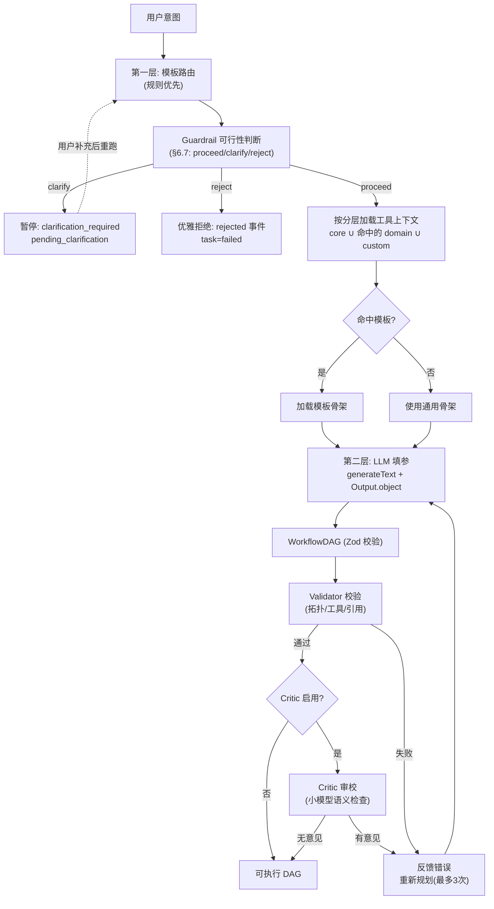

# 06 - 规划器与模板库

Planner 是 let-it-flow 把"自然语言意图"转化为"可执行 DAG"的核心组件。采用**两层规划机制**：模板路由（快速匹配）+ LLM 填参（灵活细化），输出经 AI SDK v6 结构化输出保证类型安全。

## 6.1 两层规划架构



## 6.2 第一层：模板路由

通过规则匹配意图关键词，快速路由到预定义模板骨架。规则优先，避免每次都把全部上下文喂给 LLM。

### 内置模板

| templateId | 匹配关键词 | 适用场景 | 骨架结构 |
|-------------|-----------|---------|---------|
| `research` | 分析、研究、调研、对比、综述 | 股票分析、行业调研、竞品对比 | search(多角度) → fetch → [可选 kb] → llm整合 → deliver |
| `content` | 生成、制作、创作、写、做 | 播客制作、文案创作、视频脚本 | search + kb → llm生成 → [可选自定义工具] → deliver |
| `qa` | 是什么、解释、如何、为什么、？ | 知识问答、概念解释 | kb检索 → [可选 web] → llm问答 → deliver |
| `summary` | 总结、摘要、概括、提炼 | 文档摘要、会议纪要 | fetch(给定URL) → llm总结 → deliver |

### 路由规则实现

```typescript
// src/planner/templates.ts

const TEMPLATE_RULES: Array<[string, RegExp]> = [
  ["research", /分析|研究|调研|对比|综述|investigate|analyze|research|compare/],
  ["content", /生成|制作|创作|写|做|generate|create|produce|write|make/],
  ["qa", /是什么|解释|如何|为什么|怎么办|\?|？|what|how|why|explain/],
  ["summary", /总结|摘要|概括|提炼|summarize|digest/],
];

export function routeTemplate(intent: string): string | null {
  for (const [templateId, pattern] of TEMPLATE_RULES) {
    if (pattern.test(intent)) return templateId;
  }
  return null;
}

export interface TemplateSkeleton {
  templateId: string;
  description: string;
  nodesHint: Array<{
    kind: string;
    idPrefix: string;
    count: "multiple" | "optional" | number;
    toolRole?: string;
    purpose: string;
  }>;
}

const RESEARCH_SKELETON: TemplateSkeleton = {
  templateId: "research",
  description: "研究分析类工作流：多角度搜索 → 抓取 → [可选知识库] → LLM整合 → 交付",
  nodesHint: [
    { kind: "web_search", idPrefix: "search", count: "multiple", purpose: "多角度搜索" },
    { kind: "web_fetch", idPrefix: "fetch", count: 1, purpose: "抓取详情" },
    { kind: "knowledge_base", idPrefix: "kb", count: "optional", purpose: "内部资料" },
    { kind: "llm", idPrefix: "llm", count: 1, toolRole: "integrator", purpose: "整合分析" },
    { kind: "deliver", idPrefix: "deliver", count: 1, purpose: "交付报告" },
  ],
};

const CONTENT_SKELETON: TemplateSkeleton = {
  templateId: "content",
  description: "内容创作类工作流：搜索 + 知识库 → LLM生成 → [可选自定义工具] → 交付",
  nodesHint: [
    { kind: "web_search", idPrefix: "search", count: 1, purpose: "主题资料" },
    { kind: "knowledge_base", idPrefix: "kb", count: "optional", purpose: "本地素材" },
    { kind: "web_fetch", idPrefix: "fetch", count: 1, purpose: "抓取网页" },
    { kind: "llm", idPrefix: "llm", count: 1, toolRole: "creator", purpose: "生成内容" },
    { kind: "tool", idPrefix: "custom", count: "optional", purpose: "后处理（如TTS）" },
    { kind: "deliver", idPrefix: "deliver", count: 1, purpose: "交付产物" },
  ],
};

const QA_SKELETON: TemplateSkeleton = {
  templateId: "qa",
  description: "问答类工作流：知识库检索 → [可选网络补充] → LLM问答 → 交付",
  nodesHint: [
    { kind: "knowledge_base", idPrefix: "kb", count: 1, purpose: "检索答案" },
    { kind: "web_search", idPrefix: "search", count: "optional", purpose: "补充信息" },
    { kind: "llm", idPrefix: "llm", count: 1, toolRole: "qa", purpose: "生成答案" },
    { kind: "deliver", idPrefix: "deliver", count: 1, purpose: "交付答案" },
  ],
};

export const TEMPLATES: Record<string, TemplateSkeleton> = {
  research: RESEARCH_SKELETON,
  content: CONTENT_SKELETON,
  qa: QA_SKELETON,
};
```

## 6.3 第二层：LLM 填参（AI SDK v6 结构化输出）

把意图 + 模板骨架 + 可用工具清单交给 planner LLM，通过 AI SDK v6 的 `generateText` + `Output.object` 直接生成符合 Zod schema 的强类型 DAG。

> **关键**：AI SDK v6 移除了独立的 `generateObject`，统一为 `generateText({ output: Output.object({ schema }) })`。planner 不直接调用，而是经 `RobustOutputGuard`（`guardedGenerateObject`，见 [02-architecture.md](02-architecture.md) §2.8）守护——按模型能力走原生强约束或弱模型平替（Prompt 脚手架 + 鲁棒解析），保证多模型下 DAG 编译的绝对稳定性。解析/校验反复失败时降级为 Fallback DAG（见 §6.6）。

### Planner 主流程

```typescript
// src/planner/planner.ts
import { type LanguageModel } from "ai";
import { WorkflowDAG } from "./dag-schema";
import { registry } from "../tools/registry";
import type { ToolTier } from "../tools/base";
import { routeTemplate, TEMPLATES, type TemplateSkeleton } from "./templates";
import { validateDag } from "./validator";
import { buildSystemPrompt } from "./prompts/system-prompt";
import { loadFewShots } from "./prompts/few-shots";
import { guardedGenerateObject } from "../llm/robust-output-guard";  // 结构化输出守卫（见 02 §2.8）
import { buildFallbackDag } from "./fallback";                       // 降级兜底（见 §6.6）

export interface PlannerConfig {
  model: LanguageModel | string;   // 如 "openai/gpt-4o" 或 model 实例
  structuredSupport?: "native" | "weak";  // 模型结构化输出能力（见 02 §2.8），缺省 native
  knowledgeBaseEndpoint?: string;
  searchProvider?: string;
  customTools?: string[];          // 消费应用注入的自定义工具 name
}

const MAX_RETRIES = 3;

export async function plan(
  intent: string,
  config: PlannerConfig,
): Promise<WorkflowDAG> {
  // 第一层：模板路由
  const templateId = routeTemplate(intent);
  const skeleton = templateId ? TEMPLATES[templateId] : undefined;

  // 两阶段动态工具检索：粗筛（分层）+ 精排（向量 top-K），见 04 §4.7
  const availableTools = await selectToolsForPlanner(intent, config, registry);

  // 装配 prompt
  const system = buildSystemPrompt({ availableTools });
  const fewShots = await loadFewShots(templateId);
  const userMsg = buildUserMessage(intent, skeleton, config, fewShots);

  // 第二层：LLM 填参（结构化输出，经 RobustOutputGuard 守护，见 02 §2.8）
  let dag: WorkflowDAG | undefined;
  let lastError: string | undefined;

  for (let attempt = 0; attempt < MAX_RETRIES; attempt++) {
    try {
      // 守卫层：按模型能力（native/weak）走原生强约束或 Prompt 脚手架 + 鲁棒解析
      const { data: output, rawText } = await guardedGenerateObject(
        config.model,
        WorkflowDAG,
        [{ role: "user", content: userMsg }],
        { structuredSupport: config.structuredSupport ?? "native" },
        { system, temperature: 0.2 },
      );

      if (!output) throw new Error(`LLM 输出非合法结构化对象（解析失败）${rawText ? `, 原始文本: ${rawText.slice(0, 200)}` : ""}`);

      // 业务层校验（拓扑/工具/引用）
      const errors = validateDag(output, registry);
      if (errors.length === 0) {
        // Critic 语义审校（可选，见 §6.8；默认关闭）
        const critique = await critiqueDag(intent, output, config);
        if (critique === null) {
          dag = output;
          break;
        }
        // Critic 有意见：并入 retry feedback
        lastError = `Critic 审校意见: ${critique}`;
        userMsg = appendRetryFeedback(userMsg, [lastError], attempt);
      } else {
        lastError = errors.join("; ");
        // 带错误反馈重新规划
        userMsg = appendRetryFeedback(userMsg, errors, attempt);
      }
    } catch (e) {
      // 解析失败/结构化输出失败：计为一次重试，反馈错误让 LLM 重规划（不抛底层 Crash）
      lastError = e instanceof Error ? e.message : String(e);
      userMsg = appendRetryFeedback(userMsg, [lastError], attempt);
    }
  }

  if (!dag) {
    // 降级保障：3 次重试耗尽，返回 Fallback DAG 而非抛异常，保证流式确定性（见 §6.6）
    return buildFallbackDag(intent, lastError);
  }
  return dag;
}

function buildUserMessage(
  intent: string,
  skeleton: TemplateSkeleton | undefined,
  config: PlannerConfig,
  fewShots: string[],
): string {
  const parts: string[] = [`## 用户意图\n${intent}`];
  if (skeleton) {
    parts.push(`## 推荐模板\n${JSON.stringify(skeleton, null, 2)}`);
  }
  if (config.knowledgeBaseEndpoint) {
    parts.push(`## 知识库配置\nendpoint: ${config.knowledgeBaseEndpoint}`);
  } else {
    parts.push("## 知识库配置\n无（不要添加 knowledge_base 节点）");
  }
  if (config.searchProvider) {
    parts.push(`## 搜索后端\n${config.searchProvider}`);
  }
  if (fewShots.length > 0) {
    parts.push(`## 黄金示例参考\n${fewShots.join("\n\n")}`);
  }
  return parts.join("\n\n");
}
```

## 6.4 契约式 System Prompt

采纳自详细设计文档 §4.2 的四段式骨架，强制约束 planner 输出符合规范的 DAG。System Prompt 作为可维护资产存放于 `src/planner/prompts/system-prompt.md`。

```markdown
<!-- src/planner/prompts/system-prompt.md -->
# ROLE & OBJECTIVE
你是一个高精度的 "意图到工作流图（Intent-to-DAG）" 编译器。你的唯一任务是分析用户的自然语言意图，并将其翻译成一个逻辑闭环、无死循环、数据流合法的 JSON 任务图（DAG）。你不是聊天助手，不要输出任何解释性文本。

# GENERAL CONSTRAINTS (绝对硬约束)
1. 必须且只能输出符合指定 JSON Schema 的数据，不要包含任何前导、后导解释文本，也不要使用 markdown 代码块包裹。
2. 变量引用约束：从前置任务引用数据时，必须使用标准的 JSONPath 语法：
   `$.tasks.前置id.output.字段名`。禁止写"上一步的结果"这类意会描述。
3. 执行顺序约束：如果任务 B 的输入依赖任务 A 的输出，B 必须在 edges 中显式声明依赖 A。
4. 最小化步骤原则：严禁生成无实际意义的冗余转发步骤。一步 LLM 整合能解决的，不要拆成两步。
5. 有且仅有一个 deliver 节点作为终点。
6. web_fetch 节点通过 inputRefs 接收上游 search 节点的 output.results。
7. llm 节点的 inputRefs 指向要整合的内容来源。
8. 知识库节点仅在配置提供了 endpoint/provider 时添加（见 user message 的"知识库配置"）。
9. 对于研究类任务，建议从多个角度搜索（拆分 2-3 个 search 节点）。
10. 顶层 planRationale 必须填写规划思考逻辑（一句话说明链路设计理由）。

# OUTPUT SCHEMA
字段说明：
- planRationale: 规划思考逻辑（必填）
- tasks[]: 节点列表，每项含 id/kind/label/params/inputRefs
- edges[]: 依赖边，每项含 source/target
- variables: 从意图中提取的关键变量，供节点通过 $.variables.xxx 引用

# AVAILABLE TOOLS (当前可用工具空间)
这里列出你唯一可以调用的工具列表。绝对不能使用此处未声明的任何工具名称。
每个工具含：name / description / whenToUse（何时调用、何时不调用）/ inputSchema（入参）/ outputSchema（输出结构）/ outputExample（输出样例，决定你下一步能引用哪些字段）。

${AVAILABLE_TOOLS_JSON}

# FEW-SHOT EXAMPLES (黄金示例)
见 user message 中的 "黄金示例参考" 段落。仔细观察示例中的依赖关系和 JSONPath 参数引用方式——LLM 的模仿能力远强于纯推理能力。

# EXECUTION GENERATION GUIDE
现在，请仔细分析 user message 中的用户实际意图，结合上方"当前可用工具空间"的工具契约（注意 whenToUse 判断选哪个工具，注意 outputExample 判断下游参数引用哪些字段），输出一个逻辑闭环、无死循环、数据流合法的任务图 JSON。
```

### Prompt 装配

```typescript
// src/planner/prompts/system-prompt.ts
import { readFileSync } from "node:fs";
import { resolve } from "node:path";
import { fileURLToPath } from "node:url";

const __dirname = fileURLToPath(new URL(".", import.meta.url));
const SYSTEM_PROMPT_TEMPLATE = readFileSync(
  resolve(__dirname, "system-prompt.md"),
  "utf8",
);

export function buildSystemPrompt(opts: {
  availableTools: Array<Record<string, unknown>>;
}): string {
  return SYSTEM_PROMPT_TEMPLATE.replace(
    "${AVAILABLE_TOOLS_JSON}",
    JSON.stringify(opts.availableTools, null, 2),
  );
}
```

## 6.5 Few-Shot 黄金示例库

采纳自详细设计文档 §4.2，要求「3-5 个涵盖跨域协同、依赖传递的黄金 Few-Shot 示例」。作为可维护资产存放于 `src/planner/prompts/few-shots/`。

```
src/planner/prompts/few-shots/
├── research-stock-analysis.json      # 多角度搜索 + kb 协同
├── content-podcast-cross-domain.json # web + kb + llm + tool 四类节点
├── qa-knowledge-only.json            # 纯知识库问答
├── summary-given-url.json            # fetch → llm 短链路
└── multi-angle-search.json           # 并行多角度搜索
```

```typescript
// src/planner/prompts/few-shots.ts
import { glob } from "node:fs/promises";

/**
 * 加载与当前模板相关的 few-shot 示例。
 * 每个示例是一个完整的 DAG JSON（带 planRationale），
 * 格式化为 "意图 → DAG" 的对照文本注入 user message。
 */
export async function loadFewShots(templateId?: string): Promise<string[]> {
  const dir = new URL("./few-shots/", import.meta.url);
  const files = templateId
    ? await glob(`${dir}*.json`)
    : await glob(`${dir}*${templateId}*.json`);

  const shots = await Promise.all(
    files.slice(0, 5).map(async (f) => {
      const dag = JSON.parse(await readFile(f, "utf8"));
      return `### 示例：${dag.intent}\n\`\`\`json\n${JSON.stringify(dag, null, 2)}\n\`\`\``;
    }),
  );
  return shots;
}
```

> **重要**：few-shot 示例**不得**与评测用例（见 [11-benchmark-and-eval.md](11-benchmark-and-eval.md)）重叠，否则评测变成"背答案"，失去泛化检验意义。

## 6.6 Validator 校验规则

```typescript
// src/planner/validator.ts
import type { WorkflowDAG } from "./dag-schema";
import type { ToolRegistry } from "../tools/registry";

export function validateDag(dag: WorkflowDAG, registry: ToolRegistry): string[] {
  const errors: string[] = [];
  const taskIds = new Set(dag.tasks.map((t) => t.id));

  // 1. 结构完整性：edge 的 source/target 必须存在
  for (const e of dag.edges) {
    if (!taskIds.has(e.source)) errors.push(`边指向不存在的节点: source=${e.source}`);
    if (!taskIds.has(e.target)) errors.push(`边指向不存在的节点: target=${e.target}`);
  }

  // 2. 拓扑无环
  if (hasCycle(dag)) errors.push("DAG 存在环");

  // 3. deliver 唯一且为终点
  const deliverNodes = dag.tasks.filter((t) => t.kind === "deliver");
  if (deliverNodes.length === 0) errors.push("缺少 deliver 节点");
  else if (deliverNodes.length > 1) errors.push("deliver 节点超过一个");
  else {
    const deliverId = deliverNodes[0].id;
    if (dag.edges.some((e) => e.source === deliverId)) {
      errors.push("deliver 节点不能有后继");
    }
  }

  // 4. 工具存在性
  for (const t of dag.tasks) {
    if ((t.kind === "llm" || t.kind === "tool") && t.toolName) {
      if (!registry.get(t.toolName)) {
        errors.push(`节点 ${t.id} 引用未注册的工具: ${t.toolName}`);
      }
    }
  }

  // 5. 引用合法性：inputRefs 的 node id 必须是前驱
  const predecessors = buildPredecessorMap(dag);
  for (const t of dag.tasks) {
    for (const ref of t.inputRefs) {
      const refNodeId = extractRefNodeId(ref);
      if (refNodeId && !predecessors.get(t.id)?.has(refNodeId)) {
        errors.push(`节点 ${t.id} 引用了非前驱节点: ${refNodeId}`);
      }
    }
  }

  return errors;
}

function hasCycle(dag: WorkflowDAG): boolean {
  // Kahn 算法检测环
  const inDegree = new Map(dag.tasks.map((t) => [t.id, 0]));
  const adj = new Map(dag.tasks.map((t) => [t.id, [] as string[]]));
  for (const e of dag.edges) {
    adj.get(e.source)!.push(e.target);
    inDegree.set(e.target, (inDegree.get(e.target) ?? 0) + 1);
  }
  const queue = [...inDegree.entries()].filter(([, d]) => d === 0).map(([id]) => id);
  let visited = 0;
  while (queue.length) {
    const nid = queue.pop()!;
    visited++;
    for (const nxt of adj.get(nid) ?? []) {
      inDegree.set(nxt, (inDegree.get(nxt) ?? 1) - 1);
      if (inDegree.get(nxt) === 0) queue.push(nxt);
    }
  }
  return visited !== dag.tasks.length;
}

function extractRefNodeId(ref: string): string | null {
  // 解析 $.tasks.<id>.output... 提取 <id>
  const match = ref.match(/^\$\.tasks\.([^.]+)\.output/);
  return match ? match[1] : null;
}
```

### 降级保障（Fallback DAG）

当 planner 经 `MAX_RETRIES`（3 次）重试仍无法产出合法 DAG（解析失败 / schema 不符 / 校验不过），**不抛异常**，而是返回固定的 Fallback DAG，保证流程仍能流式走完：

```typescript
// src/planner/fallback.ts
export function buildFallbackDag(intent: string, lastError?: string): WorkflowDAG {
  return {
    id: `fallback-${Date.now()}`,
    intent,
    planRationale: `规划降级：${MAX_RETRIES} 次重试失败（${lastError ?? "未知原因"}），返回兜底单节点 DAG`,
    templateId: null,
    variables: {},
    tasks: [
      {
        id: "llm_synthesis",
        kind: "llm",
        label: "降级应答",
        toolName: "integrator",
        params: {
          systemPrompt: "你是 let-it-flow 的降级应答节点。规划失败时礼貌告知用户并建议简化意图。",
          userPrompt: `抱歉，我在规划工作流时遇到格式解析错误，未能为您构建任务流程。请尝试简化您的意图描述，例如提供更具体的主题或标的。`,
        },
        inputRefs: [],
        description: "规划降级兜底节点",
      },
      {
        id: "deliver",
        kind: "deliver",
        label: "交付",
        toolName: "default",
        params: { content: "$.tasks.llm_synthesis.output.text" },
        inputRefs: ["$.tasks.llm_synthesis.output"],
        description: "降级产物交付",
      },
    ],
    edges: [{ source: "llm_synthesis", target: "deliver" }],
    requirePlanConfirmation: false,
    onNodeError: "abort",
    retryAttempts: 2,
  };
}
```

> **与 Guardrail `rejected` 的区分**（见 §6.7）：Fallback DAG 是"想规划但解析/校验反复失败"的兜底，task 正常 `completed`（带降级标记）；`rejected` 是"根本不该规划"（越界意图）的拒绝，task 置 `failed`。两者事件类型与状态不同。

## 6.7 Guardrail（意图护栏）与反向追问

Intent Router（模板路由 §6.2）在面对**模糊意图**（如"帮我看看那个股票"——缺标的）或**越界意图**（如"帮我点杯咖啡"——无工具可服务）时，需优雅处理而非硬规划出一个注定失败的 DAG。Guardrail 是 planner 入口前的**可行性判断层**，默认走**规则层**，小模型语义判断为后续迭代（见 [09-milestones-and-todolist.md](09-milestones-and-todolist.md) §9.4）。

### 三种处理路径

| 情形 | 判定依据 | 处理 | 产出事件 / 状态 |
|------|---------|------|----------------|
| **明确可行** | 路由命中模板 且 关键参数齐全 | 进入正常规划 | `stage`(planning) |
| **意图模糊**（可澄清） | 路由命中但缺关键参数（如分析类缺标的物） | 暂停，反向追问 | `clarification_required` / `pending_clarification` |
| **越界/不可服务** | 路由未命中 且 无任何工具可覆盖 | 优雅拒绝，说明边界 | `rejected` / `failed`（带原因） |

> 三者只取其一，按"可行 > 模糊 > 越界"顺序判定。命中模板即视为可行，不轻易拒绝。

### 规则层实现（M1 内置）

```typescript
// src/planner/guardrail.ts

export interface GuardrailResult {
  decision: "proceed" | "clarify" | "reject";
  /** decision=clarify 时要问的问题 */
  questions?: Array<{ field: string; prompt: string; required: boolean }>;
  /** decision=reject 时的友好原因 + 重试建议 */
  reason?: string;
  suggestRetry?: string;
}

export function guardrailCheck(
  intent: string,
  routedTemplate: string | null,
  registry: ToolRegistry,
): GuardrailResult {
  // 1) 越界：路由未命中 且 关键词扫描无任何可服务能力
  if (routedTemplate === null && !hasAnyServiceableSignal(intent, registry)) {
    return {
      decision: "reject",
      reason: "该请求超出当前工具链覆盖范围。",
      suggestRetry: "可服务能力：网络检索 / 知识库问答 / 内容生成 / 文档摘要。",
    };
  }
  // 2) 模糊：命中模板但缺关键参数（示例：research 缺分析标的）
  const missing = detectMissingParams(intent, routedTemplate);
  if (missing.length > 0) {
    return {
      decision: "clarify",
      questions: missing.map((m) => ({
        field: m.field,
        prompt: m.prompt,
        required: true,
      })),
    };
  }
  // 3) 可行
  return { decision: "proceed" };
}
```

### clarify / reject 的闭环

- **clarify**：task 进入 `pending_clarification`，发 `clarification_required` 事件（payload 见 [08-task-streaming.md](08-task-streaming.md) §8.7）。用户经 `POST /api/tasks/:id/clarify` 补充信息后，用**补充后的意图**重跑 planner 入口。保留原 task id，不新建。
- **reject**：task 直接置 `failed`，发 `rejected` 事件（payload 含 `reason` + `suggestRetry`），不消耗 LLM 规划预算。

> Guardrail 只做"准入可行性"判断，**不替代** Validator（结构校验）与 Critic（语义审校）——三者职责正交：Guardrail 管"该不该规划"、Validator 管"规划得对不对"、Critic 管"规划得好不好"。

### 后续迭代（§9.4 登记）

| 增强项 | 机制 |
|--------|------|
| **小模型语义判定层** | 用低成本模型（如 haiku）做"越界/模糊"的语义判断，规则层作为兜底，覆盖规则遗漏的边界 |
| **澄清后置合并** | 多轮 clarify 的补充信息累积合并到意图上下文，而非简单覆盖 |

## 6.8 LLM Critic 审校阶段（Refinement Loop，可选）

现有流程是 "草稿 → 代码 Linting（Validator）→ Retry"。为提升规划质量，在 Validator 通过后、执行前，可插入一个可选的 **LLM Critic 审校员**——用极小极快的模型（如 `gpt-4o-mini` 或 Groq 极速模型）做**语义审查**，检查 Validator 无法发现的逻辑遗漏。

### Critic 与 Validator 的分工

| 阶段 | 检查类型 | 示例 |
|------|---------|------|
| Validator（§6.6，必经） | **语法/结构**校验 | 环检测、引用节点存在性、deliver 唯一、工具已注册 |
| Critic（本节，可选） | **语义/约束**审查 | "用户说'只要最近 24h 新闻'，但 search 节点没传时间参数" |

### Critic 审查项

Critic 拿到 `(意图, DAG)`，检查以下语义遗漏并产出 critique：

1. **关键约束遗漏**：用户意图中的时间/数量/范围约束是否体现在节点参数中
2. **工具选择合理性**：选用的工具是否符合其 `whenToUse`（如该用 knowledge_base 却用了 web_search）
3. **数据流闭环**：llm 节点是否真正引用了它声称要整合的来源字段

### 实现（预留，M5 后迭代）

```typescript
// src/planner/critic.ts（预留，非 M1-M7 实装）
import { generateText } from "ai";

export interface PlannerConfig {
  // ... 既有字段 ...
  criticModel?: string;          // 启用 Critic：传入小模型，如 "openai/gpt-4o-mini"
  criticEnabled?: boolean;       // 默认 false
}

/**
 * Critic 审校：返回语义审查意见。无意见返回 null（DAG 通过），有意见返回 critique 文本。
 * 列为 M5 后迭代项；接口先预留，避免扩大 M1-M7 范围。
 */
export async function critiqueDag(
  intent: string,
  dag: WorkflowDAG,
  config: PlannerConfig,
): Promise<string | null> {
  if (!config.criticEnabled || !config.criticModel) return null;

  const { text } = await generateText({
    model: config.criticModel,
    system: `你是工作流审校员。检查 DAG 是否遗漏用户意图中的关键约束（时间/数量/范围），或选错工具。无问题输出 "PASS"，有问题输出具体 critique。`,
    messages: [{ role: "user", content: `意图: ${intent}\nDAG: ${JSON.stringify(dag)}` }],
  });

  return text.trim() === "PASS" ? null : text;
}
```

> **成本控制**：Critic 默认关闭（`criticEnabled: false`）。仅在质量敏感场景开启，且用小模型，避免每次规划多一次大模型调用。Critic 产出的 critique 并入 retry feedback（与 Validator 错误同处理路径）。

## 6.9 规划示例

**输入意图**：`"分析宁德时代的新能源电池行业地位"`

**第一层**：命中 `research` 模板

**第二层**：Planner LLM 输出（经 `Output.object` 校验，节选）：
```json
{
  "planRationale": "从行业格局与公司动态两个角度检索，抓取详情后由 LLM 撰写综合分析报告。",
  "templateId": "research",
  "variables": { "company": "宁德时代", "sector": "新能源电池" },
  "tasks": [
    { "id": "search_industry", "kind": "web_search", "label": "行业格局", "params": { "query": "$.variables.sector 行业格局 2024" } },
    { "id": "search_company", "kind": "web_search", "label": "公司动态", "params": { "query": "$.variables.company 财报 产能" } },
    { "id": "fetch_all", "kind": "web_fetch", "label": "抓取详情", "inputRefs": ["$.tasks.search_industry.output.results", "$.tasks.search_company.output.results"] },
    { "id": "llm_analysis", "kind": "llm", "label": "撰写报告", "toolName": "integrator", "inputRefs": ["$.tasks.fetch_all.output.contents"] },
    { "id": "deliver", "kind": "deliver", "label": "交付报告", "inputRefs": ["$.tasks.llm_analysis.output.text"] }
  ],
  "edges": [
    { "source": "search_industry", "target": "fetch_all" },
    { "source": "search_company", "target": "fetch_all" },
    { "source": "fetch_all", "target": "llm_analysis" },
    { "source": "llm_analysis", "target": "deliver" }
  ]
}
```

## 6.10 自定义模板扩展

消费应用可通过 API 注册自定义模板（M3 之后支持）：

```typescript
// 未来 API: POST /api/templates
// {
//   "templateId": "competitor_analysis",
//   "matchKeywords": ["竞品", "对手", "competitive"],
//   "skeleton": { ... }
// }
```

## 6.11 相关文档

- [02-architecture.md](02-architecture.md) §2.8 - 多模型平替与结构化输出鲁棒性（RobustOutputGuard）
- [03-dag-schema.md](03-dag-schema.md) - DAG 完整规范（含 contentPipeline）
- [04-tool-protocol.md](04-tool-protocol.md) - 工具契约（description/whenToUse/outputExample）+ 分层加载 + flow-manifest
- [07-executor.md](07-executor.md) - DAG 校验后如何执行 + Content Pipeline
- [08-task-streaming.md](08-task-streaming.md) - clarification_required / rejected 事件协议
- [11-benchmark-and-eval.md](11-benchmark-and-eval.md) - planner 质量评测
