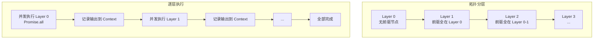
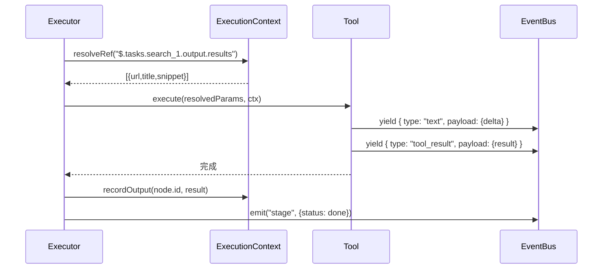

# 07 - DAG 执行器（Executor）

Executor 负责把校验通过的 WorkflowDAG 确定性执行：按拓扑分层、同层并发、跨层串行，每个节点的产出通过 EventBus 实时推送 SSE。

## 7.1 核心职责

1. **拓扑分层**：把 DAG 节点按依赖关系分成若干层
2. **并发执行**：同层节点用 `Promise.all` 并发
3. **变量解析**：执行某节点前，解析其 `inputRefs` 中的 JSONPath 引用
4. **事件发射**：每个节点的状态变更和工具产出实时推送
5. **错误处理**：单节点失败的处理策略（降级/中止）

## 7.2 拓扑分层算法



### 分层与执行实现

```typescript
// src/executor/executor.ts
import { ExecutionContextImpl, type ExecutionContext } from "./context";
import type { WorkflowDAG, WorkflowNode } from "../planner/dag-schema";
import type { ToolRegistry } from "../tools/registry";
import type { StreamEvent } from "../tools/base";

export type EmitFn = (type: StreamEvent["type"], payload: Record<string, unknown>) => Promise<void>;
export type CancelCheck = () => boolean;

/** Kahn 算法分层：返回按层分组的节点列表。 */
export function topologicalLayers(dag: WorkflowDAG): WorkflowNode[][] {
  const nodeMap = new Map(dag.tasks.map((t) => [t.id, t]));
  const inDegree = new Map(dag.tasks.map((t) => [t.id, 0]));
  const adj = new Map<string, string[]>(dag.tasks.map((t) => [t.id, []]));

  for (const edge of dag.edges) {
    adj.get(edge.source)!.push(edge.target);
    inDegree.set(edge.target, (inDegree.get(edge.target) ?? 0) + 1);
  }

  const layers: WorkflowNode[][] = [];
  let current = dag.tasks.filter((t) => inDegree.get(t.id) === 0);

  while (current.length > 0) {
    layers.push(current);
    const nextLayer: WorkflowNode[] = [];
    for (const node of current) {
      for (const nxtId of adj.get(node.id) ?? []) {
        inDegree.set(nxtId, (inDegree.get(nxtId) ?? 1) - 1);
        if (inDegree.get(nxtId) === 0) {
          nextLayer.push(nodeMap.get(nxtId)!);
        }
      }
    }
    current = nextLayer;
  }

  const layered = new Set(layers.flat().map((n) => n.id));
  if (layered.size !== dag.tasks.length) {
    throw new Error("DAG 存在环，无法分层（应被 validator 拦截）");
  }

  return layers;
}

/**
 * 执行 DAG。
 *
 * @param emit - 事件发射回调（把事件推入 SSE 流）
 * @param cancelCheck - 返回 true 时中止执行（用户取消）
 * @param awaitConfirmation - HITL 确认回调（可选）。提供时，命中
 *   `dag.requirePlanConfirmation` 或 `node.requireConfirmation` 的暂停点会暂停等待用户决策；
 *   不提供则全自动执行（HITL 关闭）。详见 12-hitl-and-control.md。
 */
export async function executeDag(
  dag: WorkflowDAG,
  registry: ToolRegistry,
  emit: EmitFn,
  cancelCheck?: CancelCheck,
  awaitConfirmation?: (req: ConfirmationRequest) => Promise<ConfirmDecision>,
): Promise<void> {
  const context = new ExecutionContextImpl(dag.variables);

  // HITL：规划确认（若开启且 awaitConfirmation 提供）
  if (awaitConfirmation && dag.requirePlanConfirmation) {
    const decision = await awaitConfirmation({ kind: "plan", dag, options: { allowEdit: true } });
    if (decision.action === "reject") { await emit("error", { message: "用户拒绝执行规划" }); return; }
    if (decision.action === "modify" && decision.modifiedDag) Object.assign(dag, decision.modifiedDag);
  }

  const layers = topologicalLayers(dag);

  await emit("stage", { label: "DAG 执行开始", totalLayers: layers.length });

  for (let layerIdx = 0; layerIdx < layers.length; layerIdx++) {
    const layer = layers[layerIdx];

    if (cancelCheck?.()) {
      await emit("error", { message: "用户取消执行" });
      return;
    }

    // 同层节点并发
    const results = await Promise.allSettled(
      layer.map((node) => executeNode(node, context, registry, emit, cancelCheck, awaitConfirmation)),
    );

    // 检查错误（按 onNodeError 策略处理）
    for (const [i, result] of results.entries()) {
      if (result.status === "rejected") {
        const node = layer[i];
        await emit("error", {
          nodeId: node.id,
          message: `节点 ${node.label} 执行失败: ${result.reason}`,
        });
        // 可配置错误策略（见 §7.4）
        const strategy = dag.onNodeError ?? "abort";
        if (strategy === "skip") {
          // 跳过该节点，下游用空值，继续执行
          context.recordOutput(node.id, {});
          continue;
        }
        // abort（默认）或 retry 耗尽：中止整个 DAG
        return;
      }
    }
  }

  await emit("stage", { label: "DAG 执行完成" });
}

/** 执行单个节点。 */
async function executeNode(
  node: WorkflowNode,
  context: ExecutionContext,
  registry: ToolRegistry,
  emit: EmitFn,
  cancelCheck?: CancelCheck,
  awaitConfirmation?: (req: ConfirmationRequest) => Promise<ConfirmDecision>,
): Promise<Record<string, unknown>> {
  await emit("stage", {
    nodeId: node.id,
    label: node.label,
    kind: node.kind,
    status: "active",
  });

  // 确定工具
  const toolName = resolveToolName(node);
  const tool = registry.get(toolName);
  if (!tool) throw new Error(`工具未注册: ${toolName}`);

  // 解析参数（替换 JSONPath 引用）
  const resolvedParams = resolveParams(node.params, context);

  // 执行工具，收集事件
  let finalResult: unknown = null;
  for await (const event of tool.execute(resolvedParams, context)) {
    if (cancelCheck?.()) throw new Error("执行被取消");
    await emit(event.type, event.payload);
    if (event.type === "tool_result") {
      finalResult = event.payload.result;
    }
  }

  // 记录输出到 context
  const output = (finalResult && typeof finalResult === "object")
    ? finalResult as Record<string, unknown>
    : { value: finalResult };

  // HITL：节点结果确认（若开启且 awaitConfirmation 提供）
  if (awaitConfirmation && node.requireConfirmation) {
    const decision = await awaitConfirmation({
      kind: "node_result",
      nodeId: node.id,
      result: output,
      options: { allowFilter: true },
    });
    if (decision.action === "skip") {
      context.recordOutput(node.id, {});
      await emit("stage", { nodeId: node.id, label: node.label, status: "skipped" });
      return {};
    }
    if (decision.action === "modify" && decision.modifiedResult !== undefined) {
      Object.assign(output, decision.modifiedResult);
    }
  }

  context.recordOutput(node.id, output);

  await emit("stage", { nodeId: node.id, label: node.label, status: "done" });

  return output;
}

/** 根据节点 kind 推断工具名。 */
function resolveToolName(node: WorkflowNode): string {
  if (node.toolName) return node.toolName;
  const map: Record<string, string> = {
    web_search: "builtin/web_search",
    web_fetch: "builtin/web_fetch",
    knowledge_base: "builtin/knowledge_base",
    deliver: "builtin/deliver",
  };
  return map[node.kind] ?? node.kind;
}

/** 递归解析 params 中的 JSONPath 引用。 */
function resolveParams(
  params: Record<string, unknown>,
  context: ExecutionContext,
): Record<string, unknown> {
  const resolved: Record<string, unknown> = {};
  for (const [key, value] of Object.entries(params)) {
    resolved[key] = resolveValue(value, context);
  }
  return resolved;
}

function resolveValue(value: unknown, context: ExecutionContext): unknown {
  if (typeof value === "string" && value.startsWith("$.") ) {
    // 整个值是一个 JSONPath 引用
    const raw = context.resolveRef(value);
    // 注入数据清洗管道：形状感知，只对超阈值的字符串/自由文本字段触发
    return applyContentPipeline(raw, value, context);
  }
  if (typeof value === "string" && value.includes("$.")) {
    // 值中内嵌 JSONPath 片段（如 "$.variables.sector 行业格局 2024"）
    return value.replace(/\$\.[\w.[\]]+/g, (match) => {
      const resolved = context.resolveRef(match);
      return resolved !== undefined ? String(resolved) : match;
    });
  }
  if (Array.isArray(value)) {
    return value.map((v) => resolveValue(v, context));
  }
  if (value && typeof value === "object") {
    const obj: Record<string, unknown> = {};
    for (const [k, v] of Object.entries(value)) {
      obj[k] = resolveValue(v, context);
    }
    return obj;
  }
  return value;
}
```

## 7.3 ExecutionContext 详解

详见 [04-tool-protocol.md](04-tool-protocol.md) §4.3。Executor 在执行每个节点后，把工具产出记录到 context，供下游节点的 `inputRefs` 解析。



### JSONPath 解析

`ExecutionContext.resolveRef` 基于 `jsonpath-plus` 实现（见 [04-tool-protocol.md](04-tool-protocol.md) §4.3）。构造的查询根对象结构为：

```typescript
{
  variables: { /* DAG 顶层 variables */ },
  tasks: {
    "<nodeId>": { output: { /* 该节点已记录的输出 */ } },
    // ...
  }
}
```

支持的引用形式：
- `$.tasks.<id>.output.<field>` — 上游节点输出字段
- `$.variables.<key>` — DAG 顶层变量

## 7.4 错误处理策略

节点失败时，executor 按**可配置策略**处理，避免"一次失败全盘重来"的极差体验。

| 错误类型 | 处理策略 | 配置项 |
|---------|---------|--------|
| 单节点工具异常 | 按 `onNodeError` 策略：abort / skip / retry | `dag.onNodeError = "abort" \| "skip" \| "retry"` |
| 知识库服务不可达 | 降级为空结果，继续执行 | 自动降级（内置） |
| web_fetch 单 URL 失败 | 记录失败，不影响其他 URL | 内置于 WebFetchTool |
| LLM 超时 | 重试 1 次，仍失败则按 onNodeError | `config.llmTimeout` |
| 用户取消 | 立即中止，已完成节点结果保留（可断点续传） | `cancelCheck()` |

### onNodeError 三种策略

```typescript
// src/planner/dag-schema.ts（扩展）
export const WorkflowDAG = z.object({
  // ... 既有字段 ...
  onNodeError: z.enum(["abort", "skip", "retry"]).default("abort")
    .describe("节点失败策略：abort 中止全图 / skip 跳过用空值继续 / retry 有限次重试"),
  retryAttempts: z.number().int().positive().default(2)
    .describe("onNodeError=retry 时的最大重试次数"),
});
```

| 策略 | 行为 | 适用场景 |
|------|------|---------|
| `abort`（默认） | 失败节点导致整个 DAG 中止，已完成的节点结果保留在 context + 缓存 | 严格任务（缺数据则结论无意义） |
| `skip` | 跳过失败节点，下游用空值继续；deliver 时若关键来源缺失则标记 partial | 容错任务（部分失败仍可产出降级结果） |
| `retry` | 对失败节点有限次重试（`retryAttempts`，默认 2），耗尽后按 abort | 网络抖动型失败（web_fetch 超时） |

### 错误事件与产物标记

- `skip` 时下游节点收到空值，executor 发 `progress` 事件提示"节点 X 被跳过"
- `skip` 完成 deliver 时，若关键 inputRefs 为空，产物标记 `partial: true`，task 状态为 `completed`（带警告）而非 `failed`
- `abort` 时 task 状态 `failed`，但已完成节点的输出已落库，可供断点续传复用

### 断点续传与修复 Agent（M5 后迭代，预留）

现有设计已为 Local Repair 预留地基：
- **中间产物缓存**（§7.5）：按 `(dagId, nodeId, paramsHash)` 存，失败后可跳过已成功节点
- **已完成节点输出**：记录在 ExecutionContext 与 TaskStore，`failed` 任务不清理

后续迭代（见 [09-milestones-and-todolist.md](09-milestones-and-todolist.md) §9.4）将实现：

| 增强项 | 机制 |
|--------|------|
| **断点续传（resume）** | `POST /api/tasks/:id/resume` 从失败层后继重新执行，已成功层从缓存读取 |
| **修复 Agent（Repair Agent）** | 失败时启动微型 Agent（类似 Critic），拿 `(失败节点, 入参, 错误, 替代工具)` 产出"微调入参/换工具"建议，重跑该节点——本质是一次受控的局部 planner 调用，不动整图 |

> **不采用"整体回滚重来"**：浪费已完成节点的昂贵上下文（web_fetch 的抓取结果、LLM 的生成内容）。Local Repair 的核心价值就是**保留前 N 步、只修第 N+1 步**。

## 7.5 中间产物缓存

节点执行结果可按 `(dagId, nodeId, paramsHash)` 缓存，便于：
- DAG 重试时跳过已成功的节点
- 相似意图复用中间结果

缓存存储在 `src/storage/file-store.ts` 的 artifacts 目录下。M1 版本暂不实现，后续视需求加入。

## 7.6 数据清洗管道（Content Pipeline）

### 问题：节点间数据直传会撑爆上下文

`web_fetch` 抓一个网页可能带回上万字 Markdown（含导航栏、版权、脚本等噪声）。若下游 `llm_synthesis` 通过 `$.tasks.fetch.output` 全量引用，会引发：
- **成本飙升 / 延迟暴增**（私有化部署尤甚）
- **Needle-In-A-Haystack 效应**：噪声淹没关键事实，干扰 LLM 产出质量
- **超小模型注意力窗口**（8B/14B 模型超出最佳区间）

### 解法：引擎层隐式拦截管道（Pipeline-Filter 模式）

Executor 在 `resolveValue` 解析出上游数据后、注入下游工具前，强制过一遍三阶段管道。**关键：形状感知，默认只压缩自由文本，结构化数据透传。**

```typescript
// src/executor/content-pipeline.ts

/**
 * 数据清洗管道：在 inputRefs 解析出原始值后、注入下游节点前执行。
 * 三阶段，成本递增：strip（免费，永远做）→ summarize（付费 LLM，默认关）→ truncate（免费，硬兜底）。
 */
export function applyContentPipeline(
  raw: unknown,
  refPath: string,
  context: ExecutionContext,
): unknown {
  const cfg = context.contentPipelineFor(refPath);   // 从节点 contentPipeline 配置解析（见 03）
  // 形状感知：结构化对象/数组默认透传，避免拍平丢失 $.output[0].url 这种字段引用
  if (typeof raw !== "string") {
    if (Array.isArray(raw) && cfg?.fields) return raw; // 结果数组透传，由下游按字段引用
    if (raw && typeof raw === "object") return raw;    // 结构化对象透传
    return raw;
  }
  let out = raw;
  if (cfg?.strip !== false) out = stripNoise(out);       // 阶段1：HTML/MD 结构净化（廉价、确定性）
  if (cfg?.summarize) out = await rollingSummarize(      // 阶段2：意图感知摘要（付费，显式开启）
    out, context.dag.intent, cfg.summarizeModel,
  );
  out = truncateToContext(out, cfg?.maxTokens ?? 4000);  // 阶段3：硬兜底截断（永远做，防 400）
  return out;
}
```

### 三阶段详解

| 阶段 | 动作 | 成本 | 默认 | 作用 |
|------|------|------|------|------|
| **1. strip（结构净化）** | 剔除 ``/内联样式/`<a href>`/脚本，保留标题（`#`）、表格、正文文本 | 极低（正则/Readability） | **永远开** | 削减约 40% 体积，去导航/版权噪声 |
| **2. summarize（滚动窗口摘要）** | strip 后仍超阈值时，调极小快模型（Qwen-1.5B / gpt-4o-mini）按 DAG intent 并行抽取核心事实 | **付费/有延迟** | **默认关** | 意图感知压缩，保留与任务相关的信息 |
| **3. truncate（硬兜底）** | 按当前节点 LLM 的 `maxTokens` 强制截断 | 极低 | **永远开** | 绝对杜绝 `400 Context Length Exceeded` |

> **为何 summarize 默认关**：它是唯一有成本/延迟的阶段，且需传 DAG intent（语义相关）。默认只走 strip+truncate 即可解决绝大多数噪声+超长问题；对高价值长文档节点，由 planner 显式在 `contentPipeline.summarize: true` 开启。

### 形状感知（避免误伤）

- **结构化数组透传**：`web_search` 返回 `[{title,url,snippet}]`，若无差别摘要会拍平成一段话、丢失 `$.tasks.search.output[0].url` 字段引用 → 数组/对象默认透传，由下游按字段引用精确取用
- **白名单字段**：节点可在 `contentPipeline.fields: ["content"]` 显式声明哪些字段需清洗（如 `web_fetch` 的 `output.content` 是自由文本，需洗；`output.url` 是结构化，透传）

### 与知识库 chunking 的职责区分

| 机制 | 发生时机 | 目的 | 详见 |
|------|---------|------|------|
| **Content Pipeline（本节）** | 节点间变量传递时（运行时隐式） | 压缩上游输出以适配下游上下文窗口 | 本节 |
| **KB Chunking** | 知识库写入/检索时（存储期） | 切分长文档为可检索的小块 | [05-kb-mcp-protocol.md](05-kb-mcp-protocol.md) §5.8 |

> 两者正交：chunking 管"怎么存怎么检索"，pipeline 管"检索/抓取回来后怎么喂给下游 LLM"。一个文档可能被 chunking 切成 10 块分别检索命中，命中结果合并后再由 pipeline 压缩注入。

## 7.7 并发控制

| 控制点 | 默认值 | 说明 |
|--------|--------|------|
| 同层节点并发 | 不限（由节点数决定） | 用 `Promise.allSettled` |
| web_fetch 单节点内 URL 并发 | 4 | WebFetchTool 的 `maxConcurrent` 参数 |
| LLM 调用并发 | 不限（受 provider 限流约束） | 由 LLM provider 的 rate limit 控制 |
| 知识库调用并发 | 不限（由消费应用限流） | 消费应用自行控制 |

> **注意**：Node.js 事件循环是单线程的，"并发"指 I/O 等待期的并发（非 CPU 并行）。对于 CPU 密集型工具（如本地 PDF 解析），应考虑用 worker_threads 隔离，避免阻塞事件循环。

## 7.8 与 LitPilot 的对比

| 维度 | LitPilot（设计参考） | let-it-flow |
|------|----------|-------------|
| 执行方式 | 硬编码流水线（search→fetch→cite→generate） | DAG 拓扑分层通用执行 |
| 并发粒度 | 子主题级并行（`literature_subtopic_pipeline`） | 节点级 + 层级双重并发 |
| 变量传递 | SessionCorpus 隐式传递 | ExecutionContext 显式 JSONPath 引用 |
| 错误处理 | 多段降级（native_fetch 五段） | 节点级中止/降级（可配置） |
| 可扩展性 | 改流水线代码 | 改 DAG 模板/新增工具 |

> LitPilot 仅为设计理念参照，不复用其 Python 代码（见 [10-litpilot-migration-guide.md](10-litpilot-migration-guide.md)）。

## 7.9 相关文档

- [03-dag-schema.md](03-dag-schema.md) - DAG 结构定义（含 requireConfirmation / contentPipeline）
- [04-tool-protocol.md](04-tool-protocol.md) - FlowConnector 工具接口与 ExecutionContext
- [05-kb-mcp-protocol.md](05-kb-mcp-protocol.md) - KB Chunking（存储期切片，与 Content Pipeline 职责区分）
- [08-task-streaming.md](08-task-streaming.md) - 事件如何推送
- [12-hitl-and-control.md](12-hitl-and-control.md) - HITL 暂停点（awaitConfirmation 集成）
