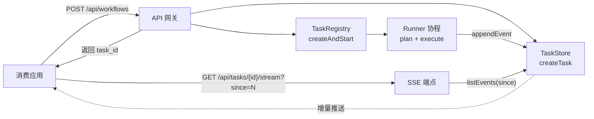

# 08 - 任务与流式机制

let-it-flow 的任务管理与 SSE 流式推送机制。核心是**后台 Task + SSE 订阅**的两段式架构。

## 8.1 架构概览



## 8.2 设计来源

任务机制的设计理念参照自 LitPilot 的 `tasks/` 模块（`reference/tasks/`，仅作设计参考，不复用 Python 代码）。核心结构保留，用 TypeScript 重新实现：

- `TaskStore`：任务存储抽象 + 文件实现（持久化）
- `TaskRegistry`：runner（plan + execute）+ iterStream（SSE 订阅）+ coalescer（流式合并）+ sweeper（崩溃恢复）

唯一实质改动：**runner 执行通用 DAG 而非固定文献流水线**。

## 8.3 TaskRecord 数据结构

```typescript
// src/tasks/task-store.ts
export type TaskStatus =
  | "pending"
  | "running"
  | "pending_confirmation"      // HITL：等待人工确认（见 12-hitl-and-control.md）
  | "pending_clarification"     // Guardrail：等待用户补充信息（见 06-planner §6.7）
  | "completed"
  | "failed"
  | "cancelled";

export interface TaskRecord {
  id: string;
  intent: string;                          // 原始用户意图
  config: Record<string, unknown>;         // 工作流配置（model/kb/...）
  status: TaskStatus;
  progress: number;                        // 0-100
  stage: string;                           // 当前阶段描述
  dagJson: string | null;                  // 规划出的 DAG（planner 产出后填入）
  error: string | null;
  workerId: string | null;
  startedAt: number;                       // epoch ms
  finishedAt: number | null;
  eventCount: number;
  updatedAt: number;                       // epoch ms
}
```

## 8.4 TaskStore 接口

```typescript
// src/tasks/task-store.ts
export interface TaskStore {
  createTask(intent: string, config: Record<string, unknown>): TaskRecord;
  getTask(taskId: string): TaskRecord | undefined;
  listActiveTasks(): TaskRecord[];
  tryClaim(taskId: string, workerId: string): boolean;   // 抢占式领取（防多 worker 重复）
  updateTask(taskId: string, patch: Partial<TaskRecord>): void;
  appendEvent(taskId: string, eventLine: string): void;
  appendEventsBatch(taskId: string, lines: string[]): void;  // 批量追加（降 I/O）
  listEvents(taskId: string, since: number): string[];       // 增量读取（断线续传）
  requestCancel(taskId: string): void;
  isCancelRequested(taskId: string): boolean;
  requeueStaleRunning(beforeEpoch: number): number;           // 崩溃恢复
}
```

默认实现 `FileTaskStore` 把任务元数据与事件流落本地文件（开发期）；生产期可扩展为 Vercel KV / Postgres 实现。

## 8.5 TaskRegistry 运行机制

```typescript
// src/tasks/registry.ts
import { plan } from "../planner/planner";
import { executeDag } from "../executor/executor";
import { registry as toolRegistry } from "../tools/registry";
import { getPlannerModel } from "../services/llm-service";
import type { TaskStore, TaskRecord } from "./task-store";
import { StreamCoalescer } from "./coalescer";

const TERMINAL_STATUSES: ReadonlySet<string> = new Set(["completed", "failed", "cancelled"]);
const STREAM_POLL_MS = 50;
const HEARTBEAT_SEC = 15;

export class TaskRegistry {
  private readonly coalescer = new StreamCoalescer();
  private readonly eventSignals = new Map<string, { resolve: () => void }>();

  constructor(private readonly store: TaskStore) {}

  async createAndStart(
    intent: string,
    config: Record<string, unknown>,
  ): Promise<TaskRecord> {
    const record = this.store.createTask(intent, config);
    // 初始事件立即落库（不经缓冲，防 serverless 提前终止）
    this.store.appendEventsBatch(record.id, [
      sseEvent("stage", { label: "任务已创建" }),
    ]);
    // 后台执行（不 await，立即返回 task_id）
    // 注意：run 内部支持 HITL 暂停（见 §8.8），通过 awaitConfirmation 注入
    void this.run(record);
    return record;
  }

  private async run(record: TaskRecord): Promise<void> {
    const workerId = currentWorkerId();
    if (!this.store.tryClaim(record.id, workerId)) return;

    try {
      this.store.updateTask(record.id, { status: "running", stage: "planning" });

      // 1. 规划 DAG
      const dag = await plan(record.intent, {
        model: getPlannerModel(),
        knowledgeBaseEndpoint: (record.config.knowledgeBase as { endpoint?: string })?.endpoint,
        searchProvider: record.config.searchProvider as string | undefined,
      });
      this.store.updateTask(record.id, {
        dagJson: JSON.stringify(dag),
        stage: "executing",
      });

      // 发布 DAG 给前端展示
      this.store.appendEvent(record.id, sseEvent("workflow_node", { graph: dag }));

      // 2. 执行 DAG（注入 HITL 确认回调，见 12-hitl-and-control.md）
      const emit = async (type: string, payload: Record<string, unknown>): Promise<void> => {
        const line = sseEvent(type, payload);
        this.coalescer.add(record.id, type, payload);
        this.coalescer.flush(record.id);
        this.eventSignals.get(record.id)?.resolve();
      };

      // HITL：把 awaitConfirmation 注入 executor，runner 在暂停点 await 闩锁
      const awaitConfirmation = (req: ConfirmationRequest): Promise<ConfirmDecision> =>
        this.awaitConfirmation(record.id, req, emit);

      await executeDag(
        dag,
        toolRegistry,
        emit,
        () => this.store.isCancelRequested(record.id),
        awaitConfirmation,
      );

      this.store.updateTask(record.id, {
        status: "completed", progress: 100, stage: "done",
      });
      this.store.appendEvent(record.id, sseEvent("done", {}));
      this.eventSignals.get(record.id)?.resolve();

    } catch (exc) {
      this.store.updateTask(record.id, {
        status: "failed", error: String(exc),
      });
      this.store.appendEvent(record.id, sseEvent("error", { message: String(exc) }));
      this.eventSignals.get(record.id)?.resolve();
    }
  }

  /** SSE 订阅：增量推送事件。用 async generator 实现。 */
  async *iterStream(taskId: string, since = 0): AsyncGenerator<string> {
    let cursor = since;
    let lastActivity = Date.now();

    while (true) {
      const events = this.store.listEvents(taskId, since = cursor);
      for (const line of events) {
        yield line;
        cursor += 1;
        lastActivity = Date.now();
      }

      if (events.length === 0) {
        // 同进程零延迟唤醒；跨进程回退轮询
        await this.waitForSignal(taskId, STREAM_POLL_MS);
        // 心跳
        if (Date.now() - lastActivity >= HEARTBEAT_SEC * 1000) {
          yield ": keepalive\n\n";
        }
      }

      // 终止条件
      const task = this.store.getTask(taskId);
      if (task && TERMINAL_STATUSES.has(task.status) && events.length === 0) {
        return;
      }
    }
  }

  private async waitForSignal(taskId: string, timeoutMs: number): Promise<void> {
    if (!this.eventSignals.has(taskId)) {
      this.eventSignals.set(taskId, { resolve: () => {} });
    }
    await Promise.race([
      new Promise<void>((resolve) => {
        this.eventSignals.set(taskId, { resolve });
      }),
      new Promise<void>((resolve) => setTimeout(resolve, timeoutMs)),
    ]);
  }
}
```

## 8.6 流式合并（Coalescer）与通道分离

参照 LitPilot 的 `_StreamCoalescer` 设计理念，用 TS 实现。为解决"LLM token 流（高频）与工具状态事件（低频但重要）互不干扰"，每个事件携带可选的 **channel** 字段，coalescer 按通道分合并策略：

```typescript
// src/tasks/coalescer.ts

/** 事件通道：决定 coalescer 的合并策略。 */
export type EventChannel = "content" | "status" | "meta";

/** content 通道：高频可合并（token 增量）；status 通道：状态变更立即落库；meta：元信息 */
function channelOf(type: string): EventChannel {
  switch (type) {
    case "text": case "think": case "artifact": return "content";  // 可激进合并
    case "stage": case "tool_call": case "tool_result": case "progress": return "status"; // 立即落库
    case "confirmation_required": case "clarification_required": return "status";          // 立即落库
    case "done": case "error": case "workflow_node": return "meta";                        // 立即落库
    default: return "status";
  }
}

export class StreamCoalescer {
  private readonly buffers = new Map<string, string[]>();

  add(taskId: string, type: string, payload: Record<string, unknown>): void {
    const ch = channelOf(type);
    if (ch === "content") {
      // content 通道：连续 token 增量按 20 字符或 50ms 空闲合并后落库
      // ... 合并 text/think/artifact 增量事件 ...
    } else {
      // status/meta 通道：状态变更与进度立即落库，绝不缓冲
      this.flush(taskId);
      this.store.appendEvent(taskId, sseEvent(type, { ...payload, channel: ch }));
    }
  }

  flush(taskId: string): void {
    // 把 content 缓冲区批量 appendEventsBatch 落库
  }
}
```

**关键规则**：
- **通道分离**：`content` 通道（text/think/artifact）可激进合并；`status` 通道（stage/tool_call/tool_result/progress/confirmation/clarification）立即落库不合并；`meta` 通道（done/error/workflow_node）立即落库
- **合并连续 token 增量**：连续的 `content` 通道事件按 20 字符或 50ms 空闲刷盘
- **批量落库**：`EventBatchBuffer` 把 N 次操作合并为 1 次（16 条或 80ms）
- **初始事件禁止缓冲**：`stage`/`capabilities` 等初始事件必须立即 `appendEventsBatch` 落库
- **边界事件前必须 flush**：`done`/边界事件前必须 `flush()`
- **消费端优先 signal 唤醒**，跨进程回退 50ms 轮询

> **为什么不用 WebSocket 双向通道**：进度上报只需服务端→客户端单向推送，SSE 已足够且断线续传（since=N）更成熟。客户端的反向信号（HITL 确认、澄清回答）走独立 `/confirm`、`/clarify` 端点，不混入事件流。

## 8.7 SSE 事件协议

```http
data: {"type": "stage", "schemaVersion": "1.0", "payload": {...}}

data: {"type": "text", "schemaVersion": "1.0", "payload": {"delta": "..."}}

: keepalive
```

### 事件类型

| type | 通道 | 用途 | 触发时机 | SDK 友好别名 |
|------|------|------|---------|-------------|
| `stage` | status | 阶段/节点状态变更（含 progress/subStep） | 规划开始/完成、节点开始/完成 | `plan`（规划阶段时） |
| `workflow_node` | meta | 发布完整 DAG 图 | planner 产出后 | `plan` |
| `tool_call` | status | 工具调用记录 | 节点开始执行工具 | `tool_start` |
| `progress` | status | **工具内细粒度进度**（子步骤/百分比） | 工具执行中上报子步骤 | `progress` |
| `tool_result` | status | 工具结果 | 节点完成 | `tool_end` |
| `text` | content | LLM 流式 token（可合并） | llm 节点生成中 | `content` |
| `think` | content | 思考链（可合并） | planner/llm 推理 | `thought` |
| `artifact` | content | 产物增量（可合并） | deliver 节点 | `artifact` |
| `confirmation_required` | status | HITL 确认请求 | 命中暂停点（见 [12-hitl-and-control.md](12-hitl-and-control.md)） | `need_confirm` |
| `clarification_required` | status | **反向追问**（意图模糊） | Guardrail 检测到缺关键参数（见 [06-planner-and-templates.md](06-planner-and-templates.md) §6.7） | `need_input` |
| `rejected` | meta | **优雅拒绝**（越界意图） | Guardrail 判定无工具可服务 | `rejected` |
| `done` | meta | 全部完成 | DAG 执行结束 | `done` |
| `error` | meta | 错误 | 任何异常 | `error` |

> **通道与合并策略**：`content` 通道（token 流）可被 coalescer 激进合并以降 I/O；`status`/`meta` 通道立即落库，保证状态变更不丢失。前端按通道分流渲染：content 流式拼接、status/meta 即时刷新。

### 关键 payload 结构

**stage（节点状态变更）** —— 含细粒度进度：
```json
{ "nodeId": "fetch_all", "status": "active", "label": "抓取详情", "progress": 0.6, "subStep": "3/5 URL 完成" }
```

**progress（工具内进度）** —— 工具内部多步骤上报：
```json
{ "nodeId": "fetch_all", "ratio": 0.6, "subStep": "正在读取第 3 个页面", "label": "抓取中" }
```

**clarification_required（反向追问）**：
```json
{ "questions": [{ "field": "stockCode", "prompt": "请问您想分析哪只股票？请提供名称或代码。", "required": true }] }
```

**rejected（优雅拒绝）**：
```json
{ "reason": "该请求超出当前工具链覆盖范围（无法点咖啡）。可服务的能力：网络检索/知识库/内容生成。", "suggestRetry": "试试：分析某只股票 / 总结某篇文章 / 检索某主题" }
```

> **线协议 vs SDK 别名**：线协议（SSE）统一用左侧 `type` 名，保证 HTTP 形态跨语言稳定。SDK 形态（`LetItFlow.execute()` 返回的 async generator）可在 StreamEvent 之上暴露右侧友好别名，方便 TS 消费端按直觉消费（如 `chunk.type === "tool_start"`）。两者通过映射表对齐，行为等价。

### 断线续传

消费应用记录已接收的事件序号 `since`，断线重连时：

```
GET /api/tasks/{id}/stream?since=42
```

服务端从第 43 条事件开始推送。消费应用用此机制实现"离开后回来继续看进度"。

## 8.8 API 端点

```typescript
// src/api/workflows.ts
import { Hono } from "hono";
import { WorkflowCreateBody } from "./schemas";

export const workflows = new Hono();

workflows.post("/workflows", async (c) => {
  const body = await c.req.json();
  const parsed = WorkflowCreateBody.parse(body);
  const record = await taskRegistry.createAndStart(parsed.intent, parsed.config);
  return c.json(ok(recordToStatus(record)));
});

// src/api/tasks.ts
tasks.get("/:id/stream", async (c) => {
  const taskId = c.req.param("id");
  const since = Number(c.req.query("since") ?? 0);

  const { readable, writable } = new TransformStream();
  const writer = writable.getWriter();
  const encoder = new TextEncoder();

  (async () => {
    try {
      for await (const line of taskRegistry.iterStream(taskId, since)) {
        // 检查客户端断开（Hono 可通过 c.req.raw.signal）
        if (c.req.raw.signal?.aborted) break;
        await writer.write(encoder.encode(line));
      }
    } finally {
      await writer.close();
    }
  })();

  return new Response(readable, {
    headers: {
      "Content-Type": "text/event-stream",
      "Cache-Control": "no-cache",
      Connection: "keep-alive",
    },
  });
});
```

> 使用 Web Streams API（`TransformStream`）实现 SSE 响应，与 Hono / Vercel Edge runtime 兼容。

### HITL 确认端点

runner 支持 HITL 暂停后，HTTP 形态需暴露确认端点：

```typescript
// src/api/tasks.ts（续）
tasks.post("/:id/confirm", async (c) => {
  const taskId = c.req.param("id");
  const body = ConfirmDecisionSchema.parse(await c.req.json());
  taskRegistry.confirm(taskId, body);   // 释放闩锁，唤醒 runner
  return c.json(ok({ status: "resumed" }));
});
```

> 完整的 HITL 机制（闩锁、`awaitConfirmation`、`confirm()`、`pending_confirmation` 状态流转）见 [12-hitl-and-control.md](12-hitl-and-control.md)。本文仅说明 runner 集成点与事件协议。

## 8.9 崩溃恢复

`sweeperLoop` 每 30s 扫描：
- 把超过 600s 未更新的 `running` 任务重置为 `pending`
- **`pending_confirmation` / `pending_clarification` 状态不被重置**：人工确认/澄清可能需要较长时间（数分钟到数小时），它们不是卡死，是正常等待。仅当超过超时阈值（可配，默认 10 分钟）才转为 `cancelled`。
- 下次 worker 空闲时重新领取 `pending` 任务执行

```typescript
// src/tasks/registry.ts (续)
async startSweeper(intervalMs = 30_000, staleMs = 600_000, pauseTimeoutMs = 600_000): Promise<void> {
  setInterval(() => {
    this.store.requeueStaleRunning(Date.now() - staleMs);
    // 暂停态超时：pending_confirmation / pending_clarification 超 pauseTimeoutMs 转为 cancelled
    this.store.expireStalePauses(Date.now() - pauseTimeoutMs);
  }, intervalMs);
}
```

## 8.10 存储布局

```
data/
├── tasks/
│   ├── index.json
│   └── {taskId}/
│       ├── meta.json        # TaskRecord
│       ├── events.jsonl     # SSE 事件流
│       └── dag.json         # DAG 快照
└── artifacts/
    └── {taskId}/
        └── {artifactId}.md  # deliver 产物
```

## 8.11 相关文档

- [07-executor.md](07-executor.md) - Executor 产出的事件如何流入 EventBus
- [02-architecture.md](02-architecture.md) - API 端点定义
- [12-hitl-and-control.md](12-hitl-and-control.md) - HITL 暂停/恢复机制（`pending_confirmation` 状态、`confirmation_required` 事件）
