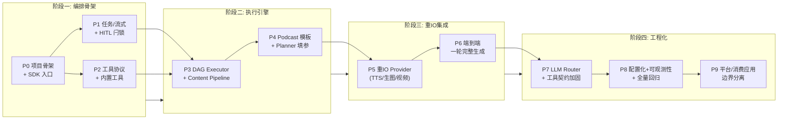
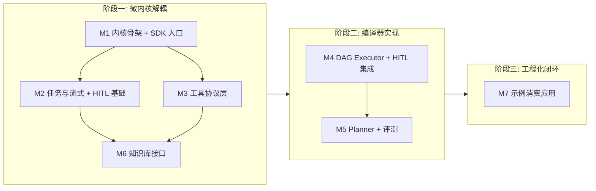

# 09 - 里程碑与 TodoList

本文档把开发工作划分为**三个阶段**（采纳自详细设计文档 §6），每个阶段下含若干细粒度里程碑（便于 TDD 渐进）。每个里程碑包含：目标、输入、输出文件、验收标准、测试用例、TDD 策略、风险点。

## 9.MVP Podcast MVP 里程碑

面向"类似 LitPilot / ai-content-factory podcast 项目"的最小可用版本：**一轮完整生成**（URL → 7 步 → 视频），支持路径澄清与数据选择（HITL），但**不支持多轮修改/提问**。

### MVP 范围决策

| 维度 | MVP 取舍 | 完整设计对照 |
|------|---------|-------------|
| 产物 | 完整 podcast（7 步，含 TTS/生图/视频） | 同 |
| DAG 生成 | 模板路由为主，LLM 只填参数 | 完整设计含 LLM 动态规划 |
| 知识库 | **不做**（仅 web_search + web_fetch） | 完整设计含 IKnowledgeProvider（M6） |
| 形态 | **SDK 优先**（进程内 async generator） | 完整设计含 HTTP/SSE |
| 自定义工具 | 仅内置工具 | 完整设计含 flow-manifest/插件 |
| HITL | 进程内 AsyncLatch（**不做快照持久化**） | 完整设计含 State Snapshot |
| 流式粒度 | 阶段事件 + LLM token 级流式 | 完整设计含工具内 progress |
| 重 IO 工具 | provider 抽象 + Python 子进程调用 ai-content-factory 脚本 | — |
| 输入源 | URL 抓取（文章/讲稿），**不做音视频转录** | 完整设计可扩展 |
| 模型 | 仅 native 结构化输出（GPT-4o） | 完整设计含弱模型平替 |

### 砍掉的完整设计项（MVP 不实装）

- M6 知识库（IKnowledgeProvider/ObsidianProvider/MCP 桥接）
- M5 评测集（50 用例）/ RobustOutputGuard 弱模型路径 / Fallback DAG / Critic / few-shots
- M7 多形态示例（仅保留单个 podcast SDK 示例）
- HITL State Snapshot 持久化 / Serverless 冷启动恢复
- 工具向量精排（top-K）/ AutonomousResearchTool / flow-manifest / http-tool-provider
- onNodeError 的 retry 策略（仅 abort+skip）/ Content Pipeline summarize 阶段

### MVP 里程碑总览



| 里程碑 | 目标 | 预估 | 依赖 |
|--------|------|------|------|
| P0 | 项目骨架 + SDK 入口 | 1 天 | 无 |
| P1 | 任务/流式 + HITL 闩锁 | 2 天 | P0 |
| P2 | 工具协议 + 内置工具 | 2 天 | P0 |
| P3 | DAG Executor + Content Pipeline | 2.5 天 | P1, P2 |
| P4 | Podcast 模板 + Planner 填参 | 2 天 | P3 |
| P5 | 重 IO Provider（TTS/生图/视频） | 3 天 | P4 |
| P6 | 端到端一轮完整生成 | 1.5 天 | P5 |
| P7 | LLM Router + 工具契约加固（已实现） | 1 天 | P6 |
| P8 | 配置化 + 可观测性 + 全量回归（见 [13](13-p8-config-and-observability.md)） | 4.5 天 | P7 |
| P9 | 平台与消费应用边界分离（见 [§P9](#p9---平台与消费应用边界分离)） | 1 天 | P8 |

P1 与 P2 可并行（都依赖 P0）。总计约 **20.5 个工作日**。

### P0 - 项目骨架 + SDK 入口（1 天）

**目标**：TS 项目可启动、可导入；`LetItFlow` 类骨架可实例化。

**输出文件**：
- `package.json` - 依赖（hono / zod / ai / @ai-sdk/openai / vitest / typescript / jsonpath-plus）
- `tsconfig.json`（strict）、`vitest.config.ts`、`eslint.config.mjs`
- `src/index.ts` - 导出 LetItFlow
- `src/sdk/let-it-flow.ts` - LetItFlow 类骨架（装配 planner/executor/tools 的占位）
- `src/core/config.ts` - DATA_DIR / 环境变量
- `src/core/stream-events.ts` - 事件构造

**验收标准**：
- [ ] `pnpm typecheck` 通过
- [ ] `pnpm test` 通过（冒烟测试）
- [ ] `import { LetItFlow } from "./src"` 不报错

**测试用例**：`tests/unit/test-smoke.ts::test LetItFlow instantiates`

---

### P1 - 任务/流式 + HITL 闩锁（2 天）

**目标**：Task 创建 + 流式订阅（stub DAG）；AsyncLatch + `pending_confirmation` + `confirmation_required` 就绪（暂停点暂用 stub 触发）。

**输出文件**：
- `src/tasks/task-store.ts` - FileTaskStore（含 `pending_confirmation` 状态）
- `src/tasks/latch.ts` - AsyncLatch（进程内，**不做快照持久化**）
- `src/tasks/registry.ts` - TaskRegistry（stub runner + awaitConfirmation/confirm）
- `src/tasks/coalescer.ts` - StreamCoalescer（content/status 通道分离）
- `src/api/workflows.ts` - POST /api/workflows
- `src/api/tasks.ts` - GET /stream + POST /confirm

**验收标准**：
- [ ] POST /workflows 返回 taskId
- [ ] SSE 收到 stage/done 事件
- [ ] 断线重连（since=N）续传
- [ ] stub 暂停 → `confirmation_required` → confirm 恢复 running

**砍掉的**：state-snapshot.ts、sweeper HITL 超时（进程内够用）。

---

### P2 - 工具协议 + 内置工具（2 天）

**目标**：FlowConnector 接口 + 分层注册表 + 4 个内置工具可独立执行并产出事件。

**输出文件**：
- `src/tools/base.ts` - FlowConnector + StreamEvent（含 confirmation_required）
- `src/tools/registry.ts` - 分层 ToolRegistry（**仅粗筛分层，不做向量精排**）
- `src/tools/builtin/web-search.ts`、`web-fetch.ts`、`llm-node.ts`、`deliver.ts`
- `src/services/llm-service.ts`

**验收标准**：
- [ ] 各工具 execute() 产出 stage/tool_call/tool_result 事件
- [ ] llm-node 用 `streamText` 流式产出 text 事件
- [ ] listByTier() 按分层过滤正确

**砍掉的**：AutonomousResearchTool、http-tool-provider、tool-router 向量精排、工具契约 whenToUse（模板路由不需要）。

---

### P3 - DAG Executor + Content Pipeline（2.5 天）

**目标**：多节点 DAG 端到端执行（mock 工具）；JSONPath 解析；数据清洗管道；HITL 暂停点集成。

**输出文件**：
- `src/planner/dag-schema.ts` - WorkflowDAG（含 requireConfirmation/onNodeError/contentPipeline）
- `src/executor/executor.ts` - 拓扑分层 + 并发 + HITL + onNodeError（abort/skip）
- `src/executor/context.ts` - ExecutionContext（jsonpath-plus）
- `src/executor/content-pipeline.ts` - strip/truncate（**summarize 砍**）

**验收标准**：
- [ ] search→fetch→llm→deliver 顺序正确
- [ ] JSONPath 引用（`$.tasks.id.output.field`）正确解析
- [ ] web_fetch 大输出经 strip+truncate 压缩，不触发 400
- [ ] requireConfirmation 节点暂停/恢复

**砍掉的**：onNodeError retry 策略、state-snapshot、Content Pipeline summarize。

---

### P4 - Podcast 模板 + Planner 填参（2 天）

**目标**：podcast 7 步模板骨架 + 模板路由 + LLM 填参 + Guardrail（路径澄清）。

**输出文件**：
- `src/planner/templates.ts` - **podcast 模板**（7 步骨架，见下方）
- `src/planner/planner.ts` - 模板路由 + LLM 填参（`generateText` + `Output.object`，**仅 native 路径**）
- `src/planner/guardrail.ts` - 规则层（proceed/clarify/reject）
- `src/planner/validator.ts` - 基础校验（拓扑/工具/引用）
- `src/api/tasks.ts`（扩展）- `/clarify` 端点

**Podcast 模板骨架**（对应 ai-content-factory step 1c/2/3/3b/3c/3d/4a∥4b/5/6）：

```
fetch(URL)
  → translate(分段初译, step2)
  → rewrite(旁述改写, step3)
  → seam_repair(接缝修复, step3b)
  → terminology(术语统一, step3c)
  → image_prompts(生图提示词, step3d)
  → [tts(配音, step4b) ∥ image_gen(生图, step4a)]
  → subtitle(字幕对齐, step5)
  → video_build(视频合成, step6)
  → deliver(final.mp4)
```

**HITL 触发点**（用户确认）：
- `fetch` 后：用户选择/筛选抓取的内容片段（`requireConfirmation: true`）
- `rewrite` 后：用户预览改写稿再继续配音（`requireConfirmation: true`）

**验收标准**：
- [ ] "把 https://... 做成播客" 命中 podcast 模板
- [ ] LLM 填参产出合法 DAG（Zod 校验通过）
- [ ] 模糊意图触发 `clarification_required`；clarify 后重跑
- [ ] podcast 模板含上述 HITL 触发点

**砍掉的**：RobustOutputGuard 弱模型路径、Fallback DAG、评测集、Critic、few-shots。

---

### P5 - 重 IO Provider：TTS/生图/视频（3 天，最重）

**目标**：抽象重 IO provider 接口；Python 子进程调用 ai-content-factory 脚本；每步真实可用。

**输出文件**：
- `src/tools/heavy-io/provider.ts` - **HeavyIoProvider 接口**（abstract，本地/云端可接）
- `src/tools/heavy-io/subprocess-adapter.ts` - Python 子进程适配（文件中转，调 `reference/ai-content-factory/tools/*.py`）
- `src/tools/heavy-io/tts.ts` - TTS provider（step4b，Edge-TTS / Qwen-TTS）
- `src/tools/heavy-io/image-gen.ts` - 生图 provider（step4a，Z-Image-Turbo）
- `src/tools/heavy-io/video-build.ts` - 视频合成（step6，FFmpeg）
- `src/tools/heavy-io/rewrite.ts` - LLM 改写（step3，调 Ollama 35B 或 TS 直连）
- `src/tools/builtin/text-steps.ts` - translate/seam-repair/terminology/image-prompts（step2/3b/3c/3d，文本类）

**数据传递约定**：TS 与 Python 子进程统一用**文件中转**（与 ai-content-factory 的 `scripts/` 目录约定一致），子进程读写 `workDir/scripts/*.txt`，TS 读结果文件。

**验收标准**：
- [ ] 每个重 IO 工具独立执行产出结果文件（mp3/png/mp4）
- [ ] 子进程失败有明确错误事件
- [ ] HeavyIoProvider 接口可替换为云端实现（mock 验证）

**风险**：这是工作量最大里程碑——7 步脚本接入 + provider 抽象 + 环境依赖（Ollama/Qwen-TTS/FFmpeg/GPU）。

---

### P6 - 端到端一轮完整生成（1.5 天）

**目标**：URL → 完整 7 步 → 视频，含 HITL 数据选择。

**输出文件**：
- `examples/podcast-generator/sdk-demo.ts` - SDK 形态端到端示例
- `src/sdk/let-it-flow.ts`（完善）- 装配真实 planner/executor/tools
- HITL 集成验证：fetch 后选内容、rewrite 后预览

**验收标准**：
- [ ] `flow.execute("把 https://... 做成播客")` 流式收到各阶段事件
- [ ] HITL 暂停（fetch 选内容）→ 确认 → 继续
- [ ] HITL 暂停（rewrite 预览）→ 确认 → 继续
- [ ] 最终产出 `final.mp4`

---

### P7 - LLM Router + 工具契约加固（1 天，已实现）

**目标**：planner 从"模板路由"升级为"LLM 自主选工具编排 DAG"（注入 `forPlanner()` 工具契约清单，LLM 据 `whenToUse`/`outputExample` 选工具并编排依赖）；同时加固全部工具的契约字段（`whenToUse`/`outputSchema`/`outputExample`），让 planner 能基于契约做合理选择。

**输入**：P6 端到端可产出 final.mp4（模板路由路径）

**输出文件**（已实现）：
- `src/planner/planner.ts`（扩展）— `planWithLlmRouter()` LLM 选工具路径，模板路由作兜底
- `src/tools/registry.ts`（扩展）— `forPlanner()` 返回完整契约清单
- `tests/unit/test-p7-llm-router.ts` — LLM router 路径测试（mock LLM 返回 DAG）
- `tests/unit/test-p7-tool-contract.ts` — 全部工具契约字段完整性测试

**验收标准**（已通过）：
- [x] planner 优先走 LLM 选工具路径；LLM 不可用时回退模板路由
- [x] 所有 core + domain 工具含完整契约（`whenToUse`/`outputSchema`/`outputExample`）
- [x] `forPlanner(["core","domain"])` 返回带契约字段的清单
- [x] LLM router 产出的 DAG 经 `validateDag` 校验通过

**注**：v4 全量测试与质量回归（原计划放在此里程碑）已挪入 P8.0 作为前置门禁，与配置化/可观测性一起闭环。

---

### P8 - 配置化 + 可观测性 + 全量回归（见 [13-p8-config-and-observability.md](13-p8-config-and-observability.md)，4.5 天）

**目标**：三件事闭环：
1. **全量回归基线**（P8.0，前置门禁）：跑通 v4 全量链路，建立可对照的基线产物 + 测试
2. **配置化**：把"哪个调用点用哪个模型"从代码硬编码升级为**两层可配置体系**（模型接入 + 调用点绑定）
3. **可观测性**：每次 LLM 调用产出结构化日志（token/latency/cost/error），按 day/callSite/model 聚合
4. **TS 直连迁移**：step2/3/3b/3c/3d 这 5 个 LLM 步骤从 Python 子进程迁移到 TS 直连（step4a/4b/5/6 非 LLM，永久保留 Python）

**输入**：P7 完成态（planner LLM router + 工具契约就位；step2/3b/3c/3d 仍走 Python 子进程）

**输出文件**：
- `tests/e2e/test-v4-baseline.ts`（@e2e，默认排除）— v4 全量基线测试（P8.0）
- `src/llm/model-registry.ts` - ModelEndpoint 注册表（第一层）
- `src/llm/call-sites.ts` - CALL_SITES 枚举 + CallSiteBinding schema（第二层）
- `src/llm/call-log.ts` - LlmCallEvent 结构化日志
- `src/llm/call-tracer.ts` - tracedGenerateText/tracedStreamText 包装（自动埋点）
- `src/llm/cost-compute.ts` - token → 美元换算
- `src/llm/config-loader.ts` - 配置加载 + env 回退
- `src/api/config-models.ts` - 页面 A 后端（CRUD /api/config/models）
- `src/api/config-bindings.ts` - 页面 B 后端（GET/PUT /api/config/bindings）
- `src/tools/heavy-io/prompts/{translate,seam-repair,terminology,image-prompts}.md` - 从 ai-content-factory 逐字移植的 prompt
- `src/tools/builtin/text-steps.ts`（修改）— 5 个 LLM 工具改 TS 直连，保留 `backend: "ts"|"python"` 应急切换
- `data/config/{model_registry,call_site_bindings}.json` - 默认配置（从 .env seed）

**Python 保留范围**（不迁移，永久保留子进程）：step4a 生图（扩散模型 torch）、step4b TTS（Qwen3-TTS torch）、step5 字幕（WhisperX torch）、step6 视频合成（FFmpeg）。这些不是 LLM 调用，依赖重量级 native 运行时。

**验收标准**（详见 [13-p8-config-and-observability.md](13-p8-config-and-observability.md) §13.8）：
- [ ] P8.0：v4 全量跑通，final.mp4 画质正常（无尺寸拉伸），基线产物归档
- [ ] 新增模型只在前端填表，不动业务代码
- [ ] 6 个调用点（planner/rewrite/translate/seam_repair/terminology/image_prompts）每个独立绑定模型 + 参数
- [ ] 5 个 LLM 步骤走 TS 直连后 v4 产物质量不下降（与 P8.0 基线对照）
- [ ] step4a/4b/5/6 仍走 Python 子进程，行为不变
- [ ] 每次 LLM 调用产出 LlmCallEvent（含 token/latency/cost/errorKind）
- [ ] 按 day/callSite/model 聚合成本统计正确
- [ ] 敏感信息（prompt 文本/API key）不出现在日志

**子阶段**（见 §13.10）：
- P8.0 全量回归基线（0.5 天，前置门禁）
- P8.1 两层配置基础设施（1.5 天）
- P8.2 调用级可观测性（1 天，可与 P8.3 并行）
- P8.3 5 个 LLM 步骤迁移 TS 直连（1 天，可与 P8.2 并行）
- P8.4 前端两个配置页面 + 热加载（1 天）

**后续里程碑占位**（仅列名，不展开）：
- P10 前端消费应用完善
- P11 评测体系与多租户
- P12 部署与生产化

---

### P9 - 平台与消费应用边界分离（1 天，已实现）

**目标**：将 podcast 消费应用特定代码从平台内核默认装配中解耦：内核只装配 `core.*` 通用工具 + 通用 planner 骨架；podcast 工具/模板/兜底逻辑移到消费应用侧（`examples/podcast-generator/`）显式注册。配置保持全局共享（不做 per-app 隔离）。

**背景问题**（分离前）：
- `LetItFlow` 构造函数 + `createDefaultRegistry` 默认调用 `registerHeavyIoTools`，把 9 个 podcast domain 工具焊进内核
- `src/planner/planner.ts` import 并调用 `buildPodcastDag`/`PodcastParams`，兜底路径写死 podcast
- `examples/podcast-generator/sdk-demo.ts` 直接 `new LetItFlow()` 不注册任何工具，全靠内核默认装配

**输出文件**：
- `src/planner/consumer-template.ts`（新建）— `ConsumerTemplate` 接口（内核/消费应用扩展点边界）
- `src/planner/planner.ts`（改造）— 兜底逻辑从 `buildPodcastDag` 改为遍历 `config.consumerTemplates`，新增 `consumerTemplates` 配置项
- `src/planner/templates.ts`（精简）— 移除 podcast 特定代码，只保留通用 `extractUrls` + research/summary 兜底路由
- `src/planner/guardrail.ts`（改造）— `findMissingParams` 改为通过消费模板注入校验
- `src/sdk/let-it-flow.ts`（改造）— 移除 `registerHeavyIoTools` 默认调用，新增 `consumerTemplates` 配置项 + `llm` getter
- `src/api/app.ts`（改造）— `createDefaultRegistry` 只装配 core.*
- `src/tasks/registry.ts`（改造）— `TaskRuntime` 新增 `consumerTemplates` 透传给 planner
- `examples/podcast-generator/toolkit.ts`（新建）— `registerPodcastTools` + `buildPodcastConfigFromEnv`
- `examples/podcast-generator/template.ts`（新建）— `podcastTemplate`（实现 ConsumerTemplate，含 `PodcastParams`/`buildPodcastDag`/参数抽取）
- `examples/podcast-generator/sdk-demo.ts`（改造）— 显式 import toolkit + template 并注册

**不动**：`src/tools/heavy-io/*`、`src/tools/builtin/text-steps.ts`（工具实现保留原位，只是注册权移交）、P8 配置层（全局共享，不改作用域）。

**验收标准**（全部通过 ✅）：
- [x] `npx tsc --noEmit` 全绿（无新增类型错误）
- [x] `npx eslint src/ examples/` 全绿（无 warning）
- [x] `pnpm test` 全量 **197/197** 通过（16 个测试文件）
- [x] 内核纯净：`rg "buildPodcastDag|PodcastParams|isPodcastIntent|podcastTemplate|registerHeavyIoTools\("` 在 `src/` 仅剩 `registerHeavyIoTools` 的函数定义（在 `src/tools/index.ts`，供消费应用 import），无任何内核调用
- [x] 受影响测试（test-p4-planner / test-p5-heavy-io / test-p6-sdk / test-p7-* / test-p4-api）改为显式装配 podcast 工具/模板，断言逻辑不变（TDD 冻结规则）

**架构详情**：见 [02-architecture.md](02-architecture.md) §2.11 平台与消费应用边界分离。

---

### MVP 风险与缓解

| 风险 | 影响 | 缓解 |
|------|------|------|
| **P5 重 IO 环境依赖重**（Ollama/Qwen-TTS/FFmpeg/GPU） | 最可能延期 | provider 抽象先 mock 验证编排；分步接入，先文本类（step2/3/3b/3c）后重IO（step4/5/6） |
| Python 子进程与 TS 数据传递 | 数据丢失/格式错 | 统一文件中转（`workDir/scripts/`），与 ai-content-factory 约定一致 |
| 7 步链路任一步失败致整链断 | 无法产出 | onNodeError=skip 兜底 + 每步产物落盘可断点续跑 |
| podcast 模板 LLM 改写质量 | 产物差 | P4 先用简单 prompt，P5 接 35B 后迭代 |

---

## 9.0 开发原则

- **TDD**：每个里程碑先写测试（测试冻结后不改断言），再实现业务代码
- **渐进式**：每个里程碑完成后跑测试门禁，用户确认后进入下一步
- **最小改动**：参考 `reference/` 的设计理念（不复用 Python 代码），TS 原生实现
- **门禁先行**：`scripts/test-gates.sh` 作为每次提交的强制检查

## 9.1 测试门禁

```bash
./scripts/test-gates.sh
```

7 道关卡（TS 化）：
1. 类型检查（`tsc --noEmit`）
2. Lint（`eslint .`）
3. 后端单元测试（`vitest run tests/unit/`）
4. 后端入口冒烟（`import { app } from "./src"`）
5. Planner 评测基准线（`pnpm eval --min-score 70`，仅 planner 相关 PR 触发）
6. 端到端测试（`vitest run tests/e2e/`，`@e2e` 标记，默认排除）
7. 前端构建（`next build`，前端阶段启用）

测试组织：`tests/unit/` 单元测试默认跑（mock 工具），`tests/e2e/` 端到端测试默认排除。

---

## 阶段总览（采纳详细设计文档 §6，融合 SDK/HITL 调整）



| 阶段 | 含义 | 里程碑 | 预估 |
|------|------|--------|------|
| 阶段一 | 微内核解耦（抽出通用核心 + SDK） | M1, M2, M3, M6 | 7.5 天 |
| 阶段二 | 编译器实现（Intent-to-DAG + HITL） | M4, M5（含评测） | 6 天 |
| 阶段三 | 工程化闭环（示例 + CI） | M7 | 2.5 天 |

---

## 阶段一：微内核解耦

### M1 - 内核骨架 + SDK 入口

**目标**：项目可启动、可导入，最小 Hono 应用跑通；**SDK 入口（`LetItFlow` 类骨架）可实例化**。

**输入**：参考 docs/02-architecture.md 技术栈与目录结构、SDK 双形态架构

**输出文件**：
- `package.json` - 依赖（hono / zod / ai / vitest / typescript）
- `tsconfig.json` - strict 模式
- `vitest.config.ts`
- `eslint.config.mjs`
- `vercel.json`
- `src/index.ts` - 导出 Hono app + LetItFlow 双入口
- `src/sdk/let-it-flow.ts` - LetItFlow 类骨架（装配 planner/executor/tools 的占位）
- `src/core/config.ts` - DATA_DIR / 环境变量
- `src/core/response.ts` - ok()/err()
- `src/core/streaming.ts` - SSE v1.0 协议
- `src/core/stream-events.ts` - 事件构造

**验收标准**：
- [ ] `pnpm typecheck` 通过
- [ ] `pnpm dev` 启动，`GET /` 返回 200
- [ ] `pnpm test` 通过（至少 1 个冒烟测试）
- [ ] SDK 入口可 import：`import { LetItFlow } from "./src"` 不报错

**测试用例**（TDD，先写）：
- `tests/unit/test-smoke.ts::test app imports`
- `tests/unit/test-smoke.ts::test health endpoint`
- `tests/unit/test-sdk.ts::test LetItFlow instantiates`

**风险**：AI SDK v6 的 import 路径需核对（`generateText`/`Output` 从 `ai` 包导入）

---

### M2 - 任务与流式机制 + HITL 基础

**目标**：Task 创建 + 流式订阅跑通（用 stub DAG）；**HITL 暂停基础设施（AsyncLatch + pending_confirmation 状态 + confirmation_required 事件）就绪**（暂停点暂用 stub 触发，真实集成在 M4）。

**输入**：docs/08-task-streaming.md + docs/12-hitl-and-control.md（§12.3-12.4 暂停机制）

**输出文件**：
- `src/tasks/task-store.ts` - TaskStore 接口 + FileTaskStore（含 `pending_confirmation` 状态）
- `src/tasks/latch.ts` - AsyncLatch 异步闩锁
- `src/tasks/registry.ts` - TaskRegistry（runner 执行 stub + awaitConfirmation/confirm 方法）
- `src/tasks/coalescer.ts` - StreamCoalescer + EventBatchBuffer
- `src/api/workflows.ts` - POST /api/workflows
- `src/api/tasks.ts` - GET /api/tasks/:id/stream + POST /api/tasks/:id/confirm
- `src/storage/file-store.ts` - 最小化（仅 task 存储布局）

**验收标准**：
- [ ] `POST /api/workflows {intent: "test"}` 返回 taskId
- [ ] `GET /api/tasks/:id/stream` 收到 stage 事件
- [ ] stub runner 完成后收到 done 事件
- [ ] 断线重连（since=N）能续传
- [ ] stub 触发暂停时任务进入 `pending_confirmation` 并发 `confirmation_required` 事件
- [ ] `POST /api/tasks/:id/confirm` 恢复执行，任务回到 `running`

**测试用例**：
- `tests/unit/test-task-store.ts::test create and get task`
- `tests/unit/test-task-store.ts::test append and list events`
- `tests/unit/test-task-streaming.ts::test post workflow returns task id`
- `tests/unit/test-task-streaming.ts::test sse stream delivers events`
- `tests/unit/test-task-streaming.ts::test reconnect with since`
- `tests/unit/test-hitl.ts::test latch wait and release`
- `tests/unit/test-hitl.ts::test pause emits confirmation_required`
- `tests/unit/test-hitl.ts::test confirm resumes task`

---

### M3 - 工具协议层

**目标**：FlowConnector 接口 + 分层注册表 + 内置工具可独立执行并产出事件；**AutonomousResearchTool（Agent-as-Tool）骨架就位**（内部 ReAct 循环可后续迭代）。

**输入**：docs/04-tool-protocol.md（含 §4.6 domain 层 AutonomousResearchTool）

**输出文件**：
- `src/tools/base.ts` - FlowConnector 接口 + ToolResult + StreamEvent 类型（含 confirmation_required/progress）
- `src/tools/registry.ts` - 分层 ToolRegistry（core/domain/custom）+ 工具向量预计算缓存
- `src/planner/tool-router.ts` - 两阶段动态工具检索（粗筛分层 + 精排向量 top-K，见 04 §4.7）
- `src/tools/base.ts` - FlowConnector 接口（含工具契约字段 whenToUse/outputExample）
- `src/tools/http-tool-provider.ts` - flow-manifest 自描述外部工具接入
- `src/tools/providers/` - web 检索/抓取 provider 实现
- `src/tools/builtin/web-search.ts`
- `src/tools/builtin/web-fetch.ts`
- `src/tools/builtin/llm-node.ts`
- `src/tools/builtin/deliver.ts`
- `src/tools/builtin/autonomous-research.ts` - AutonomousResearchTool（domain 层，受限 ReAct 循环）
- `src/services/llm-service.ts` - 按角色注入

**验收标准**：
- [ ] WebSearchTool.execute() 产出 stage/tool_call/tool_result 事件
- [ ] WebFetchTool.execute() 接收 inputRefs 并抓取
- [ ] LLMNodeTool.execute() 流式产出 text 事件（用 `streamText`）
- [ ] 注册表 listByTier() 按分层过滤正确
- [ ] AutonomousResearchTool 在 `stepCountIs(N)` 限制内停止（mock LLM）
- [ ] 所有内置工具含完整契约（whenToUse/outputExample），`forPlanner()` 返回契约字段
- [ ] http-tool-provider 拉取 flow-manifest.json 并注册工具（mock manifest）

**测试用例**：
- `tests/unit/test-tool-registry.ts::test register and get`
- `tests/unit/test-tool-registry.ts::test list by tier`
- `tests/unit/test-web-search-tool.ts::test execute yields events`（mock provider）
- `tests/unit/test-web-fetch-tool.ts::test resolves input refs`
- `tests/unit/test-llm-node-tool.ts::test streams text`（mock LLM）
- `tests/unit/test-autonomous-research.ts::test respects step limit`（mock LLM）

---

### M6 - 知识库接口（IKnowledgeProvider）

**目标**：DAG 可调用知识库（IKnowledgeProvider 抽象 + HTTP 协议 + 内置 ObsidianProvider 示例）。

**输入**：docs/05-kb-mcp-protocol.md（含 §5.8 Chunking、§5.9 读写分离、§5.10 ObsidianProvider、§5.12 MCP 桥接）

**输出文件**：
- `src/tools/knowledge/provider.ts` - IKnowledgeProvider + KnowledgeChunk schema（含 queryStream/append/update 可选方法 + versioned 能力）
- `src/tools/knowledge/http-provider.ts` - HttpKnowledgeProvider
- `src/tools/knowledge/mcp-provider.ts` - McpKnowledgeProvider（内置 MCP 桥接适配器，零代码接入 MCP 生态）
- `src/tools/knowledge/obsidian-provider.ts` - ObsidianProvider（内置示例，按二级标题 Chunking + mtime 增量同步）
- `src/tools/knowledge/write-conflict.ts` - WriteConflictError + 冲突策略（skip/rename/overwrite，见 05 §5.9）
- `src/tools/builtin/knowledge-base.ts`
- `examples/mock-kb-server/index.ts`
- `tests/helpers/mock-kb.ts`

**验收标准**：
- [ ] mock KB server 启动并响应 /kb/search
- [ ] KnowledgeBaseTool 调用成功并返回 results
- [ ] KB 不可达时降级为空结果（不中止 DAG）
- [ ] DAG 含 knowledge_base 节点时端到端执行通过
- [ ] ObsidianProvider（SDK 注入）可查询本地 vault 并按标题切分 chunk
- [ ] McpKnowledgeProvider 接入 mock MCP Server，探测能力并正确映射 query/append
- [ ] **写冲突防护：update 携带过期 expectedVersion 时抛 WriteConflictError，按 skip 策略不阻塞 deliver**
- [ ] **增量同步：ObsidianProvider 增改文件后 refresh() 仅重索引变更项（mtime 比对）**

**测试用例**：
- `tests/unit/test-knowledge-base-tool.ts::test search action`（mock fetch）
- `tests/unit/test-knowledge-base-tool.ts::test retrieve action`
- `tests/unit/test-knowledge-base-tool.ts::test unreachable degrades gracefully`
- `tests/unit/test-obsidian-provider.ts::test query matches keyword and tags`
- `tests/unit/test-obsidian-provider.ts::test splits by headings`
- `tests/e2e/test-kb-e2e.ts::test dag with kb node`（@e2e，启 mock server）

---

## 阶段二：编译器实现

### M4 - DAG Executor + HITL 集成

**目标**：多节点 DAG 可端到端执行（mock 工具），JSONPath 引用正确解析；**HITL 暂停点接入 executor（规划确认 + 节点结果确认）**；**onNodeError 三策略（abort/skip/retry）落地**。

**输入**：M3 的工具层 + M2 的 HITL 基础 + docs/03-dag-schema.md（含 requireConfirmation/onNodeError）+ docs/07-executor.md + docs/12-hitl-and-control.md

**输出文件**：
- `src/planner/dag-schema.ts` - WorkflowDAG/Task Zod schema（含 requireConfirmation/requirePlanConfirmation/onNodeError/retryAttempts/contentPipeline）
- `src/executor/executor.ts` - 拓扑分层 + Promise.all 并发执行 + HITL 暂停点 + onNodeError 策略分发
- `src/executor/context.ts` - ExecutionContext（jsonpath-plus）
- `src/executor/node-runner.ts` - 节点执行 + 确认等待 + progress 事件透传
- `src/executor/content-pipeline.ts` - 数据清洗管道（strip/summarize/truncate，形状感知，见 07 §7.6）
- `src/tasks/latch.ts` - AsyncLatch 进程内异步闩锁（见 12 §12.4）
- `src/tasks/state-snapshot.ts` - 暂停点状态快照持久化 + Serverless 冷启动恢复（见 12 §12.5）

**验收标准**：
- [ ] 单层 DAG（3 个并行 search）并发执行
- [ ] 多层 DAG（search → fetch → llm → deliver）顺序正确
- [ ] JSONPath 引用（`$.tasks.id.output.field`）正确解析
- [ ] 单节点失败时按 onNodeError=abort 中止 DAG 并报错
- [ ] onNodeError=skip 时失败节点置空、下游继续、deliver 标记 partial
- [ ] onNodeError=retry 时失败节点按 retryAttempts 重试，耗尽后中止
- [ ] **Content Pipeline：web_fetch 大输出（>maxTokens）经 strip+truncate 压缩后注入下游，不触发 400**
- [ ] **Content Pipeline 形状感知：结构化数组/对象透传，不被无差别摘要拍平**
- [ ] 工具内 yield 的 progress 事件被透传到 SSE（status 通道立即落库）
- [ ] `requirePlanConfirmation` 的 DAG 规划后暂停，确认后恢复
- [ ] `node.requireConfirmation` 的节点执行后暂停，确认后用结果继续下游

**测试用例**：
- `tests/unit/test-dag-schema.ts::test dag validation`（Zod）
- `tests/unit/test-executor.ts::test topological layers`
- `tests/unit/test-executor.ts::test concurrent layer execution`（mock 工具）
- `tests/unit/test-executor.ts::test variable resolution`（JSONPath）
- `tests/unit/test-executor.ts::test node failure aborts`
- `tests/unit/test-executor.ts::test node failure skips (onNodeError=skip)`
- `tests/unit/test-executor.ts::test node failure retries (onNodeError=retry)`
- `tests/unit/test-executor.ts::test progress event passthrough`
- `tests/unit/test-content-pipeline.ts::test strip removes html noise`
- `tests/unit/test-content-pipeline.ts::test truncate enforces maxTokens`
- `tests/unit/test-content-pipeline.ts::test structured array passes through unchanged`
- `tests/unit/test-content-pipeline.ts::test summarize (opt-in) compresses long text`
- `tests/unit/test-executor.ts::test cancel check`
- `tests/unit/test-executor.ts::test plan confirmation pauses and resumes`
- `tests/unit/test-executor.ts::test node confirmation pauses and resumes`

---

### M5 - Planner + 评测基准线

**目标**：自然语言意图 → DAG（经 AI SDK 结构化输出）→ 校验通过 → 执行完成；**并建立 50 用例评测集**。

**输入**：M4 的 DAG schema + executor + docs/06-planner-and-templates.md + docs/11-benchmark-and-eval.md

**输出文件**：
- `src/planner/planner.ts` - planner（经 `guardedGenerateObject` 守护的结构化输出）
- `src/planner/templates.ts` - 模板路由 + 骨架
- `src/planner/guardrail.ts` - Guardrail 可行性判断（规则层：proceed/clarify/reject）
- `src/planner/fallback.ts` - Fallback DAG 降级兜底（解析/校验反复失败时，见 06 §6.6）
- `src/planner/validator.ts` - DAG 校验
- `src/planner/prompts/system-prompt.md` - 契约式 System Prompt
- `src/planner/prompts/few-shots/` - 黄金示例库（5 个）
- `src/llm/robust-output-guard.ts` - 结构化输出鲁棒守卫（native/weak 双路径，见 02 §2.8）
- `src/llm/json-repair.ts` - 鲁棒 JSON 解析（平衡括号提取 + 尾逗号/未闭合修复）
- `src/api/tasks.ts`（扩展）- 新增 `POST /:id/clarify` 端点
- `eval/cases/case-schema.ts` - 评测用例 Zod schema
- `eval/cases/*.json` - 50 个评测用例
- `eval/runner.ts` - 断言评分引擎
- `eval/run-all.ts` - 评测集执行入口

**验收标准**：
- [ ] "分析XX行业" 命中 research 模板
- [ ] "生成播客" 命中 content 模板
- [ ] Planner 经 guardedGenerateObject 输出合法 DAG（Zod 校验通过）
- [ ] **弱模型（structuredSupport=weak）下，带 ```json 包裹/尾逗号/未闭合括号的输出经鲁棒解析成功还原**
- [ ] **解析失败计入重试循环，3 次耗尽后降级为 Fallback DAG（非崩溃）**
- [ ] Validator 检测出环/缺 deliver/未注册工具等错误
- [ ] Guardrail：模糊意图（如"看看那个股票"）触发 clarification_required；越界意图（如"点咖啡"）触发 rejected
- [ ] clarify 端点补充信息后用合并意图重跑 planner（原 task id 复用）
- [ ] 端到端：意图 → 执行 → deliver 产物
- [ ] **评测基准线：50 用例平均分 ≥ 70**（CI 门禁）

**测试用例**：
- `tests/unit/test-templates.ts::test route research`
- `tests/unit/test-templates.ts::test route content`
- `tests/unit/test-validator.ts::test detects cycle`
- `tests/unit/test-validator.ts::test detects missing deliver`
- `tests/unit/test-planner.ts::test plan yields valid dag`（mock LLM 返回固定 DAG）
- `tests/unit/test-planner.ts::test retry on validation failure`
- `tests/unit/test-json-repair.ts::test extract balanced object ignores code fences`
- `tests/unit/test-json-repair.ts::test repair trailing comma and unclosed brackets`
- `tests/unit/test-robust-output-guard.ts::test native path uses output.object`
- `tests/unit/test-robust-output-guard.ts::test weak path parses dirty json`
- `tests/unit/test-planner.ts::test fallback dag on retry exhaustion`
- `tests/unit/test-eval-runner.ts::test score case syntax`（mock DAG）
- `tests/unit/test-eval-runner.ts::test score case tools`
- `tests/unit/test-eval-runner.ts::test score case logic`

**风险**：AI SDK `Output.object` 在弱结构化模型上不稳定 → 已由 `RobustOutputGuard`（native/weak 双路径 + 鲁棒解析 + Fallback DAG）守护（见 02 §2.8），评测阈值设 70 给调优空间。Content Pipeline 的 summarize 阶段（付费小模型摘要）默认关，仅高价值长文档节点显式开启。

---

## 阶段三：工程化闭环

### M7 - 示例消费应用

**目标**：覆盖 SDK 与 HTTP 两种形态的示例端到端可演示。

**输出文件**：
- `examples/sdk-embedded/` - SDK 形态示例（进程内 LetItFlow + ObsidianProvider）
- `examples/stock-analysis/` - HTTP 形态示例（调 POST /api/workflows + 消费 SSE）
- `examples/podcast-generator/` - 含 mock KB server + TTS stub + HITL 筛选演示
- `examples/obsidian-kb-server/` - ObsidianProvider 远程部署示例（HTTP 线协议）
- `examples/litpilot-as-consumer/migration.md` - 迁移说明（设计参考）
- `frontend/` - 最小演示页（输入意图 + 显示 DAG + 流式展示 + HITL 确认 UI）

**验收标准**：
- [ ] sdk-embedded 示例进程内执行意图并收到产物
- [ ] stock-analysis 示例提交意图并收到分析报告 artifact
- [ ] podcast-generator 示例启 KB server + 提交意图收到脚本，HITL 筛选可交互
- [ ] 前端演示页能渲染 DAG 节点状态、流式 text、HITL 确认弹窗

---

## 9.2 整体时间估算

| 里程碑 | 阶段 | 预估工作量 | 依赖 |
|--------|------|-----------|------|
| M1（含 SDK 入口） | 一 | 1 天 | 无 |
| M2（含 HITL 基础） | 一 | 2 天 | M1 |
| M3（含 Agent-as-Tool） | 一 | 2.5 天 | M1 |
| M6（含 ObsidianProvider） | 一 | 2 天 | M3 |
| M4（含 HITL 集成） | 二 | 2.5 天 | M3, M2 |
| M5（含评测） | 二 | 3.5 天（含 50 用例编写） | M4 |
| M7（含 SDK 示例） | 三 | 2.5 天 | M5, M6 |

M2 和 M3 可并行（都依赖 M1）。M6 与 M4 可并行（都依赖 M3）。总计约 16 个工作日。

> 相比初版（约 12-13 天），增量来自：SDK 入口（M1 +0.5）、HITL 基础与集成（M2/M4 +1.5）、Agent-as-Tool（M3 +0.5）、ObsidianProvider 内置（M6 +1）、SDK 示例（M7 +0.5）。

## 9.3 风险与缓解

| 风险 | 影响 | 缓解 |
|------|------|------|
| AI SDK `Output.object` 结构化输出不稳定 | planner 输出非法 DAG | Validator + 最多 3 次重试；评测阈值 70 给调优空间 |
| web_fetch 抓取失败率高 | 内容不足 | 多段降级 native_fetch（设计参考 LitPilot） |
| 知识库服务性能不一 | 执行卡顿 | 超时控制 + 降级为空结果 |
| 复杂意图超出模板覆盖 | DAG 不合理 | 通用骨架兜底 + 后续扩展模板库 |
| 50 用例编写工作量大 | M5 延期 | 分批：M5 先建 20 用例，后续迭代补齐 |
| HITL 暂停导致 serverless 冷启动/超时 | 任务卡死 | sweeper 超时转 cancelled；长任务建议 SDK 形态或长跑 worker |
| AutonomousResearchTool 内部循环失控 | token 消耗爆炸 | `stopWhen: stepCountIs(N)` 硬上限 + 平台二次校验上限 |

## 9.4 待确认的细化点（后续迭代）

以下在 M1-M7 之外，视需求纳入：
- 多轮对话（同一 workflow 内追问）
- 工具权限与沙箱（自定义工具的安全约束）
- 产物版本管理（同 artifact 多版本）
- 多租户与配额（多消费应用隔离）
- 知识库 queryStream 流式检索实现（M1 仅纳入接口，实现延后）

### 规划质量增强（M5 后迭代）

下列规划能力增强项已在设计中预留接口/章节，但不在 M1-M7 实装范围，待 M5 评测体系跑通后按效果决定是否纳入：

| 增强项 | 设计位置 | 说明 |
|--------|---------|------|
| **LLM Critic 审校**（Refinement Loop） | 06 §6.8 | Validator 后插入小模型语义审查，检查关键约束遗漏。`critiqueDag()` 接口已预留，`criticEnabled` 默认关闭 |
| **失败记忆 / Negative Constraint** | 11（待补） | 把执行失败的 `(intent, failedNode, reason)` 沉淀为记忆，下次相似意图规划时注入为负约束（"上次 web_fetch 抓某站失败，这次换搜索 API"） |
| **Dry Run 沙盒预演** | 07（待补） | `executeDag({ dryRun: true })` 用 mock output 空跑，校验所有 JSONPath 引用可解析、数据流闭环，在真实执行前预测失败 |
| **断点续传（Resume）** | 07 §7.4 | `POST /api/tasks/:id/resume` 从失败层后继重启，已成功层从中间产物缓存读取，不重头规划。地基（缓存 + 失败保留）已在 M1 预留 |
| **修复 Agent（Repair Agent）** | 07 §7.4 | 失败时启动微型 Agent，拿 `(失败节点, 入参, 错误, 替代工具)` 产出"微调入参/换工具"建议重跑该节点，不动整图 |
| **Guardrail 小模型语义层** | 06 §6.7 | 规则层 Guardrail 之上的语义判定升级：用低成本模型判断越界/模糊，规则层兜底，覆盖规则遗漏的边界 |
| **Clarification 多轮后置合并** | 12 §12.8 | 多轮 clarify 的补充信息累积合并到意图上下文，而非简单覆盖 |
| **Content Pipeline summarize 阶段** | 07 §7.6 | 滚动窗口摘要（调小快模型按 intent 抽取核心事实）。M4 实装 strip+truncate（免费），summarize 因付费/延迟默认关，按节点显式开启；待评测确认收益后考虑自动触发策略 |
| **工具向量精排的自动触发阈值** | 04 §4.7 | M3 实装粗筛（分层）+ 精排（向量 top-K），但精排仅在候选 > TOP_K(10) 时触发；后续可根据 registry 规模动态调参，或引入两级缓存（热门意图→工具集）进一步降延迟 |
| **KB 增量同步的变更游标协议** | 05 §5.9 | M6 实装 mtime 轮询（ObsidianProvider）+ MCP resources/list；远程 HTTP provider 的 `GET /changes?since={cursor}` 时序游标协议待标准化后纳入 |

> 注：HITL（人工干预）、MCP 桥接（McpKnowledgeProvider）、工具契约（whenToUse/outputExample）、flow-manifest 已**纳入核心设计**（M2/M3/M4/M6），不再属于待确认点。`onNodeError` 三策略（abort/skip/retry）、`progress` 细粒度事件、Content Pipeline（strip+truncate）、RobustOutputGuard（多模型结构化输出守卫）+ Fallback DAG、两阶段工具检索（粗筛+精排）、KB 读写冲突防护（乐观锁）、HITL 状态快照持久化（Serverless 冷启动恢复）已纳入 M3/M4/M5/M6 核心实装。

## 9.5 相关文档

- [02-architecture.md](02-architecture.md) - 技术栈与 SDK/HTTP 双形态目录结构
- [11-benchmark-and-eval.md](11-benchmark-and-eval.md) - 评测体系详情（M5 子任务）
- [12-hitl-and-control.md](12-hitl-and-control.md) - HITL 设计（M2/M4 子任务）
- [10-litpilot-migration-guide.md](10-litpilot-migration-guide.md) - 与 LitPilot 关系
