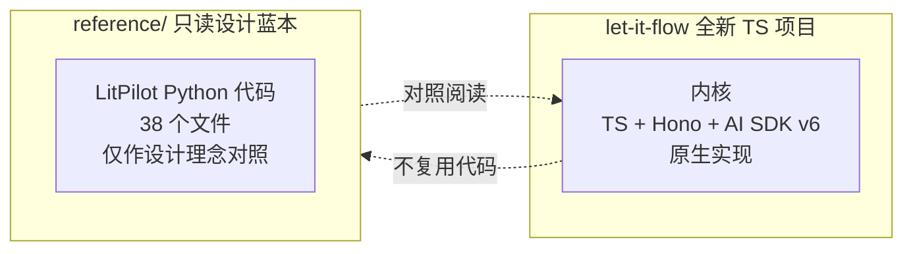

# 10 - LitPilot 关系说明（设计参考声明）

> **重要变更**：let-it-flow 已切换到 TypeScript 技术栈。本文件原为 Python 代码迁移指南，现降级为**设计理念参照声明**。`reference/` 目录的 Python 代码不复用，仅作为设计蓝本对照阅读。

## 10.1 当前定位

LitPilot 与 let-it-flow 的关系是**设计参考**，而非代码复用：

**结论**：
- let-it-flow 内核保持纯净，用 TypeScript 原生实现
- LitPilot 的文献综述逻辑若要接入，作为**上层消费应用**重新实现（可参考其设计，但代码重写）
- `reference/` 目录保留为只读参考材料，不参与构建、不纳入 import

## 10.2 为什么不复用代码

| 原因 | 说明 |
|------|------|
| 语言不匹配 | LitPilot 是 Python（FastAPI + asyncio），let-it-flow 是 TypeScript（Hono + async/await） |
| 生态对齐 | let-it-flow 靠拢 Vercel AI SDK v6 生态，Python 代码无法复用其结构化输出/流式协议 |
| 长期技术债 | 跨语言复用会引入胶水层与双重维护成本，断开更干净 |

## 10.3 可借鉴的设计理念

虽然不复用代码，但 LitPilot 的以下设计理念值得在 TS 实现中对照参考：

| LitPilot 设计理念 | let-it-flow TS 对应 | 参考文件 |
|------------------|---------------------|---------|
| 进程级共享 HTTP 连接池 | undici Agent keep-alive | `reference/llm/http_client.py` |
| 流式落库合并（避免逐 token 写盘） | StreamCoalescer + EventBatchBuffer | `reference/tasks/task_registry_reference.py` |
| 五段降级抓取 | native_fetch 多段降级（TS 重写） | `reference/tools/providers/native_fetch.py` |
| 抢占式任务领取（防多 worker 重复） | TaskStore.tryClaim | `reference/tasks/task_store.py` |
| DAG schema 蓝本（静态构建→动态生成） | WorkflowDAG Zod schema | `reference/planner/workflow_graph_reference.py` |
| SSE v1.0 协议事件构造 | stream-events.ts | `reference/core/streaming.py` |

## 10.4 LitPilot 作为消费应用的迁移路径（若需要）

若未来要把 LitPilot 的文献综述能力接入 let-it-flow，路径如下（全部 TS 重写，非代码搬运）：

1. **把文献综述封装为 DAG 模板**：在消费应用侧定义 `literature_review` 模板骨架
2. **LibraryStore 实现为知识库 HTTP 服务**：用 TS/Hono 重写，暴露 `/kb/search`、`/kb/retrieve`、`/kb/upsert`
3. **前端改为消费 let-it-flow 的 SSE**：`GET /api/tasks/:id/stream`

详细示例见 `examples/litpilot-as-consumer/`（M7 阶段实现）。

## 10.5 相关文档

- [01-overview.md](01-overview.md) - 项目定位（含与 LitPilot 关系决策）
- [02-architecture.md](02-architecture.md) - 目标架构（TS）
- [09-milestones-and-todolist.md](09-milestones-and-todolist.md) - 实现里程碑
- [REFERENCE-MANIFEST.md](REFERENCE-MANIFEST.md) - reference/ 目录清单（设计蓝本）
