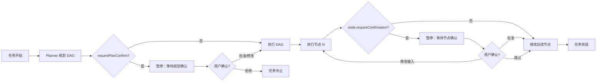
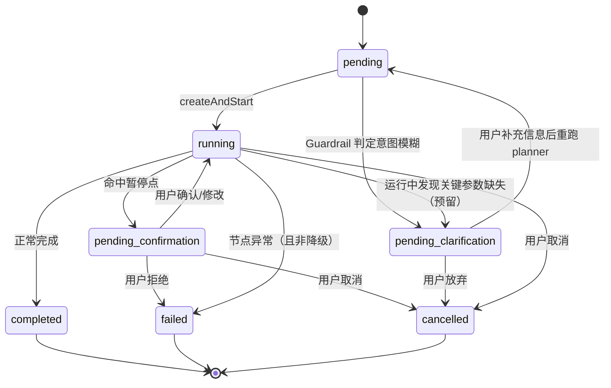

# 12 - Human-in-the-Loop 与流程控制

let-it-flow 在"确定性 DAG 执行"的基础上，支持在关键节点引入**人工干预（Human-in-the-loop, HITL）**。HITL 通过**暂停点（pause point）**实现：runner 在特定位置暂停，等待外部确认信号后恢复，全程不阻塞事件循环。

## 12.1 设计目标

- **可控性**：规划阶段或敏感工具执行前，允许用户审核/修改/否决
- **非阻塞**：暂停通过状态机驱动，不阻塞事件循环，其他任务正常执行
- **可流式**：暂停/恢复过程通过 SSE 实时推送，消费端 UI 可展示"等待确认"
- **渐进式**：HITL 是可选的，默认全自动执行；按需开启

## 12.2 三种 HITL 模式



### 模式一：规划确认（Plan Confirmation）

planner 产出 DAG 后、执行前，暂停任务，把完整 DAG 推送给消费端，等待用户：
- **批准**：原样执行
- **修改**：用户在前端编辑 DAG（增删节点/改参数）后回传，重新校验再执行
- **拒绝**：任务中止

由 `config.requirePlanConfirm: true` 全局开启。

### 模式二：节点结果确认（Node Result Confirmation）

某些节点（如 web_search 返回 5 支股票）执行后，暂停任务，把结果推送给消费端，等待用户：
- **批准**：用原结果继续下游
- **筛选/修改**：用户勾选子集（如选 3 支）后回传，下游用筛选后的结果
- **跳过**：该节点结果置空，下游用空值继续

由 DAG 节点级 `requireConfirmation: true` 开启。

### 模式三：链中干预（Mid-Flow Intervention）

模式二的泛化：在任意节点边界插入暂停点，不限于"确认结果"，可注入任意外部输入（如人工补充的查询词）。实现上与模式二相同，区别在于 `confirmation_required` 事件携带的 `payload.kind`。

## 12.3 任务状态机扩展

TaskStatus 新增 `pending_confirmation`（HITL 确认）与 `pending_clarification`（意图澄清）状态：



```typescript
// src/tasks/task-store.ts（扩展）
export type TaskStatus =
  | "pending"
  | "running"
  | "pending_confirmation"      // HITL：等待人工确认
  | "pending_clarification"     // Guardrail：等待用户补充意图信息
  | "completed"
  | "failed"
  | "cancelled";
```

## 12.4 暂停点实现机制

HITL 的核心是**runner 可暂停/恢复**。通过 `AsyncLatch`（异步闩锁）实现：runner 在暂停点 `await latch.wait()`，外部确认后 `latch.release(decision)` 唤醒。

```typescript
// src/tasks/latch.ts
/** 异步闩锁：runner 暂停等待，外部注入决策后唤醒。 */
export class AsyncLatch<T = unknown> {
  private resolveFn?: (value: T) => void;
  private promise?: Promise<T>;

  wait(): Promise<T> {
    this.promise = new Promise<T>((resolve) => { this.resolveFn = resolve; });
    return this.promise;
  }

  release(value: T): void {
    this.resolveFn?.(value);
  }

  get isPending(): boolean {
    return this.promise !== undefined && this.resolveFn !== undefined;
  }
}
```

### TaskRegistry 的可暂停 runner

```typescript
// src/tasks/registry.ts（关键扩展）
export class TaskRegistry {
  /** taskId → 当前活跃的确认闩锁（同一时刻最多一个） */
  private readonly confirmLatches = new Map<string, AsyncLatch<ConfirmDecision>>();

  /** 供 executor 调用：在暂停点等待用户决策。 */
  async awaitConfirmation(taskId: string, req: ConfirmationRequest): Promise<ConfirmDecision> {
    const latch = new AsyncLatch<ConfirmDecision>();
    this.confirmLatches.set(taskId, latch);

    // 更新任务状态 + 推送 confirmation_required 事件
    this.store.updateTask(taskId, {
      status: "pending_confirmation",
      stage: `awaiting:${req.kind}`,
    });
    this.emit(taskId, "confirmation_required", {
      kind: req.kind,          // "plan" | "node_result" | "node_input"
      nodeId: req.nodeId,      // 节点确认时填
      dag: req.dag,            // 规划确认时填
      result: req.result,      // 节点结果确认时填
      options: req.options,    // 可选操作（如允许筛选/修改）
    });

    // 持久化暂停点快照（防进程崩溃/Serverless 冷回收，见 §12.5）
    await this.snapshots.save(taskId, this.buildSnapshot(taskId, req));

    try {
      return await latch.wait();
    } finally {
      this.confirmLatches.delete(taskId);
      this.store.updateTask(taskId, { status: "running" });
    }
  }

  /** 供 API/SDK 调用：用户提交确认决策。热路径唤醒闩锁，冷路径从快照恢复（见 §12.5）。 */
  async confirm(taskId: string, decision: ConfirmDecision): Promise<void> {
    const latch = this.confirmLatches.get(taskId);
    if (latch) { latch.release(decision); return; }
    // 冷路径：进程已重启，从快照恢复执行
    const snap = await this.snapshots.load(taskId);
    if (!snap) throw new Error(`任务 ${taskId} 无可恢复快照`);
    this.rescheduleFromSnapshot(snap, decision);
  }
}

export interface ConfirmationRequest {
  kind: "plan" | "node_result" | "node_input";
  nodeId?: string;
  dag?: WorkflowDAG;
  result?: unknown;
  options?: { allowEdit?: boolean; allowFilter?: boolean };
}

export interface ConfirmDecision {
  action: "approve" | "modify" | "reject" | "skip";
  /** action=modify 时，修改后的 DAG 或节点结果 */
  modifiedDag?: WorkflowDAG;
  modifiedResult?: unknown;
}
```

## 12.5 状态快照与持久化（State Snapshot）

### 痛点：进程内 AsyncLatch 不够

`AsyncLatch`（§12.4）是**进程内**的 Promise——一旦进程退出（Serverless 冷回收、崩溃、重启），闩锁与执行上下文全部丢失，暂停中的任务无法恢复。在 Serverless（Vercel Functions）或分布式环境下，需把"暂停点状态"持久化到存储，使任务能跨进程/跨实例恢复。

### 解法：暂停点写快照 + 恢复时重建上下文

executor 在 `awaitConfirmation` 暂停时，不仅设闩锁，还把**恢复所需的全部状态**序列化落盘。恢复时从快照重建 ExecutionContext，从断点后继继续执行。

```typescript
// src/tasks/state-snapshot.ts

/** 暂停点状态快照：恢复执行所需的全部信息。 */
export interface StateSnapshot {
  taskId: string;
  dagId: string;
  /** 已完成节点的输出（ExecutionContext 的 outputs 快照） */
  completedOutputs: Record<string, Record<string, unknown>>;
  /** 当前执行到的层索引（恢复时从 layerIdx+1 继续） */
  layerIdx: number;
  /** 触发暂停的节点/阶段 */
  pausePoint: { kind: "plan" | "node"; nodeId?: string };
  /** 快照时间戳（用于超时判定） */
  savedAt: number;
}

export class SnapshotStore {
  /** 暂停时保存快照。 */
  async save(taskId: string, snap: StateSnapshot): Promise<void> {
    await this.store.write(`snapshots/${taskId}.json`, JSON.stringify(snap));
  }
  /** 恢复时加载快照。 */
  async load(taskId: string): Promise<StateSnapshot | null> {
    const raw = await this.store.read(`snapshots/${taskId}.json`);
    return raw ? JSON.parse(raw) as StateSnapshot : null;
  }
  /** 任务终态后清理。 */
  async clear(taskId: string): Promise<void> {
    await this.store.delete(`snapshots/${taskId}.json`);
  }
}
```

### 恢复流程

`confirm` 端点收到决策后，若当前进程无活跃闩锁（冷启动/不同实例），从快照恢复：

```typescript
// src/tasks/registry.ts（恢复逻辑）
async confirm(taskId: string, decision: ConfirmDecision): Promise<void> {
  const latch = this.confirmLatches.get(taskId);
  if (latch) {
    // 热路径：同进程，直接唤醒闩锁
    latch.release(decision);
    return;
  }
  // 冷路径：进程已重启（Serverless 冷回收），从快照恢复执行
  const snap = await this.snapshots.load(taskId);
  if (!snap) throw new Error(`任务 ${taskId} 无可恢复快照（可能已过期清理）`);
  // 重建 ExecutionContext，从 snap.layerIdx+1 继续 executeDag
  this.rescheduleFromSnapshot(snap, decision);
}
```

### Serverless / 分布式适配

| 环境 | 暂停表现 | 恢复机制 |
|------|---------|---------|
| **长跑进程**（SDK / 自托管 worker） | `AsyncLatch` 进程内挂起，内存常驻 | `confirm` 直接唤醒闩锁（热路径） |
| **Serverless**（Vercel Functions） | Function 实例可能被冷回收，闩锁丢失 | 快照已落盘；`confirm` 触发新 Function 实例，从快照重建执行 |
| **崩溃** | 进程异常退出 | sweeper 检测 `pending_confirmation` 任务（见 [08-task-streaming.md](08-task-streaming.md) §8.9），有快照则可恢复 |

> **关键：快照是闩锁的持久化后盾，不替代闩锁。** 热路径（同进程）用闩锁零开销唤醒；冷路径（跨进程）才读快照重建。两者覆盖不同场景，缺一不可。

### 存储选择

快照写入复用 TaskStore 的存储后端（FileStore / KVStore，见 [02-architecture.md](02-architecture.md) §2.7 约定6）。Serverless 环境须用**持久化后端**（KV / Blob），不能用进程内存——否则冷回收后丢失。

> 快照在任务进入终态（completed/failed/cancelled）后由 `SnapshotStore.clear` 清理，避免无限累积。超时未确认的任务（sweeper 转 cancelled）也会清理快照。

## 12.6 Executor 中的暂停点

Executor 在两个位置检查暂停需求：规划后、每个节点执行后。

```typescript
// src/executor/executor.ts（关键扩展）
export async function executeDag(
  dag: WorkflowDAG,
  registry: ToolRegistry,
  emit: EmitFn,
  cancelCheck?: CancelCheck,
  /** HITL：确认回调（不传则全自动执行） */
  awaitConfirmation?: (req: ConfirmationRequest) => Promise<ConfirmDecision>,
): Promise<void> {
  const context = new ExecutionContextImpl(dag.variables);
  const layers = topologicalLayers(dag);

  // 规划确认（若开启且 awaitConfirmation 提供）
  if (awaitConfirmation && dag.requirePlanConfirmation) {
    const decision = await awaitConfirmation({
      kind: "plan",
      dag,
      options: { allowEdit: true },
    });
    if (decision.action === "reject") {
      await emit("error", { message: "用户拒绝执行规划" });
      return;
    }
    if (decision.action === "modify" && decision.modifiedDag) {
      // 用修改后的 DAG 替换（重新分层）
      Object.assign(dag, decision.modifiedDag);
    }
  }

  for (const layer of topologicalLayers(dag)) {
    if (cancelCheck?.()) { /* ... */ return; }

    const results = await Promise.allSettled(
      layer.map((node) => executeNode(node, context, registry, emit, cancelCheck, awaitConfirmation)),
    );
    // ... 错误检查 ...
  }
}

async function executeNode(
  node: WorkflowNode,
  context: ExecutionContext,
  registry: ToolRegistry,
  emit: EmitFn,
  cancelCheck?: CancelCheck,
  awaitConfirmation?: (req: ConfirmationRequest) => Promise<ConfirmDecision>,
): Promise<Record<string, unknown>> {
  // ... 工具执行（见 07-executor.md）...
  const output = /* 执行结果 */;

  // 节点结果确认
  if (awaitConfirmation && node.requireConfirmation) {
    const decision = await awaitConfirmation({
      kind: "node_result",
      nodeId: node.id,
      result: output,
      options: { allowFilter: true },
    });
    if (decision.action === "skip") {
      return {};  // 下游用空值
    }
    if (decision.action === "modify" && decision.modifiedResult !== undefined) {
      Object.assign(output, decision.modifiedResult);
    }
    // approve：用原 output
  }

  return output;
}
```

## 12.7 DAG Schema 支持

WorkflowNode 与 WorkflowDAG 新增 HITL 标记（见 [03-dag-schema.md](03-dag-schema.md)）：

```typescript
// src/planner/dag-schema.ts（扩展）
export const WorkflowNode = z.object({
  // ... 既有字段 ...
  requireConfirmation: z.boolean().default(false)
    .describe("节点执行后是否暂停等待人工确认"),
});

export const WorkflowDAG = z.object({
  // ... 既有字段 ...
  requirePlanConfirmation: z.boolean().default(false)
    .describe("规划完成后是否暂停等待人工确认整个 DAG"),
});
```

## 12.8 SSE 事件：confirmation_required

新增事件类型，遵循 [08-task-streaming.md](08-task-streaming.md) 的命名风格：

```json
{
  "type": "confirmation_required",
  "schemaVersion": "1.0",
  "payload": {
    "kind": "node_result",
    "nodeId": "search_stocks",
    "result": { "results": [ /* 5 支股票 */ ] },
    "options": { "allowFilter": true }
  }
}
```

| payload 字段 | 类型 | 说明 |
|-------------|------|------|
| `kind` | `"plan"` \| `"node_result"` \| `"node_input"` | 确认类型 |
| `nodeId` | string? | 节点确认时填 |
| `dag` | WorkflowDAG? | 规划确认时填 |
| `result` | unknown? | 节点结果确认时填 |
| `options` | object? | 允许的操作（allowEdit/allowFilter） |

## 12.9 API 与 SDK 入口

### HTTP 形态

```typescript
// src/api/tasks.ts
tasks.post("/:id/confirm", async (c) => {
  const taskId = c.req.param("id");
  const body = await c.req.json();
  const decision = ConfirmDecision.parse(body);
  await taskRegistry.confirm(taskId, decision);   // 异步：热路径唤醒闩锁，冷路径从快照恢复
  return c.json(ok({ status: "resumed" }));
});
```

### 意图澄清端点（Clarification，承接 Guardrail）

当 Guardrail（[06-planner-and-templates.md](06-planner-and-templates.md) §6.7）判定意图模糊时，task 进入 `pending_clarification` 并发 `clarification_required` 事件。用户补充信息后经此端点恢复：

```typescript
// src/api/tasks.ts
tasks.post("/:id/clarify", async (c) => {
  const taskId = c.req.param("id");
  const { answers } = await c.req.json();        // { stockCode: "AAPL", ... }
  const task = taskRegistry.get(taskId);
  if (task?.status !== "pending_clarification") {
    return c.json(err("任务不在待澄清状态"));
  }
  // 合并补充信息到意图，原 task id 复用，重跑 planner 入口
  const enrichedIntent = mergeClarification(task.intent, answers);
  taskRegistry.rescheduleFromPlanner(taskId, enrichedIntent);
  return c.json(ok({ status: "rescheduled" }));
});
```

> clarify 与 confirm 都让暂停的任务恢复运行，区别在于：**confirm** 回答的是"已产出的节点/规划是否认可"（决策型），**clarify** 回答的是"意图缺什么"（补全型），因此 clarify 触发的是 planner 重跑而非 executor 继续。两者复用同一个暂停-恢复骨架（AsyncLatch），但状态字段与事件类型不同，避免语义混淆。

### SDK 形态

```typescript
// src/sdk/let-it-flow.ts
export class LetItFlow {
  async *execute(intent: string, config: Config): AsyncGenerator<StreamEvent> {
    const taskId = await this.registry.createAndStart(intent, config);
    // 把 awaitConfirmation 注入 executor
    const awaitConfirmation = async (req: ConfirmationRequest): Promise<ConfirmDecision> => {
      // 通过 generator yield 把确认请求推给调用方
      yield* this.emitConfirmation(req);  // 伪代码：实际通过共享队列
      return await this.latchFor(taskId).wait();
    };
    // ... 启动 executor，订阅事件流 yield 给调用方 ...
  }

  /** SDK 调用方在收到 confirmation_required 后调用此方法提交决策。 */
  async confirm(taskId: string, decision: ConfirmDecision): Promise<void> {
    await this.registry.confirm(taskId, decision);
  }
}
```

## 12.10 使用示例：股票分析中筛选

```typescript
// SDK 形态
const flow = new LetItFlow({ plannerModel: "openai/gpt-4o" });

const stream = await flow.execute("分析 5 支新能源龙头股", {
  // 通过 DAG 模板或 planner 在 search 节点标记 requireConfirmation: true
});

for await (const chunk of stream) {
  if (chunk.type === "confirmation_required" && chunk.payload.kind === "node_result") {
    const stocks = chunk.payload.result.results;
    // 前端展示，用户勾选 3 支
    const selected = await ui.promptSelect(stocks, { multi: true });
    flow.confirm(taskId, {
      action: "modify",
      modifiedResult: { results: selected },
    });
  }
}
```

## 12.11 边界与约束

- **同时只有一个暂停点**：同一任务同一时刻最多一个 `pending_confirmation`（闩锁互斥）。DAG 中多个节点标记 `requireConfirmation` 时，按拓扑序逐个暂停。
- **超时**：暂停可配置超时（如 10 分钟无确认自动取消），由 sweeper 处理（见 [08-task-streaming.md](08-task-streaming.md) §8.9）。
- **断线恢复**：消费端断线重连后，通过 `GET /api/tasks/:id` 发现 `status=pending_confirmation`，可重新拉取最近的 `confirmation_required` 事件恢复 UI。
- **进程崩溃/Serverless 冷回收**：暂停点状态已持久化为快照（§12.5），`confirm` 在新进程/实例从快照重建执行；热路径（同进程）仍走内存闩锁零开销唤醒。
- **默认关闭**：HITL 默认全自动执行（`requirePlanConfirmation`/`requireConfirmation` 均为 false），仅在显式开启时生效。

## 12.12 相关文档

- [03-dag-schema.md](03-dag-schema.md) - `requireConfirmation` / `requirePlanConfirmation` 字段
- [06-planner-and-templates.md](06-planner-and-templates.md) - Guardrail 与 `clarification_required` 的产生方
- [07-executor.md](07-executor.md) - Executor 暂停点集成
- [08-task-streaming.md](08-task-streaming.md) - `confirmation_required` / `clarification_required` 事件、`pending_confirmation` / `pending_clarification` 状态、sweeper 崩溃恢复
- [02-architecture.md](02-architecture.md) - `/confirm`、`/clarify` API 端点、存储后端可切换（§2.7 约定6）
