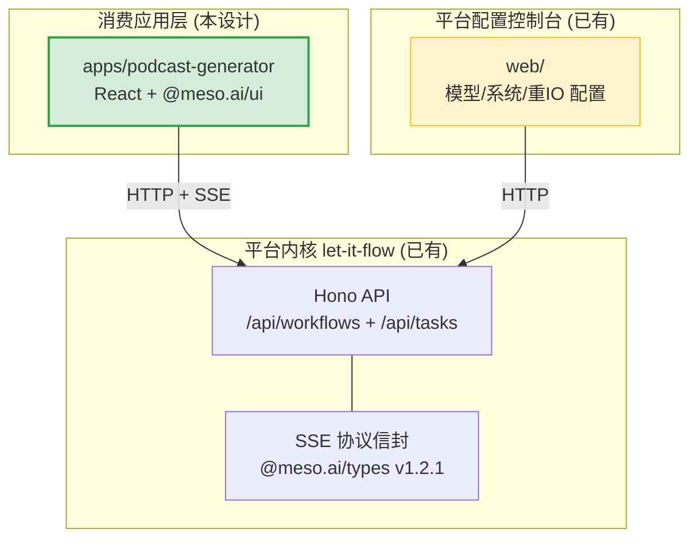
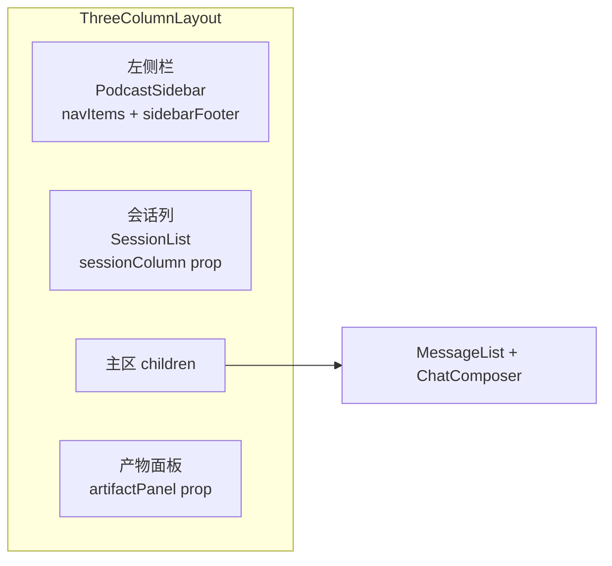
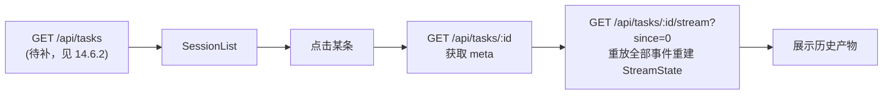
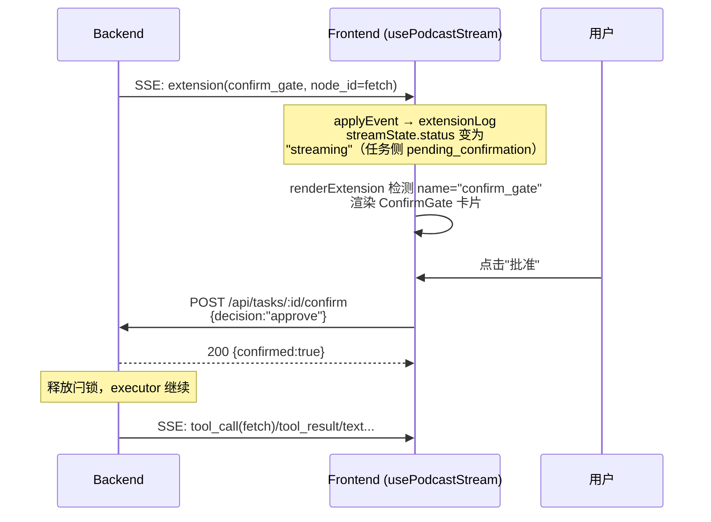
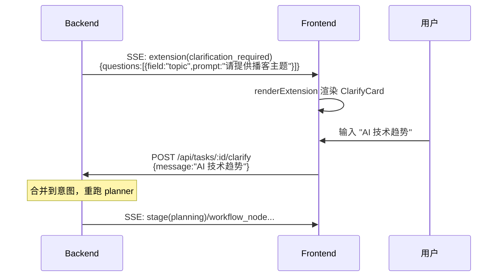

# 14 - Podcast Generator 消费应用前端设计

> 配套文档：[01-overview.md](01-overview.md) §不做对话式 UI 壳、[02-architecture.md](02-architecture.md) §2.3 前端选型、[08-task-streaming.md](08-task-streaming.md) SSE 协议、[12-hitl-and-control.md](12-hitl-and-control.md) HITL 机制、[09-milestones-and-todolist.md](09-milestones-and-todolist.md) P10 占位。

## 14.1 定位与架构边界

### 14.1.1 设计原则

遵循 [01-overview.md](01-overview.md) 第 127 行的架构铁律——**不做对话式交互的 UI 壳：UI 由消费应用自己开发，平台只提供流式能力（SDK generator 或 SSE）**。

因此 podcast-generator 前端是**消费应用层**，不归属平台内核：



### 14.1.2 与现有 `web/` 配置控制台的边界

| 维度 | `web/`（已有） | `apps/podcast-generator`（本设计） |
|------|---------------|-----------------------------------|
| 角色 | 平台管理后台 | 消费应用业务前端 |
| 用户 | 平台管理员 | podcast 内容创作者 |
| 页面 | 模型配置 / 系统设置 / 重IO 工具链 | 意图输入 / 流式生成 / 产物展示 / 历史会话 |
| UI 范式 | 表单 CRUD | 流式会话（chat-like） |
| 路由 | `/models` `/system` `/heavy-io` | `/` `/history` `/settings` |
| 部署 | 独立 Vite 子包 | 独立 Vite 子包（**不混用路由**） |

**两者完全独立**：各自的 `package.json`、各自的 Vite 配置、各自的端口。共享的只有后端 API 与 `@meso.ai/types` 协议。

### 14.1.3 不做的事

- **不修改平台内核**：所有需要的 API 端点已实现（见 §14.2.1），仅在任务历史功能需补一个列表端点（见 §14.6.2）
- **不修改 `examples/podcast-generator/`**：SDK 调用代码（`sdk-demo.ts` / `template.ts` / `toolkit.ts`）保持不变，前端通过 HTTP 消费而非直接 import SDK
- **不实现认证**：单用户本地使用，无 JWT/session
- **不在 `web/` 加路由**：独立子包

## 14.2 技术栈选型

### 14.2.1 后端 API（已就绪）

[src/api/app.ts](src/api/app.ts) 已挂载全部所需端点：

| 端点 | 方法 | 用途 | 请求/响应 |
|------|------|------|----------|
| `/api/workflows` | POST | 创建并启动 podcast 任务 | req: `{intent: string, config?: object}` → 201 `{status:"success", data:{taskId, status, createdAt}}` |
| `/api/tasks/:id` | GET | 查询任务 meta + 状态 | → `{status:"success", data: TaskMeta}` |
| `/api/tasks/:id/stream` | GET | SSE 流式订阅（断线续传） | `?since=N` → `text/event-stream` |
| `/api/tasks/:id/confirm` | POST | HITL 确认门 | req: `{decision:"approve"\|"reject"\|"modify", params?, note?}` → `{status:"success", data:{confirmed:true}}` |
| `/api/tasks/:id/clarify` | POST | Guardrail 澄清 | req: `{message: string}` → `{status:"success", data:{clarified:true}}` |

> **confirm 前置条件**（[src/api/tasks.ts](src/api/tasks.ts) 第 108 行）：任务状态必须为 `pending_confirmation`，否则返回 409。
> **clarify 前置条件**（第 139 行）：任务状态必须为 `pending_clarification`，否则返回 409。

### 14.2.2 `@meso.ai/types` v1.2.1（已存在于根 [package.json](package.json) 第 23 行）

后端 [src/core/stream-events.ts](src/core/stream-events.ts) 第 155-166 行的 `toSSE()` 产出协议信封：

```typescript
// SSE 线协议（每个 data: 行的 JSON 内容）
{ "type": "stage|text|tool_call|...", "schema_version": "1.0", "payload": {...} }
```

前端用 `parseSSELine(line)` 解析 + `applyEvent(state, event)` 归约成 `StreamState`。状态机纯函数、零副作用、可直接用于 React `useState`。

### 14.2.3 `@meso.ai/ui` v2.1.1（需新增依赖）

已在同级项目 `/Users/admin/work/LitPilot/frontend` 与 `/Users/admin/work/stock-fe/frontend` 验证可用。特性：

- **19 个组件 + 3 个 hooks**，peerDeps 仅 `react >= 18` + `@meso.ai/types >= 1.0`
- **CSS 变量主题系统**：`tokens.css` 定义 `--color-bg` / `--color-accent` 等稳定令牌，支持 `data-theme="dark"`
- **零 JS 运行时依赖**（纯 React + 协议类型）
- 导出路径：
  - `@meso.ai/ui` — 组件 + hooks
  - `@meso.ai/ui/runtime` — `parseSSELine` / `applyEvent` / `createInitialStreamState`（fetch-free，用于自定义 transport）
  - `@meso.ai/ui/tokens.css` — 设计令牌
  - `@meso.ai/ui/style.css` — 组件样式

### 14.2.4 前端技术栈（对齐现有 [web/package.json](web/package.json)）

| 类别 | 选型 | 理由 |
|------|------|------|
| 框架 | React 18.3 + react-router-dom 6.26 | 与 `web/` 一致，复用经验 |
| 构建 | Vite 5.4 + `@vitejs/plugin-react` | 与 `web/` 一致 |
| 流式 UI | `@meso.ai/ui ^2.1.1` | 核心依赖，提供 chat/workflow/HITL 全套组件 |
| 协议 | `@meso.ai/types ^1.2.1` | workspace 共享，与后端对齐 |
| 样式 | Tailwind CSS 3.4 + meso tokens.css | meso 组件用自身 CSS，业务自写部分用 Tailwind |
| 语言 | TypeScript 5.6（strict） | 与 `web/` 一致 |
| 状态管理 | React hooks（无 Redux/Zustand） | 流式状态由 `usePodcastStream` hook 管理 |

## 14.3 页面与组件设计

### 14.3.1 整体布局：基于 `ThreeColumnLayout`

主页面 `PodcastChatPage` 使用 meso 的 `ThreeColumnLayout`（[组件 props](../LitPilot/frontend/node_modules/@meso.ai/ui/dist/components/ThreeColumnLayout/ThreeColumnLayout.d.ts)）：



| `ThreeColumnLayout` prop | 传入内容 | 实现来源 |
|--------------------------|---------|---------|
| `appName` | `"Podcast Generator"` | 字面量 |
| `navItems` | `[{id:"generate",label:"生成"},{id:"history",label:"历史"},{id:"settings",label:"设置"}]` | 自写 `PodcastSidebar` |
| `sidebarFooter` | 版本号 / GitHub 链接 | 自写 |
| `sessionColumn` | `<SessionList/>` | 自写（读任务历史） |
| `children` | `<MessageList/> + <ChatComposer/>` | meso 组件 |
| `artifactPanel` | `<ArtifactSlot/>` | 自写（包 `ArtifactPaneShell`） |
| `defaultArtifactVisible` | `false` | 产物出现时自动显示 |
| `contentMaxWidth` | `860` | 与 meso 默认一致 |

### 14.3.2 聊天主区：`MessageList` + `ChatComposer`

#### `MessageList`（[props](../LitPilot/frontend/node_modules/@meso.ai/ui/dist/components/MessageList/MessageList.d.ts)）

```typescript
<MessageList
  messages={historyMessages}        // 已完成的对话轮次
  streaming={liveStreamState}       // usePodcastStream 的实时状态（idle 时 undefined）
  renderExtension={renderExtension} // 自写：confirm_gate / clarify 渲染
  renderLiveTrace={renderLiveTrace} // 自写：WorkflowTimeline + ProcessTrace
  emptyState={<WelcomeScreen/>}     // 首次进入的引导
  emptyStateAlign="top"
  onToolConfirm={handleToolConfirm} // awaiting_confirm 工具批准
  onToolCancel={handleToolCancel}
/>
```

- `historyMessages`：历史轮次（`{id, role:"user"|"assistant", content}`），从任务 meta + textContent 重建
- `streaming`：当前活跃的 `StreamState`（来自 `usePodcastStream`），驱动实时渲染
- `renderExtension`：见 §14.5 HITL 处理
- `renderLiveTrace`：自定义执行轨迹渲染（嵌入 `WorkflowTimeline`）

#### `ChatComposer`（[props](../LitPilot/frontend/node_modules/@meso.ai/ui/dist/components/ChatComposer/ChatComposer.d.ts)）

```typescript
<ChatComposer
  value={input}
  onChange={setInput}
  onSubmit={handleSend}
  onStop={handleAbort}      // 中断流
  streaming={isStreaming}   // 显示停止按钮
  placeholder="输入意图，如：把 https://example.com/a 做成播客"
  leadingSlot={<PipelineToggle/>}  // 文本链/完整视频链切换
/>
```

### 14.3.3 产物面板：`ArtifactSlot`（自写，包 `ArtifactPaneShell`）

podcast 产物有两种形态（见 [examples/podcast-generator/template.ts](examples/podcast-generator/template.ts)）：

| 产物类型 | 来源 | 展示方式 |
|---------|------|---------|
| `podcast_script` | 文本链 deliver 节点（第 100-108 行） | Markdown 渲染 |
| `podcast_video` | 完整视频链 deliver 节点（第 206-215 行） | 视频路径链接 + 元数据 |

`ArtifactSlot` 从 `streamState.artifacts` 提取产物，用 `ArtifactPaneShell` 多 Tab 展示：

```typescript
// Pseudocode
function ArtifactSlot({ streamState }) {
  const tabs = streamState.artifactOrder.map(id => {
    const art = streamState.artifacts[id];
    return {
      id,
      label: inferLabel(art.lang),  // "文稿" / "视频"
      content: renderArtifact(art), // <ArtifactPanel type="markdown" .../> 或视频播放器
      ready: art.done,
    };
  });
  return <ArtifactPaneShell tabs={tabs} autoSelectFirstReady />;
}
```

> **注意**：当前后端 deliver 工具（[src/tools/builtin/deliver.ts](src/tools/builtin/deliver.ts)）产出的是 `tool_result` 而非协议层 `artifact` 事件（第 14-16 行注释）。前端 MVP 阶段从 `streamState.toolCalls` 的 deliver 节点 `tool_result.output`（JSON 字符串）解析产物。完整视频链落地后，后端改发 `artifact` 事件，前端无缝切换到 `streamState.artifacts`。

### 14.3.4 会话列：`SessionList`（自写）

历史任务列表。当前后端**无 `GET /api/tasks` 列表端点**（见 §14.6.2 待补），MVP 方案：



每条历史项显示：意图摘要（`meta.intent` 截断 40 字）、状态徽章（`done/error/pending_confirmation`）、创建时间。

## 14.4 SSE 事件 → meso 组件映射表

基于 [docs/08-task-streaming.md](docs/08-task-streaming.md) §8.7 的事件类型与 meso `StreamState` 字段的对应关系：

| 后端 SSE 事件 type | meso `StreamState` 字段 | 渲染组件 | podcast 链路触发点 |
|---|---|---|---|
| `stage` | `stages[]` | `StageTimeline`（在 `ProcessTrace` 内） | 规划开始/完成、节点开始/完成 |
| `workflow_node` | `workflowRuns{run_id}.{nodes}` | `WorkflowTimeline` | fetch/search/rewrite/translate/tts/image_gen/video_build/deliver 各节点状态 |
| `tool_call` | `toolCalls{id}` (status: `pending`) | `ToolCallBlock` | 工具调用发起 |
| `tool_result` | `toolCalls{id}` (status: `done`/`error`) | `ToolCallBlock` | 工具返回 |
| `text` | `textContent` | `ChatBubble`（assistant + streaming cursor） | rewrite 节点流式产出文稿 |
| `extension(confirm_gate)` | `extensionLog[]` | 自写 `renderExtension` → `ConfirmGate` | fetch 节点 `requireConfirmation:true`（[template.ts](examples/podcast-generator/template.ts) 第 53/75/129 行） |
| `extension(clarification_required)` | `extensionLog[]` | 自写 `renderExtension` → 澄清输入框 | Guardrail 判定意图模糊 |
| `extension(rejected)` | `extensionLog[]` | 自写 `renderExtension` → 拒绝提示 | Guardrail 判定越界 |
| `done` | `status: "done"` | 结束流式光标 | DAG 执行结束 |
| `error` | `status: "error"`, `errorMessage` | 错误气泡 | 任何异常 |

### 14.4.1 `renderLiveTrace` 自定义实现

`MessageList` 的 `renderLiveTrace` 回调用于替换默认执行轨迹。podcast 场景需要同时展示 DAG 节点进度与工具调用：

```typescript
// Pseudocode
function renderLiveTrace(stream: StreamState) {
  return (
    <div className="podcast-live-trace">
      {stream.workflowRunOrder.length > 0 && (
        <WorkflowTimeline
          runs={stream.workflowRunOrder.map(id => stream.workflowRuns[id])}
        />
      )}
      <ProcessTrace
        stream={stream}
        streaming={stream.status === "streaming"}
        onToolConfirm={handleToolConfirm}
        onToolCancel={handleToolCancel}
      />
    </div>
  );
}
```

## 14.5 HITL 交互流程

### 14.5.1 confirm_gate（节点确认）

podcast DAG 中 `requireConfirmation: true` 的节点（见 [template.ts](examples/podcast-generator/template.ts)）：
- `fetch`（URL 模式，第 53 行）— 确认抓取该 URL
- `fetch`（topic 模式，第 75 行）— 确认抓取搜索结果
- `rewrite`（文本链，第 95 行）— 确认改写方向

后端通过 `extension(name="confirm_gate")` 事件承载（[src/core/stream-events.ts](src/core/stream-events.ts) 第 128-140 行）：

```json
{
  "type": "extension",
  "schema_version": "1.0",
  "payload": {
    "name": "confirm_gate",
    "version": "1.0",
    "data": {
      "gate_id": "g_abc123",
      "node_id": "fetch",
      "run_id": "r_xyz",
      "prompt": "确认抓取以下 URL？",
      "options": ["approve", "reject"],
      "detail": { "urls": ["https://example.com/a"] }
    }
  }
}
```



`renderExtension` 实现：

```typescript
// Pseudocode
function createRenderExtension({ taskId, onConfirm, onClarify }) {
  return (event: ExtensionEvent) => {
    const { name, data } = event.payload;
    if (name === "confirm_gate") {
      const d = data as ConfirmGateData;
      return (
        <ConfirmGateCard
          prompt={d.prompt}
          detail={d.detail}
          onApprove={() => onConfirm(taskId, { decision: "approve" })}
          onReject={() => onConfirm(taskId, { decision: "reject" })}
        />
      );
    }
    if (name === "clarification_required") {
      const d = data as ClarifyData;
      return (
        <ClarifyCard
          questions={d.questions}
          onSubmit={(msg) => onClarify(taskId, msg)}
        />
      );
    }
    return null;
  };
}
```

### 14.5.2 clarification_required（意图澄清）

当 Guardrail 判定意图模糊（如既无 URL 也无明确主题），任务进入 `pending_clarification`，发 `extension(clarification_required)`：



## 14.6 目录结构 + pnpm workspace 配置

### 14.6.1 目录结构

```
apps/podcast-generator/
├── package.json              # @let-it-flow/podcast-generator
├── vite.config.ts            # proxy /api → localhost:8787（复用 web/vite.config.ts 模式）
├── tsconfig.json             # strict，jsx: react-jsx（复用 web/tsconfig.json）
├── tailwind.config.js        # 扫描 src/**，叠加 meso tokens
├── postcss.config.js
├── index.html                # FOUC 防闪脚本（meso tokens.css 要求）
└── src/
    ├── main.tsx              # 入口：BrowserRouter + 导入 meso style.css + tokens.css
    ├── App.tsx               # 路由：/ 生成页，/history 历史，/settings 设置
    ├── pages/
    │   ├── PodcastChatPage.tsx     # 主页面（ThreeColumnLayout + 流式）
    │   ├── HistoryPage.tsx         # 历史任务列表（复用 SessionList 或独立页）
    │   └── SettingsPage.tsx        # podcast 专属设置（默认 style/language/maxSearchResults）
    ├── components/
    │   ├── PodcastSidebar.tsx      # NavItem[] + sidebarFooter
    │   ├── SessionList.tsx         # 任务历史列表
    │   ├── ArtifactSlot.tsx        # 包 ArtifactPaneShell，展示文稿/视频
    │   ├── renderExtension.tsx     # createRenderExtension（confirm_gate / clarify）
    │   ├── renderLiveTrace.tsx     # WorkflowTimeline + ProcessTrace 组合
    │   ├── ConfirmGateCard.tsx     # confirm_gate 专用卡片（基于 meso ConfirmGate 扩展 prompt/detail）
    │   ├── ClarifyCard.tsx         # clarification_required 输入卡片
    │   ├── PipelineToggle.tsx      # 文本链/完整视频链切换（ChatComposer leadingSlot）
    │   └── WelcomeScreen.tsx       # 空状态引导
    ├── hooks/
    │   └── usePodcastStream.ts     # 简化版 SSE 流管理（无 auth，见 §14.6.3）
    └── lib/
        ├── api.ts                  # 复用 web/src/lib/api.ts 的 {status,data,message} 封装
        ├── tasks.ts                # 任务 CRUD 客户端（createTask/getTask/listTasks）
        └── artifacts.ts            # 从 StreamState 提取 podcast 产物
```

### 14.6.2 后端待补端点：`GET /api/tasks`

当前 [src/api/tasks.ts](src/api/tasks.ts) 仅有 `GET /api/tasks/:id`（查单个），**无列表端点**。前端历史功能需后端补一个轻量列表端点：

```typescript
// 待补：src/api/tasks.ts
app.get("/", (c) => {
  const tasks = registry.getStore().listAll();  // 需在 FileTaskStore 补 listAll()
  return c.json({ status: "success", data: tasks });
});
```

**实现方式**（在 `FileTaskStore`）：扫描 `data/tasks/*/meta.json`，按 `createdAt` 降序返回摘要（`id` / `intent` / `status` / `createdAt` / `updatedAt`）。

> **本设计文档不实现此后端端点**，仅标注依赖。前端 MVP 可先做空状态，历史功能等后端补全后启用。

### 14.6.3 `usePodcastStream` hook 设计

参考 [stock-fe/frontend/src/hooks/useAuthenticatedSSEStream.ts](../stock-fe/frontend/src/hooks/useAuthenticatedSSEStream.ts)，去掉 auth 部分：

```typescript
// Pseudocode — apps/podcast-generator/src/hooks/usePodcastStream.ts
import { applyEvent, createInitialStreamState, parseSSELine, isCompatibleVersion } from "@meso.ai/ui/runtime";
import type { StreamState } from "@meso.ai/types";

export function usePodcastStream() {
  const [state, setState] = useState<StreamState>(createInitialStreamState);
  const [taskId, setTaskId] = useState<string | null>(null);
  const abortRef = useRef<AbortController | null>(null);

  // 创建任务 + 订阅流
  const start = useCallback(async (intent: string, config?: object) => {
    abortRef.current?.abort();
    const created = await api.post<{taskId: string}>("/api/workflows", { intent, config });
    setTaskId(created.taskId);

    const ctrl = new AbortController();
    abortRef.current = ctrl;
    setState({ ...createInitialStreamState(), status: "streaming" });
    let current = state;

    const resp = await fetch(`/api/tasks/${created.taskId}/stream?since=0`, { signal: ctrl.signal });
    const reader = resp.body!.getReader();
    const decoder = new TextDecoder();
    let buffer = "";

    while (true) {
      const { done, value } = await reader.read();
      if (done) break;
      buffer += decoder.decode(value, { stream: true });
      const lines = buffer.split("\n");
      buffer = lines.pop() ?? "";
      for (const line of lines) {
        const event = parseSSELine(line);
        if (!event || !isCompatibleVersion(event)) continue;
        current = applyEvent(current, event);
        setState(current);
        if (event.type === "done" || event.type === "error") return;
      }
    }
  }, []);

  const confirm = useCallback((decision: "approve" | "reject" | "modify", params?) => {
    if (!taskId) return;
    return api.post(`/api/tasks/${taskId}/confirm`, { decision, params });
  }, [taskId]);

  const clarify = useCallback((message: string) => {
    if (!taskId) return;
    return api.post(`/api/tasks/${taskId}/clarify`, { message });
  }, [taskId]);

  const abort = useCallback(() => { abortRef.current?.abort(); }, []);
  const reset = useCallback(() => { setState(createInitialStreamState()); setTaskId(null); }, []);

  return { state, taskId, start, confirm, clarify, abort, reset };
}
```

### 14.6.4 pnpm workspace 配置

更新 [pnpm-workspace.yaml](pnpm-workspace.yaml)：

```yaml
packages:
  - "web"
  - "apps/podcast-generator"
```

### 14.6.5 `apps/podcast-generator/package.json`

```json
{
  "name": "@let-it-flow/podcast-generator",
  "private": true,
  "version": "0.1.0",
  "type": "module",
  "scripts": {
    "dev": "vite --port 5174",
    "build": "tsc -b && vite build",
    "preview": "vite preview",
    "typecheck": "tsc --noEmit"
  },
  "dependencies": {
    "@meso.ai/ui": "^2.1.1",
    "@meso.ai/types": "^1.2.1",
    "react": "^18.3.1",
    "react-dom": "^18.3.1",
    "react-router-dom": "^6.26.0"
  },
  "devDependencies": {
    "@types/react": "^18.3.0",
    "@types/react-dom": "^18.3.0",
    "@vitejs/plugin-react": "^4.3.0",
    "autoprefixer": "^10.4.20",
    "postcss": "^8.4.41",
    "tailwindcss": "^3.4.10",
    "typescript": "^5.6.0",
    "vite": "^5.4.0"
  }
}
```

> **端口 5174**：避免与 `web/`（5173）冲突，可同时 dev。

### 14.6.6 `vite.config.ts`

```typescript
import { defineConfig } from "vite";
import react from "@vitejs/plugin-react";

export default defineConfig({
  plugins: [react()],
  server: {
    port: 5174,
    proxy: {
      "/api": {
        target: process.env.LIF_BACKEND_URL ?? "http://localhost:8787",
        changeOrigin: true,
      },
    },
  },
  build: { outDir: "dist", emptyOutDir: true },
});
```

### 14.6.7 `index.html` FOUC 防闪

```html
<!DOCTYPE html>
<html lang="zh-CN">
  <head>
    <meta charset="UTF-8" />
    <meta name="viewport" content="width=device-width, initial-scale=1.0" />
    <title>Podcast Generator · Let It Flow</title>
    <!-- meso tokens.css FOUC 防闪脚本（见 tokens.css 头部注释） -->
    <script>(function(){var t=localStorage.getItem('meso-theme')||'light';
      document.documentElement.setAttribute('data-theme',t);})()</script>
  </head>
  <body>
    <div id="root"></div>
    <script type="module" src="/src/main.tsx"></script>
  </body>
</html>
```

### 14.6.8 `main.tsx` 样式导入顺序

```typescript
import "@meso.ai/ui/tokens.css";   // 设计令牌（必须最先）
import "@meso.ai/ui/style.css";    // 组件样式
import "./index.css";              // 业务 Tailwind + 覆盖
import React from "react";
import ReactDOM from "react-dom/client";
import { BrowserRouter } from "react-router-dom";
import App from "./App";

ReactDOM.createRoot(document.getElementById("root")!).render(
  <React.StrictMode>
    <BrowserRouter>
      <App />
    </BrowserRouter>
  </React.StrictMode>,
);
```

## 14.7 样式集成策略

meso 组件自带 CSS（`style.css`），使用 `--color-*` 令牌。业务自写部分用 Tailwind，但**不重复定义 meso 已有的令牌**：

### 14.7.1 `tailwind.config.js`

```javascript
module.exports = {
  content: ["./index.html", "./src/**/*.{ts,tsx}"],
  theme: {
    extend: {
      colors: {
        // 桥接 meso CSS 变量到 Tailwind
        bg: "rgb(var(--color-bg) / <alpha-value>)",
        accent: "rgb(var(--color-accent) / <alpha-value>)",
        border: "rgb(var(--color-border) / <alpha-value>)",
      },
    },
  },
  plugins: [],
};
```

### 14.7.2 `src/index.css`

```css
@tailwind base;
@tailwind components;
@tailwind utilities;

/* 业务专属覆盖：podcast 生成页的微调 */
.podcast-live-trace {
  margin: 8px 0;
}
.podcast-welcome h1 {
  color: var(--color-accent);
}
```

## 14.8 验收标准

设计文档完整性检查：

- [x] §14.1 明确 podcast-generator 前端与 `web/` 配置控制台的边界（独立子包，不混用）
- [x] §14.3 每个区域有组件规格（用哪些 meso 组件 + 自写哪些）
- [x] §14.4 SSE 事件 → 组件映射表完整（覆盖 podcast 文本链 + 完整视频链所有事件）
- [x] §14.5 HITL confirm_gate 与 clarification 的前端处理流程有时序图
- [x] §14.6 目录结构、pnpm workspace、package.json、vite.config 可执行
- [x] §14.6.3 `usePodcastStream` hook 完整 pseudocode
- [x] §14.6.2 标注后端待补端点（`GET /api/tasks` 列表）

## 14.9 后续实现里程碑（仅规划，不在本文档执行）

参考 [09-milestones-and-todolist.md](09-milestones-and-todolist.md) P10 占位项，建议拆分：

| 阶段 | 内容 | 预估 |
|------|------|------|
| P10.1 | 子包脚手架（package.json/vite/tailwind）+ 依赖安装 + 空壳 ThreeColumnLayout 跑通 | 0.5 天 |
| P10.2 | `usePodcastStream` hook + ChatComposer 意图输入 + 基础流式渲染（text 通道） | 0.5 天 |
| P10.3 | `renderLiveTrace` + WorkflowTimeline + ProcessTrace（DAG 节点可视化） | 0.5 天 |
| P10.4 | `renderExtension` + ConfirmGate + ClarifyCard（HITL 完整链路） | 0.5 天 |
| P10.5 | ArtifactSlot 产物展示（podcast_script 文稿） | 0.5 天 |
| P10.6 | 后端补 `GET /api/tasks` 列表端点 + SessionList 历史功能 | 0.5 天 |
| P10.7 | 完整视频链产物展示（视频播放器）+ 端到端验收 | 0.5 天 |

**总计**：约 3.5 天。

## 14.10 相关文档

- [01-overview.md](01-overview.md) — 不做对话式 UI 壳的架构铁律（§第 127 行）
- [02-architecture.md](02-architecture.md) — 前端选型（§2.3）、平台与消费应用边界（§2.11）
- [08-task-streaming.md](08-task-streaming.md) — SSE 事件协议（§8.7）、断线续传（§8.7）、API 端点（§8.8）
- [12-hitl-and-control.md](12-hitl-and-control.md) — HITL 三种模式、confirm/clarify 端点
- [09-milestones-and-todolist.md](09-milestones-and-todolist.md) — P10 前端消费应用完善占位
- [examples/podcast-generator/template.ts](examples/podcast-generator/template.ts) — podcast DAG 节点结构（fetch/search/rewrite/translate/tts/image_gen/video_build/deliver）
