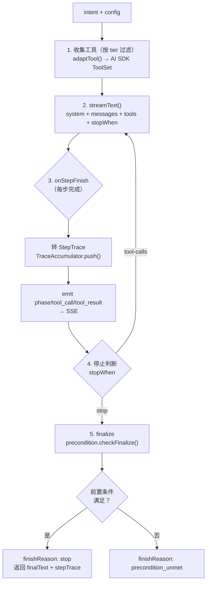

# 15 - Harness Engineering（Agent 执行基础设施）

> 配套文档：[02-architecture.md](02-architecture.md) 架构分层、[07-executor.md](07-executor.md) 静态 DAG 执行、[04-tool-protocol.md](04-tool-protocol.md) 工具协议、[08-task-streaming.md](08-task-streaming.md) SSE、[16-nexusops.md](16-nexusops.md) NexusOps 应用。

## 15.1 什么是 Harness Engineering

任务执行的可靠性，与底层模型的关系，远不如与包裹模型的基础设施层（agent execution harness）的关系密切。这是 2025–2026 年被正式命名的独立学科。

与 prompt/context engineering 的递进关系：

| 层次 | 关注点 | 单位 |
|------|--------|------|
| Prompt Engineering | 优化单次调用的输入文本 | 单次 LLM 调用 |
| Context Engineering | 每一步模型该看到什么 | 单步上下文窗口 |
| **Harness Engineering** | 完整的基础设施包裹层 | 整个 agent 生命周期 |

let-it-flow 把 harness 拆成 7 个关注层（**ETCLOVG**），每层都有清晰的"平台提供机制 / 应用提供内容"边界。

## 15.2 ETCLOVG 七层模型

```
E - Execution        执行层      ReAct 循环 / 静态 DAG / stop 策略
T - Tools            工具层      FlowConnector / ToolRegistry / 风险评级
C - Context          上下文层    IKnowledgeProvider / Obsidian / MCP / EvidenceEnvelope
L - Lifecycle        生命周期层  skill 沉淀 / 轨迹工具化 / 自动沉淀
O - Observability    可观测层    StepTrace / token 计量 / KV-cache 前缀（规划）
V - Validation       验证层      Precondition / 上下文充分性校验
G - Governance       治理层      GovernanceHooks / 确定性阻断 / HITL
```

### 15.2.1 平台 vs 应用的职责边界（关键）

这是整套设计的核心纪律：**平台只提供机制（挂钩点），应用提供内容（挂什么）**。

| 层 | 平台提供（机制） | 应用提供（内容） |
|----|------------------|------------------|
| E | `runReactHarness()` 执行循环 | 调用点绑定（哪个模型驱动）、system prompt |
| T | `ToolRegistry` / `FlowConnector` 接口 / tool-adapter | 具体 domain.* 工具集（OEE/设备/质量…） |
| C | `IKnowledgeProvider` 接口 / `ObsidianProvider` / MCP 客户端 | vault 内容结构（精益五类上下文）、MCP server 配置 |
| L | `SkillConnector` / `createSkill` 桥接 | 已验证轨迹沉淀为 skill.* |
| O | `StepTrace` / `TraceAccumulator` / SSE 事件 | 无（自动） |
| V | `PreconditionRegistry` / `checkFinalize` / `checkEveryStep` | 业务前置条件（"OEE 结论需 oee.* 实测"） |
| G | `GovernanceChain` / `toHooks()` / tool-adapter 钩子 | 业务阻断规则（"批量改排产 >3 需 HITL"） |

**反模式**：把业务规则写进内核 prompt，或把通用执行逻辑写进应用。前者依赖概率性合规（不可靠），后者导致重复实现。

## 15.3 E 层：执行

### 15.3.1 双范式共存

let-it-flow 同时支持两种执行范式，由消费应用在 boot 时选择：

| 范式 | 入口 | 适用场景 | 文件 |
|------|------|----------|------|
| 静态 DAG | `runPlanned`（planner + executor） | 流程确定、可预编译（podcast 链路） | `src/planner/` `src/executor/` |
| **ReAct 循环** | `runReactHarness`（streamText + tool calling） | 动态规划、多步取证（NexusOps 分析） | `src/agent/react-harness.ts` |

共存机制：`TaskRuntime.customRunner` 钩子（见 §15.3.3）。应用注入 customRunner 则走 ReAct，否则走默认 planner+DAG。内核 `TaskRegistry.start()` 优先调用 customRunner。

### 15.3.2 ReAct Harness 核心

`runReactHarness(intent, config)` 的执行循环（`src/agent/react-harness.ts`）：



关键配置（`HarnessConfig`，`src/agent/types.ts`）：

```typescript
interface HarnessConfig {
  callSite: CallSite;           // 哪个调用点驱动（→ 模型解析）
  model: LanguageModel;         // LlmService.model(callSite)
  registry: ToolRegistry;       // 工具池
  toolTiers: string[];          // 暴露给 LLM 的工具层级（core/domain/custom）
  stopPolicy: { maxSteps; costCap?; finalizeTool? };
  preconditions: Precondition[];
  governanceHooks: GovernanceHooks;
  requireConfirmation?: HitlGateFn;  // HITL 门
  emit?: EmitFn;                    // SSE 事件出口
  systemPrompt?: string;            // 应用追加的角色 prompt
  compatMode?: boolean;             // DeepSeek 等兼容服务
}
```

### 15.3.3 customRunner 钩子（应用接入点）

```typescript
// src/tasks/registry.ts
interface TaskRuntime {
  llm: LlmService;
  toolRegistry: ToolRegistry;
  customRunner?: (taskId, intent, hooks: TaskRunnerHooks) => Promise<void>;
}

interface TaskRunnerHooks {
  emit: (type, payload) => StreamEvent;   // 事件落库 + SSE
  setStatus: (status, message?) => void;   // 任务状态机
  awaitConfirmation: (gate) => Promise<ConfirmationResult>;  // HITL
}
```

应用（如 NexusOps boot.ts）注入 customRunner，内部调 `runReactHarness`，把 harness 的 emit/requireConfirmation 桥接到内核 store + HITL。这样应用复用全部平台基础设施（SSE/HITL/配置/任务存储），只贡献"用什么模型+工具+规则驱动 ReAct"。

### 15.3.4 兼容模式（compatMode）

DeepSeek 等 OpenAI 兼容服务不支持 `developer` 角色（AI SDK 默认把 system 映射成 developer）。compatMode 开启时，harness 把 system 折叠进 user 消息（与 planner 的 `llmCallArgs` 同策略）。

```typescript
// src/agent/react-harness.ts
const streamArgs = compatMode
  ? { messages: [{ role: "user", content: `${system}\n\n---\n${intent}` }] }
  : { system, messages: [{ role: "user", content: intent }] };
```

### 15.3.5 步数预算（R4）与 prepareStep 中间件（R6）

平台新增的 E 层机制：

- **StepBudget**（`src/agent/step-budget.ts`）：`computeStepBudget(stepNumber, maxSteps)` 返回 `{ total, used, remaining, ratio, phase }`，phase 三档（ramp_up 0-40% / focus 40-80% / wrap_up 80-100%+）。harness 自动计算并通过 `PrepareStepContext.budget` 透传给 prepareStep 钩子。
- **prepareStep 中间件模式**（`src/agent/prepare-step-middleware.ts`）：`composePrepareStep([mw1, mw2, ...])` 把多个职责（方法论注入 / 工具裁剪 / 前置条件提醒 / 证据门 / 步数预警）组合成单个 prepareStep 函数（洋葱模型）。平台内置 `stepBudgetWarnMiddleware`：phase=wrap_up 时注入步数预警提示。

应用读取 `ctx.budget.phase` 决定策略（如 NexusOps 的 40/40/20 分级），不再自己算 stepRatio。

## 15.4 T 层：工具

### 15.4.1 FlowConnector 接口

所有工具实现 `FlowConnector`（`src/tools/base.ts`），核心字段：

- `name` / `tier`（core/domain/custom）/ `description`
- `inputSchema`：JSON Schema（function calling 严格校验）
- `whenToUse`：`{ triggers, notFor }`——**工具描述质量是被严重低估的杠杆**。LLM 永远看不到工具代码实现，只读文字描述决定用不用、怎么用。
- `risk`：`safe | write | destructive`（决定是否走 HITL）
- `execute`：async generator，yield `ToolEvent`，return `ToolResult`

### 15.4.2 tool-adapter：FlowConnector → AI SDK ToolSet

`adaptTool(connector, deps, ctxMeta)`（`src/agent/tool-adapter.ts`）把 FlowConnector 转成 AI SDK 的 `tool()`：

1. 拼 description（核心 + triggers + notFor）
2. `inputSchema`：`jsonSchema(withObjectType(connector.inputSchema))`
   - `withObjectType` 兜底：部分内置工具用 zod `.shape`（含 Zod 内部结构），function calling 要求顶层 `type:"object"`，此处用 `zod-to-json-schema` 转换
3. execute：
   - G 层 governance 钩子（先于 HITL，确定性阻断）
   - risk=write/destructive → HITL requireConfirmation
   - 调 FlowConnector.execute（消费 ToolEvent 流 → emit 桥接 SSE）
   - return output 给 SDK 作 Observation

### 15.4.3 风险评级与 HITL

```typescript
// tool-adapter.ts
if ((risk === "write" || risk === "destructive") && deps.requireConfirmation) {
  // 发 tool_status(awaiting_confirm) → 挂起 → POST /confirm 释放
  const decision = await deps.requireConfirmation({ prompt, detail: { tool, args, risk } });
  confirmed = decision.approved;
}
```

## 15.5 C 层：上下文 + EvidenceEnvelope

### 15.5.1 三源上下文

| 源 | 接口 | 实现 | 用途 |
|----|------|------|------|
| 本地知识库 | `IKnowledgeProvider` | `ObsidianProvider` | 企业 SOP/A3/术语/方法论 |
| MCP resources | `IKnowledgeProvider` | `McpKnowledgeProvider` | 企业系统只读数据（KB 语义） |
| 外部知识 | core 工具 | `web_search` / `web_fetch` | 公开通用专家知识 |

`core.knowledge_base` 工具（`src/tools/builtin/knowledge-base.ts`）汇总所有 provider，统一检索接口。

### 15.5.2 EvidenceEnvelope 规范

所有工具返回 `EvidenceEnvelope`（`src/core/evidence-envelope.ts`）——证据驱动的核心：

```typescript
interface EvidenceEnvelope<T> {
  data: T;
  freshness: "realtime" | "shift" | "daily" | "weekly" | "historical";
  capturedAt: string;       // ISO 时间戳
  confidence: "measured" | "estimated" | "inferred";
  source: { system: string; provenance: string };
  caveat?: string;          // 数据注意事项
}
```

意义：LLM 在 Reasoning 时能感知证据时效/置信度，避免用 `inferred` 数据下硬结论。前端用 EvidenceBadge 渲染成徽章。

## 15.6 L 层：生命周期 + skill 沉淀

已验证的 ReAct 轨迹（如 OEE 诊断的"取证→损失分解→交叉验证→结论"五步）沉淀为 `skill.*` 工具（`src/agent/skill-bridge.ts`），主循环可像调普通工具一样调用。

`createSkill({ name, steps })` 把多步 FlowConnector 串成一个 SkillConnector，execute 时顺序执行所有 step，把最后一步的 EvidenceEnvelope 提升为 skill 输出（注入 `_skill` 元数据）。

### 15.6.1 SkillConnector 成熟度（status）

SkillConnector 带 `status` 字段标识成熟度：

- `active`（缺省）：正式 skill，注册进 toolTiers，主循环直接采用结果
- `draft`：试运行 skill，以影子模式运行（输出标记 `_shadow`，不直接采用，与主循环结果对比）

draft 影子模式的意义：把"自动识别准不准"降级为"试错代价够不够低"。识别错也不会造成伤害，顶多浪费几次影子计算。连续 N 次成功（无反信号）才转正（由 SkillRegistry 计数升级，见 §17）。

### 15.6.2 自动沉淀（trace 挖矿 + draft 转正）

skill 沉淀从"纯手写"升级为混合机制（详见 [17-skill-sedimentation.md](17-skill-sedimentation.md)）：

- 用户主动触发走快通道
- 自动挖矿（`src/agent/skill-miner.ts`）走慢通道：候选 → 确认 → draft 影子 → 转正

挖矿不训练分类器，用"三硬信号 AND + 反信号一票否决 + 跨会话去重降权"：
- 三硬信号：簇内 ≥3 次 + 成本占比 >60% + 成功率 ≥80%
- 反信号一票否决：含 inferred 硬结论 / HITL 决策 / governance 阻断 / skill 部分失败

## 15.7 O 层：可观测

- `StepTrace`（`src/agent/types.ts`）：每步的 thought/reasoning/toolCalls/usage/durationMs
- `TraceAccumulator`：累积全部步骤，汇总 token 用量
- SSE 事件：`phase` / `tool_call` / `tool_result` / `workflow_node` / `extension`
- 前端 `StepTrace` 组件渲染 Thought→Action→Observation 时间线

### 15.7.1 平台新增的 O 层机制（R5/R7/R9）

- **TraceCompressor**（`src/agent/trace-compressor.ts`）：把 stepTrace 压成精简文本（thought 截断 200 字、Evidence 附徽章、rejected 标记），供多轮追问作为 user 消息前置段落注入。`DefaultTraceCompressor` 是默认实现；`loadPreviousContext` 封装从 task 事件流还原 + 压缩的完整链路。
- **emitHarnessResult**（`src/agent/result-emitter.ts`）：会话收尾时统一 emit 兜底总结 + extension（precondition_unmet / artifacts / react_result）。三种 finishReason 分支（success / precondition_unmet / error）由平台处理，应用只需调用一次。
- **NarrationSequencer**（`react-harness.ts` 的 `fireNarrations`）：多工具解读的下发顺序可配置（`HarnessConfig.narrationSequence`）。缺省 `serial`（按 toolCalls 顺序串行，避免 token 交错混乱）；`concurrent` 走 Promise.all 并发。

## 15.8 V 层：验证（Precondition）

来自洞察："某类任务在哪些信息被确认之前禁止进入回答阶段——比靠模型自我感知可靠得多。"

`PreconditionRegistry`（`src/agent/precondition.ts`）维护条件列表，两种触发时机：

- `on_finalize`：finalize 时检查（缺省）
- `every_step`：每步检查（注入 prepareStep）

应用声明条件（如 NexusOps 的 `require_oee_evidence`）：讨论 OEE 但未调 `oee.*` 取证 → `finishReason: precondition_unmet`，前端提示"证据不足"。

`checkFinalize` 返回首个未满足条件的 `{ missingTool, prompt }`，喂给 LLM 补取证或终止。

> **语义级增强**：规则化前置条件只检查"调没调过某前缀工具"，不看证据内容质量。收尾前的开放式语义评估见 [23-conversational-quality-layers.md](23-conversational-quality-layers.md) 的 evidence-gate 层。

## 15.9 G 层：治理（Governance）

来自洞察："在 prompt 里告诉 agent 遵循规范，和接入规范被违反时直接阻断的 linter，本质是两件不同的事。前者概率性合规，后者强制确定性约束。"

`GovernanceChain`（`src/agent/governance.ts`）维护规则列表，每个工具执行前过一遍链（`preToolUse`），任一阻断即拒绝（不发请求）。

`PostToolUseChain`（对称 `GovernanceChain`）维护过程侧一致性校验规则，每个工具执行后、结果返回 LLM 前过一遍链（`postToolUse`）。与 preToolUse 的区别：preToolUse 拿不到结果只能按入参阻断；postToolUse 能看到 EvidenceEnvelope，检测证据冲突、置信度兜底等，可 warn（注入 `_warnings`）或 block（替换结果为 `{ blocked: true, reason }`）。

与 HITL 的区别：

| | Governance preToolUse | Governance postToolUse | HITL |
|---|---|---|---|
| 性质 | 确定性阻断（前） | 确定性校验（后） | 询问用户 |
| 决策方 | 代码规则 | 代码规则 | 人 |
| 输入 | 入参 + risk | 入参 + 结果 | 入参 + risk |
| 适用 | 违规即禁（批量改排产） | 证据冲突/inferred 兜底 | 高风险需授权（停线） |

应用挂规则（如 NexusOps 的 `guard_bulk_schedule_change` + `warn_inferred_repeat` + `warn_low_evidence_strength`）：前者单次改 >3 工单直接阻断；后者检测 inferred 证据被反复引用、低强度证据出现，注入 warn 提示 LLM 降权。

### 15.9.1 finalize 后 review pass

除确定性钩子外，可选挂一次 finalize 后的 LLM 事后审计（`src/agent/review-pass.ts`）：

- 把 stepTrace 压成精简文本（thought + toolName + 证据徽章），喂给便宜模型（callSite `nexus_review`）
- 产出结构化报告：`{ overClaims, unsupportedConclusions, evidenceGaps, confidence }`
- 不阻断主结果（只挂可信度报告），失败降级为 skipped
- 开关 `NEXUS_REVIEW_PASS=1`（默认关）

这是把"证据-结论"链路的校验从主循环里剥离，避免主循环上下文爆炸。

> **能力前移**：同样的"证据是否支撑结论"判断已前移到收尾前（事前拦截 + 分级阻断），见 [23-conversational-quality-layers.md](23-conversational-quality-layers.md) 的 evidence-gate 层。review-pass 保留为 finalize 后的事后审计。

## 15.10 ETCLOVG 检查清单

设计新消费应用时，逐层确认：

- [ ] **E**：选范式（DAG 还是 ReAct）；若 ReAct，注入 customRunner
- [ ] **T**：domain.* 工具集，每个返回 EvidenceEnvelope，描述含 triggers/notFor
- [ ] **C**：KB provider 配置（vault 路径 / MCP server）；core.knowledge_base 自动注册
- [ ] **L**：高频诊断流程沉淀为 skill.*；启用 trace 挖矿（SkillRegistry）+ draft 影子转正
- [ ] **O**：StepTrace 自动产出，无需应用干预
- [ ] **V**：声明业务前置条件（on_finalize 兜底 + every_step 实时拦截 + prepareStep 裁工具）
- [ ] **G**：声明业务阻断规则（preToolUse 违规即禁 + postToolUse 一致性校验 + 可选 review pass）
