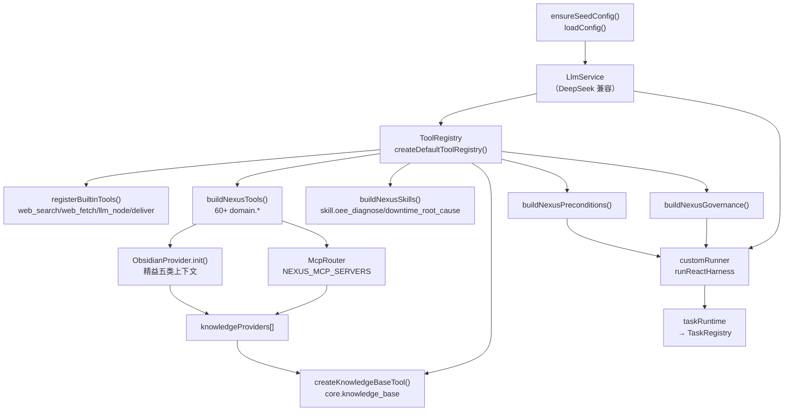

# 16 - NexusOps 运营智能分析消费应用

> 配套文档：[15-harness-engineering.md](15-harness-engineering.md) ETCLOVG 框架、[04-tool-protocol.md](04-tool-protocol.md) 工具协议、[05-kb-mcp-protocol.md](05-kb-mcp-protocol.md) KB/MCP、[14-podcast-generator-frontend.md](14-podcast-generator-frontend.md) 前端设计（通用部分）。

## 16.1 定位

NexusOps 是 let-it-flow 的第二个消费应用，面向精益生产/运营智能分析。核心理念：**ReAct 多步取证 + 证据驱动建议**——大模型根据问题动态规划、编排、调度工具取证，结合本地知识库（专有）+ MCP（企业系统）+ web（通用专家），产出带影响度/执行度/置信度的结构化建议，能执行则给行动按钮，不能则不勉强。

## 16.2 ETCLOVG 装配

应用层只贡献"内容"，机制全部复用平台（见 [15-harness-engineering.md](15-harness-engineering.md) §15.2.1）。

### 16.2.1 装配入口

`apps/nexusops/server/boot.ts` 的 `bootNexusOps()`：



### 16.2.2 E 层（执行）

NexusOps 注入 `customRunner`（绕过 planner+DAG），内部调 `runReactHarness`：

- 调用点：`nexus_agent`（ReAct 主循环）、`nexus_advise`（结构化建议）
- 模型：DeepSeek（pro 驱动 ReAct，flash 驱动 advise）
- compatMode=true（折叠 system 进 user，规避 developer 角色）
- toolTiers：`["core", "domain", "custom"]`——全部工具对 LLM 可见
- stopPolicy：maxSteps=12（可配 NEXUS_MAX_STEPS）

### 16.2.3 T 层（工具集）

60+ mock 工具，按精益域分层（`apps/nexusops/tools/`），全部返回 EvidenceEnvelope：

| 域 | 工具前缀 | 示例 | 数据时效 |
|----|----------|------|----------|
| OEE | `oee.*` | `oee.realtime` / `oee.history` / `oee.target_gap` | realtime/shift |
| 设备 | `equipment.*` | `equipment.downtime` / `equipment.health` / `equipment.mtbf` | realtime |
| 质量 | `quality.*` | `quality.pareto` / `quality.defect_rate` / `quality.spc` | shift |
| 工艺 | `process.*` | `process.parameters` / `process.deviation` / `process.capability` | realtime |
| 能耗 | `energy.*` | `energy.realtime` / `energy.peak` / `energy.waste` | realtime |
| 排产 | `schedule.*` | `schedule.load` / `schedule.changeover` / `schedule.conflict` | shift |
| 物料 | `material.*` | `material.inventory` / `material.shortage` / `material.wip` | realtime |
| 安全 | `safety.*` | `safety.events` / `safety.near_miss` / `safety.audit` | daily |

加 MCP 动作工具（`mcp.<server>.<tool>`，风险推断 write/destructive）和收尾工具 `nexus_finalize` / `nexus_advise`。

### 16.2.4 C 层（上下文：三源）

1. **本地知识库**：Obsidian vault（`OBSIDIAN_VAULT_PATH`），精益五类上下文结构：
   - `01-现场状态/`（OEE 计算口径、停机根因模板）
   - `02-改善项目/`（A3 报告、改善案例）
   - `03-精益知识/`（方法论、术语表）
   - `04-人与组织/`（培训、技能矩阵）
   - `05-推理辅助/`（5Why、鱼骨图模板）
2. **MCP resources**：`NEXUS_MCP_SERVERS` 配置的 server，读桥适配成 KB provider
3. **web**：`core.web_search` / `core.web_fetch`

`core.knowledge_base` 工具统一检索全部 provider。

### 16.2.5 L 层（skill 沉淀）

`apps/nexusops/skills/`：

- `skill.oee_diagnose`：OEE 异常标准诊断流（5 步：取 OEE→损失分流→5M1E 交叉验证→综合诊断→包 EvidenceEnvelope）
- `skill.downtime_root_cause`：停机根因流（取证→帕累托→5Why→根因）

未来：从高频 ReAct trace 自动提取沉淀为新 skill。

### 16.2.6 V 层（precondition）

`apps/nexusops/server/preconditions.ts`：

- `require_oee_evidence`：讨论 OEE 给建议前，必须调过 `oee.*` 实测
- `require_downtime_evidence`：讨论停机根因前，必须调 `equipment.*` 或 `skill.downtime_root_cause`

未满足 → `finishReason: precondition_unmet` → 前端提示证据不足。

### 16.2.7 G 层（governance）

`apps/nexusops/server/governance.ts`：

- `block_destructive_by_default`：destructive 工具默认需 `NEXUS_ALLOW_DESTRUCTIVE=1` + HITL
- `guard_bulk_schedule_change`：批量排产变更（单次 >3 工单）确定性阻断

## 16.3 前端（apps/nexusops/web）

复用 podcast 7 个通用文件（[14-podcast-generator-frontend.md](14-podcast-generator-frontend.md) 通用部分）+ 改写 3 业务文件 + 新增 3 业务组件。

### 16.3.1 文件清单

| 类别 | 文件 | 说明 |
|------|------|------|
| 通用（复用） | `lib/api.ts` | 统一 API 客户端（端点同构） |
| 通用（复用） | `hooks/useNexusStream.ts` | SSE 流式会话 hook |
| 通用（复用） | `components/SessionList.tsx` | 会话历史列表 |
| 通用（复用） | `components/ConfirmGateCard.tsx` | HITL 确认门卡 |
| 通用（复用） | `components/ClarifyCard.tsx` | Guardrail 澄清卡 |
| 通用（复用） | `components/renderExtension.tsx` | extension 渲染（+NexusOps 专属扩展） |
| 通用（复用） | `components/renderLiveTrace.tsx` | 实时轨迹（+StepTrace） |
| **业务（改写）** | `pages/NexusChatPage.tsx` | 主页（欢迎语/示例是运营场景） |
| **业务（改写）** | `lib/artifacts.ts` | 提取建议/诊断产物（非文稿/视频） |
| **业务（改写）** | `components/ArtifactSlot.tsx` | 产物面板（JSON 渲染） |
| **新增** | `components/RecommendationCard.tsx` | nexus_advise 建议卡（impact/confidence/actionTool） |
| **新增** | `components/EvidenceBadge.tsx` | EvidenceEnvelope 时效/置信度徽章 |
| **新增** | `components/StepTrace.tsx` | ReAct Thought→Action→Observation 时间线 |

### 16.3.2 关键业务组件

**RecommendationCard**：渲染 `nexus_advise` 的建议列表。每条含：
- 优先级徽章（紧急/高优/参考，按 impact × executionScore 计算）
- 三维度评分进度条（影响度/执行度/置信度）
- 依据（可展开，引用证据 evidenceRefs）
- 行动按钮：**仅当有 actionTool 时渲染**（无对应 MCP 则显示"建议人工实施"，不勉强）

**EvidenceBadge**：从工具结果解析 EvidenceEnvelope，渲染 freshness（实时/历史）+ confidence（实测/估算/推断）+ source 徽章。

**StepTrace**：把 StreamState.toolCalls 渲染成 ReAct 工具链时间线，每节点显示工具名（按域着色）+ 参数摘要 + 证据徽章。

## 16.4 配置

### 16.4.1 环境变量（`.env`）

```bash
# LLM（DeepSeek，OpenAI 兼容）
OPENAI_API_KEY=sk-...
OPENAI_BASE_URL=https://api.deepseek.com
OPENAI_MODEL=deepseek-v4-pro

# NexusOps 调用点模型绑定
LIF_NEXUS_AGENT_MODEL=deepseek-v4-pro    # ReAct 主循环（强推理）
LIF_NEXUS_ADVISE_MODEL=deepseek-v4-flash # 结构化建议（量大）

# Obsidian vault（精益五类上下文）
OBSIDIAN_VAULT_PATH=./data/nexus-vault

# MCP server（JSON 数组）
NEXUS_MCP_SERVERS=[{"id":"mes","transport":"http","url":"http://localhost:9000/mcp"}]

# ReAct 控制
NEXUS_MAX_STEPS=12
NEXUS_COST_CAP_INPUT=
NEXUS_PORT=8788
NEXUS_ALLOW_DESTRUCTIVE=
```

### 16.4.2 vault 初始化

```bash
# 把 seed（精益五类上下文）拷到 OBSIDIAN_VAULT_PATH（幂等，不覆盖）
OBSIDIAN_VAULT_PATH=./data/nexus-vault npx tsx apps/nexusops/kb-seed/install-vault.ts
```

## 16.5 运行

### 16.5.1 后端

```bash
# 启动 NexusOps HTTP 服务（:8788）
pnpm dev:nexus
# 或
npx tsx apps/nexusops/server/index.ts
```

启动日志会打印工具数（70）、KB providers（obsidian）、MCP servers、全部端点。

### 16.5.2 前端

```bash
cd apps/nexusops/web
pnpm dev   # Vite :5175，代理 /api → :8788
```

### 16.5.3 提交分析

```bash
curl -X POST http://localhost:8788/api/workflows \
  -H 'Content-Type: application/json' \
  -d '{"intent":"L01产线OEE最近偏低，帮我诊断原因并给出改善建议"}'
# → {"status":"success","data":{"taskId":"t_...","status":"pending"}}

# 订阅 SSE 看实时执行
curl -N http://localhost:8788/api/tasks/<taskId>/stream?since=0
```

## 16.6 端到端验证（DeepSeek 实跑）

已验证的完整 ReAct 链（intent: "L01产线OEE最近偏低，帮我诊断原因并给出改善建议"）：

1. LLM 选 `skill.oee_diagnose`（scenarioId=anomaly, line=L01）
2. skill 执行 5 步：取 OEE（0.61）→ 损失分流（availability）→ 5M1E 交叉验证 → 综合诊断 → 包 EvidenceEnvelope
3. 诊断：设备健康下降 + 工艺参数漂移，confidence=0.8
4. LLM 调 `nexus_advise` 产出 3 条建议：
   - 【紧急】排查主轴轴承（impact 0.75, execution 0.7, confidence 0.85，evidenceRefs 引用 equipment.* + KB 案例）
   - 【紧急】采购主轴轴承（消除缺件风险）
   - 【高优】校准工艺参数
5. actionTool 全部留空（无真实 MES MCP，遵循"不勉强"原则）
6. 134 个 SSE 事件，状态 done

## 16.7 后续扩展

- MCP 接入真实 MES/ERP：配 `NEXUS_MCP_SERVERS`，写工具自动注册为 `mcp.<server>.<tool>`，建议卡自动出现行动按钮
- skill 自动沉淀：从高频 trace 提取重复轨迹 → 生成新 skill
- KV-cache 优化（O 层）：前缀稳定性管理 + 语义路由，压 token 成本
- 多产线/多工厂：vault 按 `工厂/产线/` 分层，precondition 按域细化
