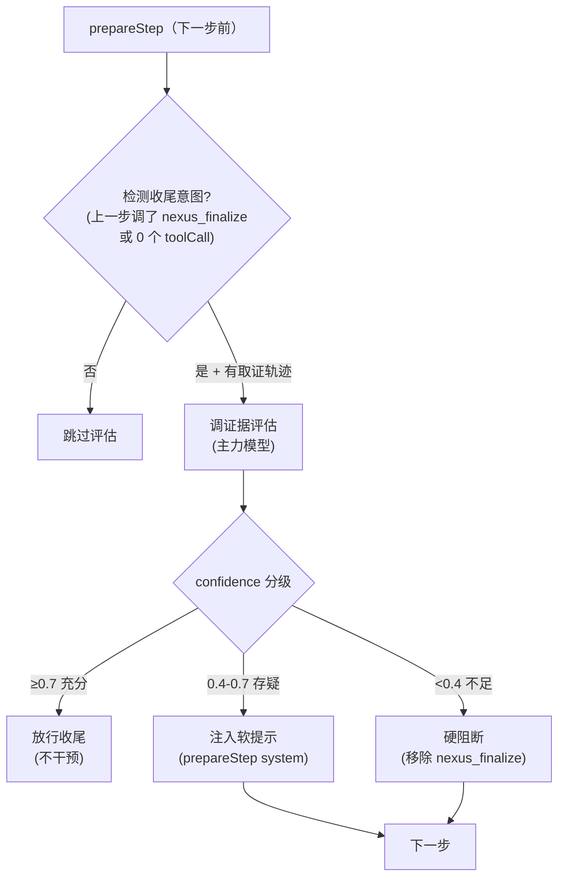

# 23 - 会话质量双层：实时解读 + 收尾前证据评估

> 配套文档：[15-harness-engineering.md](15-harness-engineering.md) ETCLOVG 七层模型（O/V 层）、[20-narrative-output-rules.md](20-narrative-output-rules.md) helper 层叙述规范。

## 23.1 解决的两个问题

NexusOps 的 ReAct 会话原本有两个"干"的痛点，本层分别治理：

| 痛点 | 现象 | 根因 | 治理层 |
|------|------|------|--------|
| **数据不出声** | 用户只看到工具卡片亮灭，不知道拿到了什么、意味着什么 | domain 工具只 emit `tool_call` / `tool_result`，没有中间解读 | O 层增强：实时解读（narrate-pass） |
| **收尾太草率** | 模型可能在证据不足时就给结论（如只调一次 `oee.*` 就下"设备老化"的判断） | V 层前置条件只检查"调没调过某前缀工具"（刚性），不看证据内容质量 | V 层增强：收尾前证据评估（evidence-gate） |

## 23.2 O 层增强：实时解读（narrate-pass）

### 23.2.1 与 helper 叙述的分工

[20 号文档](20-narrative-output-rules.md) 记录的 `narrate.ts` 是 **helper 层**：skill/tool 开发者在代码里**手写**固定叙述文本（如"正在检索写稿铁律…"）。

narrate-pass 是 **LLM 生成层**：把工具返回的 `EvidenceEnvelope` 喂给轻量模型，**自动生成**针对这条数据的人类可读解读。两者互补：

| | helper 叙述（narrate.ts） | LLM 解读（narrate-pass） |
|---|---|---|
| 触发方 | 开发者在代码里显式调用 | harness 钩子自动触发 |
| 内容 | 固定模板（"正在 X…"） | 针对具体数据的动态解读 |
| 适用 | 流程节点（步骤开始/结束/分支） | 工具结果（拿到一条数据） |
| 模型 | 不调模型 | 轻量模型（callSite `nexus_narrate`） |

### 23.2.2 触发位置

`react-harness.ts` 的 `onStepFinish` 钩子——每步完成后，对该步的每个工具调用结果调 `narrateStepResult`，生成的文本通过 `narrate.ts` 的 `narrateSummary` 流式下发为 `text` 事件。

```
onStepFinish(step) {
  for (const tc of step.toolCalls) {
    const narration = await narrateStepResult(tc.toolName, tc.args, tc.result, { model: narrateModel });
    if (narration) emit text 事件
  }
  ...原有 StepTrace 累积 + phase 事件...
}
```

### 23.2.3 实现要点

- **只解读 EvidenceEnvelope**：非信封结果（如纯回执）返回空字符串，不调模型
- **数据先压缩**：`data` 字段 `JSON.stringify` 后截断到 400 字，配 `summarizeEvidence` 生成的徽章，防 token 爆炸
- **输出约束**：≤80 字、第一人称、动词开头、点出 1-2 个关键数值、点破明显异常
- **失败降级**：返回空字符串，不阻断主循环（与 review-pass 容错原则一致）
- **maxOutputTokens: 120**：硬限制防长段落

### 23.2.4 callSite 配置

新增 callSite `nexus_narrate`，默认绑定轻量模型（如 deepseek-flash）。在 P8 配置体系（`call-sites.ts` / `config-loader.ts` / `llm-service.ts`）中已注册，角色映射为 `summarizer`。

## 23.3 V 层增强：收尾前证据评估（evidence-gate）

### 23.3.1 为什么需要语义级评估

[15 号文档 §15.8](15-harness-engineering.md) 的 V 层前置条件是**规则化**的：扫已调工具名前缀，"涉及 OEE 但没调 `oee.*`"就拦截。这有两个盲区：

1. **不看证据质量**：调了 `oee.realtime` 但返回的是 `confidence: "inferred"` 的弱证据，照样放行
2. **不看证据覆盖**：调了一次 `oee.realtime` 但没做 availability/performance 拆解交叉验证，也能下"设备老化"的硬结论

evidence-gate 用主力模型做**开放式语义判断**，回答"当前证据是否足以支撑针对用户意图的结论"——这是规则化前缀检查做不到的。

### 23.3.2 触发时机：仅收尾意图时

评估不是每步都跑（控制延迟），只在模型表现出收尾意图时触发：



典型会话触发 1-2 次（模型尝试收尾 → 被拦 → 补取证 → 再收尾）。

### 23.3.3 分级处理（三级动作）

`resolveAction(confidence)` 按 confidence 分级：

| confidence | action | 处理 | 技术实现 |
|------------|--------|------|----------|
| ≥ 0.7 | `pass` | 放行，不干预 | 评估结果被 `tryEvaluateEvidenceGate` 过滤，不写 result |
| 0.4 – 0.7 | `soft_warn` | 保留 finalize，注入警告 | `result.system` 追加"证据充分性提醒" + evidenceGaps |
| < 0.4 | `block` | 硬阻断，模型看不到收尾工具 | `result.activeTools` 过滤掉 `nexus_finalize` + system 注入"禁止收尾" |

**硬阻断的技术原理**：prepareStep 的 `activeTools` 是白名单机制（`react-harness.ts` 透传给 SDK）。从 activeTools 移除 `nexus_finalize` 后，模型这一步根本看不到该工具，无法调用它收尾。这比 `toolChoice: "none"`（禁所有工具）精准得多。

### 23.3.4 prepareStep 的三件事集成

`buildNexusPrepareStep` 现在做三件事（原两件 + 新增证据评估）：

1. **动态裁工具**（A3）：识别主导域后只保留相关工具
2. **every_step 前置条件提醒**：规则化的前缀检查（V 层原有）
3. **收尾意图检测 + 证据评估**（新增）：语义级评估 + 分级阻断

```typescript
// prepare-step.ts 的核心结构
export function buildNexusPrepareStep(
  allToolNames: string[],
  evidenceGateModel?: LanguageModel,      // 新增：主力模型做评估
  evidenceGateCompatMode?: boolean,
) {
  return async (ctx) => {
    const result = {};
    // 1. 裁工具
    if (detectDominantDomain(ctx.steps)) { result.activeTools = ... }
    // 2. 前置条件提醒
    const reminders = collectEveryStepReminders(ctx.steps);
    if (reminders.length) { result.system = ... }
    // 3. 证据评估（仅收尾意图时触发）
    if (evidenceGateModel) {
      const verdict = await tryEvaluateEvidenceGate(ctx, evidenceGateModel);
      if (verdict) applyGateVerdict(verdict, result, allToolNames);
    }
    return result.activeTools || result.system ? result : undefined;
  };
}
```

### 23.3.5 与 review-pass / 规则化前置条件的关系

三者构成证据治理的完整链路，职责不重叠：

| | every_step 前置条件（V 层原有） | evidence-gate（V 层增强） | review-pass（G 层） |
|---|---|---|---|
| 时机 | 每步前 | 收尾前（仅收尾意图） | finalize 后 |
| 判断方 | 代码规则（前缀匹配） | 主力模型（语义） | 便宜模型（语义） |
| 管什么 | "调没调过某工具" | "证据内容够不够" | "结论是否超出证据" |
| 力度 | 注入提醒（软） | 分级（软提示/硬阻断） | 只挂报告（不阻断） |
| 是否阻断 | 软（注入 system） | 软或硬 | 不阻断 |

**互补不冲突**：规则化前缀检查管"该取证的工具调没调"，语义评估管"已取的证据质量够不够支撑结论"。前者快速刚性，后者深度语义。

### 23.3.6 复用 review-pass 的能力

evidence-gate 不重复造轮子，通过 import 复用 review-pass 的两个工具函数：

- `compressTrace(stepTrace)`：把 StepTrace[] 压成精简文本（thought + toolName + 证据徽章）
- `parseReviewReport(text)`：解析 LLM 返回的 JSON 报告（`{ overClaims, evidenceGaps, confidence }`）

区别只在 prompt 和触发时机：evidence-gate 无 `finalText`（结论还没产出），改为基于用户意图判断证据充分性。

### 23.3.7 失败降级

与 review-pass 一致的容错原则——评估是锦上添花，任何失败都不阻断主流程：

- 模型报错（超时/网络）→ `skipped: true, action: "pass"`
- 解析失败（非合法 JSON）→ `skipped: true, action: "pass"`
- 空轨迹 → `skipped: true, action: "pass"`（不调模型）

### 23.3.8 模型选择

复用 `nexus_agent` 同款主力模型（不新增 callSite）。评估是主力的同款推理任务，没必要单独配。boot.ts 装配时直接注入：

```typescript
const prepareStep = buildNexusPrepareStep(
  allToolNames,
  llm.model("nexus_agent"),
  llm.compatModeFor ? llm.compatModeFor("nexus_agent") : false,
);
```

## 23.4 prepareStep 异步化

evidence-gate 的评估是 async（调 LLM），要求 prepareStep 支持 async。AI SDK v6 的 `PrepareStepFunction` 原生支持 `PromiseLike<PrepareStepResult>`，但项目自己的 `HarnessConfig.prepareStep` 类型原本窄化为同步。

本次改动把类型扩展为支持 Promise 返回：

```typescript
// src/agent/types.ts
prepareStep?: (ctx: PrepareStepContext) =>
  Promise<PrepareStepResult | undefined> | PrepareStepResult | undefined;
```

`react-harness.ts` 的 SDK 回调相应改为 `async` + `await`。这是支撑异步评估钩子的必要改动，不影响原有同步 prepareStep（仍可直接返回非 Promise 值，JS 的 await 对非 Promise 是透传）。

## 23.5 固定 vs 动态（边界纪律）

| 内容 | 来源 | 性质 |
|------|------|------|
| 分级阈值（0.7 / 0.4） | 硬编码常量 | 流程控制参数，固定 |
| 阻断/放行/软提示的动作逻辑 | 硬编码代码 | 流程控制，固定 |
| 收尾意图检测（nexus_finalize 或 0 toolCall） | 硬编码代码 | 流程控制，固定 |
| "证据是否充分"的判断 | 主力模型开放式推理 | 动态，**非硬编码领域知识** |
| "还缺什么取证"（evidenceGaps） | 主力模型语义判断 | 动态，**非领域清单** |
| prompt 角色定义（证据评估员 / 解说员） | 硬编码 prompt 文本 | 固定框架文字 |

核心纪律：**流程控制硬编码，内容判断交给模型**。不把"OEE 诊断需要查 availability"这类领域知识写进代码或清单。

## 23.6 延迟控制

- **narrate-pass**：每步每个工具结果调一次轻量模型（deepseek-flash 级），单次延迟低。与主循环串行（在 onStepFinish 后），不阻塞下一步 LLM 调用
- **evidence-gate**：仅收尾意图时触发，典型会话 1-2 次。每次用主力模型，单次延迟与一步主循环相当，不额外引入更慢环节
- **最坏情况**：模型反复尝试收尾被反复阻断，最多 `maxSteps` 次。步数兜底会终止，不会死循环

## 23.7 文件落点

| 文件 | 角色 |
|------|------|
| `src/agent/narrate-pass.ts` | O 层：工具结果实时解读 |
| `src/agent/evidence-gate.ts` | V 层：收尾前证据评估 + 分级动作 |
| `apps/nexusops/server/prepare-step.ts` | 集成证据评估（收尾检测 + 分级阻断） |
| `apps/nexusops/server/boot.ts` | 装配评估模型（复用 nexus_agent） |
| `src/agent/react-harness.ts` | onStepFinish 注入 narrate-pass；prepareStep 回调改 async |
| `src/agent/types.ts` | prepareStep 类型扩展支持 Promise |
| `src/llm/call-sites.ts` 等 | 注册 `nexus_narrate` callSite |

## 23.8 验证

- `tests/unit/agent/test-narrate-pass.ts`：解读输入校验、正常路径、降级路径、compatMode
- `tests/unit/agent/test-evidence-gate.ts`：分级阈值边界（pass/soft_warn/block）、失败降级、空轨迹、compatMode
- `tests/unit/apps/nexusops/test-prepare-step-evidence-gate.ts`：集成测试——block 断言 activeTools 不含 nexus_finalize、soft_warn 保留 finalize、pass 不干预、无收尾意图不触发、无模型退化
- 现有测试套件 518 个无回归（含被 prepareStep 异步化影响的测试）

手动验证方式：问一个需要多步取证的问题（如"L01 产线 OEE 为什么低"），观察：
1. 每个工具结果后是否出现人类可读解读（narrate-pass）
2. 模型尝试收尾时若证据不足，是否被硬阻断并继续取证（evidence-gate 的 block）
