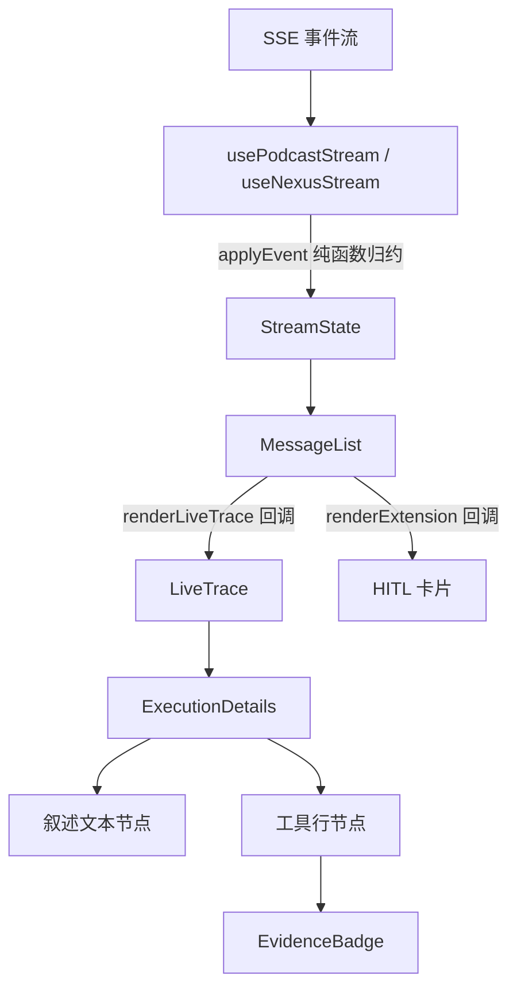

# 对话流式会话风格规范

## 文档定位

本文档是 let-it-flow 平台消费应用（nexusops、ai-content-factory 及未来应用）**对话流式会话界面**的视觉风格规范，提炼自已落地的 nexusops 前端，作为各应用统一的风格基线。

与 [docs/21-streaming-ui-guidelines.md](21-streaming-ui-guidelines.md) 的关系：21 号文档是**平台级组件规范**（讲 `CollapsibleStepTrace` 组件与 `.streaming-*` 类的用法），偏抽象；本文档是**视觉风格规范**（讲字号、配色、圆角、动画等具体数值与设计原则），偏落地。两者互补：21 号管"用什么组件"，本文档管"长什么样"。

---

## 一、设计原则

整套风格的核心是「**工业冷调 + 终端感**」——像 Claude Code 那样克制、线性、信息密度高，而非花哨的卡片堆砌。

### 原则 1：主流程线性纯净

主对话区只展示「用户输入 → 助手叙述 → 最终结果」这条线性主线。执行细节（工具调用、参数、耗时）默认折叠或低调渲染，绝不打断阅读流。

```
用户：做一期关于 AI 的播客
├─ 我来检索相关线索…            ← 助手叙述（14px 正文）
├─ core.web_search › 返回 320 字  ← 工具行（12px mono，无框）
├─ 正在聚焦单一主线索…          ← 助手叙述
└─ ✓ 口播稿完成，约 6300 字     ← 结果摘要
```

### 原则 2：渐进式披露

- **永远可见**：用户输入、助手叙述文本、最终产物、HITL 确认门
- **默认折叠**：工具参数、工具原始输出、执行耗时、完整调用链
- **按需展开**：点击工具行的 chevron 展开参数/输出

### 原则 3：工具行不装箱

工具调用**不用卡片框**，而是用一行紧凑布局：mono 字体工具名 + chevron + 右侧状态文本 + 证据徽章。降低视觉噪音，保持终端感。

### 原则 4：证据语义化

工具返回的 `EvidenceEnvelope`（时效/置信度/来源）渲染成彩色徽章，让用户一眼判断数据可信度。实时数据用绿色，历史数据用灰色，估算用橙色。

### 原则 5：单色 accent + 状态色

主强调色单一（绿色），不堆砌多色。状态信息用固定的语义色映射（success/error/warning/info），不让组件自由发挥配色。

### 原则 6：隐藏 meta 工具

`nexus_finalize`、`nexus_advise` 等收尾/元信息工具**不在执行轨迹中显示**，它们有独立的渲染路径（产物面板、建议卡）。

### 原则 7：低对比代码块

工具参数/输出的代码块用低对比度（elevated 底 + secondary 文字 + 11px），刻意"退到背景"，需要看时才看。

### 原则 8：克制的动画

只在折叠展开、状态切换时用短动画（0.15-0.2s），不做入场动画、不做轮播、不做闪烁装饰。光标闪烁除外（终端感需要）。

---

## 二、设计令牌（数值规范）

### 2.1 字号阶梯（严格四档 + 一档正文）

| 用途 | 字号 | 用在哪 |
|---|---|---|
| 极小 | 11px | 证据徽章、工具状态文本、section-label、代码块、sidebar footer |
| 小 | 12px | 工具名（mono）、工具描述、verbose 开关、ChatComposer 辅助文本 |
| 中 | 13px | 步骤项、拒绝原因、错误信息、ExampleCard 描述 |
| 叙述 | 14px | 助手叙述文本（narrative-text）、line-height 1.5 |
| 正文 | 15px | 消息气泡正文（由 meso MessageList 控制） |

> 不要出现 16px、18px 等中间字号；标题（h1）例外，可用 24px。

### 2.2 配色

**主强调色（单绿）**：通过 `--color-accent` 引用（tokens.css 定义，nexusops 落地值 `#3d6b52`）。

**状态语义色**（固定映射，不要自由发挥）：

| 语义 | CSS 变量 | 用途 |
|---|---|---|
| 成功/实时 | `--color-success` | 实测证据、完成状态、实时数据徽章 |
| 错误 | `--color-error` | 失败、拒绝、invalid |
| 警告 | `--color-warning` | 证据不足、估算、本周数据 |
| 信息 | `--color-info` | 当日数据、运行中 |
| 中性 | `--color-text-secondary` / `--color-text-muted` | 历史数据、描述文本 |

**证据徽章 freshness 配色表**（bg 用对应色 0.15 透明度）：

| freshness | 前景色 | 含义 |
|---|---|---|
| realtime | success（绿） | 秒级实时 |
| shift | success（绿） | 当前班次 |
| daily | info（蓝） | 当日 |
| weekly | warning（橙） | 本周 |
| historical | text-secondary（灰） | 历史（需谨慎） |

**证据徽章 confidence 配色表**：

| confidence | 图标 | 前景色 | 含义 |
|---|---|---|---|
| measured | ✓ | success（绿） | 实测 |
| estimated | ≈ | warning（橙） | 估算 |
| inferred | ? | #8b5cf6（紫） | 推断 |

### 2.3 圆角

| 元素 | 圆角 |
|---|---|
| 卡片（HITL、产物、拒绝） | 10px |
| 徽章、代码块、小标签 | 4px |
| 步骤序号圆圈 | 50%（圆形） |
| 焦点 outline | 2px |

### 2.4 间距（4px 网格）

| 场景 | 值 |
|---|---|
| 卡片内边距 | 16px（HITL）/ 8px 10px（代码块）|
| 元素间 gap | 4px（徽章内）/ 6-8px（工具行、步骤项）|
| 区块 margin | 8px 0（live-trace、HITL 卡片）|
| 步骤链 gap | 6px |

### 2.5 动画

| 场景 | 动画 |
|---|---|
| 折叠展开 | `slideDown 0.2s ease-out`（opacity + max-height）|
| chevron 旋转 | `transform 0.15s ease`（rotate 90deg）|
| toggle 悬停 | `color 0.2s` |
| 流式光标 | 终端风闪烁（由 meso MessageList 控制）|

> 所有动画都应尊重 `prefers-reduced-motion`。

---

## 三、组件规范

### 3.1 消息气泡（MessageList）

由 `@meso.ai/ui` 的 `MessageList` 提供，消费应用不重写。要点：
- 用户消息与助手消息视觉区分（头像、对齐）由 meso 内部处理
- 流式 text delta 增量追加由 meso 的 `applyEvent` 纯函数 + MessageList 内部渲染完成
- markdown / 代码块渲染由 meso 内部完成
- 打字光标（终端风闪烁）由 meso 提供

### 3.2 叙述文本（narrative-text）

助手在执行过程中发出的进度文本（`text` 事件）。

```css
.narrative-text {
  font-size: 14px;
  line-height: 1.5;
  color: var(--color-text);
  padding: 4px 0;
  white-space: pre-wrap;
  word-break: break-word;
}
```

**简单 markdown 渲染**（不引入 react-markdown 等重库）：
- `**bold**` → `<strong>`
- `- item` → `· bullet`（bullet 标记用 `--color-text-muted`，11px-13px）
- 去 emoji（`replace(/\p{Emoji_Presentation}/gu, "")`），避免装饰性噪音
- 保留换行

### 3.3 工具行（tool-name-row）—— 核心风格

每个工具调用渲染为一行，不装箱：

```
core.web_search ›      返回 320 字  [实时][实测]
└ · 搜索内容
```

结构（参见 [ExecutionDetails.tsx](../apps/nexusops/web/src/components/ExecutionDetails.tsx)）：

```html
<div class="tool-item">
  <div class="tool-name-row" role="button">
    <div class="tool-name-left">
      <code class="tool-name">core.web_search</code>
      <span class="tool-chevron">›</span>
    </div>
    <div class="tool-name-right">
      <span class="tool-status-text">返回 320 字</span>
      <EvidenceBadge data={...} />  <!-- 可选 -->
    </div>
  </div>
  <div class="tool-desc-line">
    <span class="tool-desc-mark">·</span> 搜索内容
  </div>
  <!-- 展开后 -->
  <div class="tool-expanded">
    <div class="tool-section-label">&gt; Input Parameters</div>
    <pre class="code-block">{...}</pre>
  </div>
</div>
```

关键样式：
- `.tool-name`：mono 字体、12px、`--color-text-secondary`、font-weight 500
- `.tool-chevron`：12px、muted、hover 时旋转 90deg
- `.tool-status-text`：11px、muted；运行中「执行中…」、失败「调用失败」、完成「返回 N 字」
- `.tool-desc-line`：12px、muted、前缀 `·`
- 点击整行 toggle 展开（无障碍：role=button、tabIndex=0、Enter/Space 触发）

### 3.4 证据徽章（EvidenceBadge）

从工具结果的 `EvidenceEnvelope` 解析，渲染最多 4 类徽章（参见 [EvidenceBadge.tsx](../apps/nexusops/web/src/components/EvidenceBadge.tsx)）：

```css
.nexus-badge {  /* aicf 用 .aicf-badge */
  display: inline-flex;
  align-items: center;
  gap: 4px;
  font-size: 11px;
  padding: 1px 6px;
  border-radius: 4px;
  font-weight: 500;
}
```

- **freshness**：5 色（见 2.2 表），中文标签（实时/本班次/当日/本周/历史）
- **confidence**：3 色 + 图标（✓实测 / ≈估算 / ?推断）
- **source.system**：中性灰底，显示来源系统（MES/obsidian/web:tavily/wechat 等）
- **caveat**：红底 + ⚠ 前缀，title 悬停看全文

### 3.5 HITL 卡片（ConfirmGateCard / ClarifyCard / 拒绝卡）

统一骨架（margin 8px 0 / padding 16px / radius 10px / bg-elevated / 左边框状态色）：

**确认门**（ConfirmGateCard）：自写而非用 meso ConfirmGate（因 podcast DAG 需节点级 extension 确认，meso 面向 tool_call 级）。含 prompt + detail 键值网格 + 批准/拒绝两按钮。

**澄清卡**（ClarifyCard）：问题列表 + 输入框 + 回车提交。

**拒绝卡**（inline style）：

```tsx
<div style={{
  margin: "8px 0", padding: 16, borderRadius: 10,
  background: "var(--color-bg-elevated)",
  border: "1px solid var(--color-error)",
}}>
  <div style={{ color: "var(--color-error)", fontWeight: 600, marginBottom: 4 }}>
    ✗ 请求被拒绝    {/* 注意：用 ✗ U+2717，不用 ✕ U+2715 */}
  </div>
  <div style={{ fontSize: 13, color: "var(--color-text-secondary)" }}>{reason}</div>
</div>
```

> 符号统一用 `✗`（U+2717），跨应用一致。

### 3.6 代码块（code-block）

低调渲染（参考 Claude Code）：

```css
.code-block {
  background: var(--color-bg-elevated);
  border: 1px solid var(--color-border-light);
  border-radius: 4px;
  padding: 8px 10px;
  font-family: var(--font-mono, 'SF Mono', 'Cascadia Code', Menlo, monospace);
  font-size: 11px;
  line-height: 1.5;
  overflow-x: auto;
  color: var(--color-text-secondary);  /* 低对比 */
  margin: 4px 0;
  white-space: pre;
}
```

JSON 输出尝试格式化（`JSON.stringify(obj, null, 2)`），失败则截断 1000 字。

### 3.7 执行轨迹容器（live-trace）

```css
.nexus-live-trace {  /* aicf 用 .aicf-live-trace */
  margin: 8px 0;
  display: flex;
  flex-direction: column;
  gap: 12px;
}
```

内部用 `ExecutionDetails` 组件把「叙述文本」与「工具行」按 eventLog 顺序交错排列。

---

## 四、CSS 类命名约定

各应用用自有前缀，保持命名空间独立，避免样式冲突：

| 应用 | 前缀 | 示例 |
|---|---|---|
| nexusops | `.nexus-` | `.nexus-live-trace`、`.nexus-badge`、`.nexus-step-item` |
| ai-content-factory | `.aicf-` | `.aicf-live-trace`、`.aicf-badge`、`.aicf-step-item` |

**通用类（无前缀）**：`.execution-details`、`.narrative-text`、`.narrative-bullet`、`.tool-item`、`.tool-name-row`、`.tool-name`、`.tool-chevron`、`.code-block` —— 这些是 ExecutionDetails 组件内部的固定类名，两个应用共享同一套（因组件代码相同），不需要前缀。

平台级类（来自 `@let-it-flow/common-ui/styles`）：`.streaming-details`、`.streaming-summary`、`.streaming-step-*` —— 保持原样。

---

## 五、数据流与渲染职责



- **hook**（usePodcastStream/useNexusStream）：用 `fetch + getReader` 读 SSE，`parseSSELine` + `applyEvent`（来自 `@meso.ai/ui/runtime`）归约 StreamState
- **MessageList**（meso）：消费 StreamState，渲染气泡 + 流式光标，把轨迹/扩展渲染委托给回调
- **renderLiveTrace**：返回 `<ExecutionDetails stream={stream} />`（自写组件）
- **renderExtension**：按 extension name 分发到 ConfirmGateCard / ClarifyCard / 拒绝卡 / 应用专属卡

---

## 六、应用专属差异（允许的偏离）

各应用业务不同，允许在以下方面有专属实现，但**视觉风格必须一致**：

| 维度 | 共享（必须一致） | 应用专属（允许差异） |
|---|---|---|
| 执行轨迹组件 | ExecutionDetails（自写） | 工具描述映射表（getToolDescription） |
| 证据徽章 | EvidenceBadge（照搬） | 无 |
| HITL 卡片骨架 | margin/padding/radius/配色 | ConfirmGate 的 detail 字段 |
| 产物面板 | ArtifactPaneShell（meso） | 内容渲染（markdown / video / iframe） |
| extension 类型 | confirm_gate/clarification_required/rejected | 应用专属（nexus_recommendations 等） |
| 导航图标 | 内联 SVG 16x16 | 图形（wave/chart） |

---

## 七、实现检查清单

新建消费应用或对齐风格时：

- [ ] index.css 导入 `@let-it-flow/common-ui/styles`（仅一次，勿重复）
- [ ] 业务类名用 `.<app>-` 前缀
- [ ] 复用 ExecutionDetails 组件（叙述+工具行交错）
- [ ] 复用 EvidenceBadge 组件（四类徽章）
- [ ] 工具行不装箱（mono 工具名 + chevron + 状态 + 徽章）
- [ ] HITL 卡片用统一骨架（16px padding / 10px radius / 状态色边框）
- [ ] 拒绝符号用 `✗`（U+2717）
- [ ] 代码块低对比（elevated 底 + 11px secondary）
- [ ] 字号遵循四档阶梯（11/12/13/14）
- [ ] 隐藏 meta 工具（nexus_finalize 等）
- [ ] 动画尊重 prefers-reduced-motion

---

## 参考

- [ExecutionDetails.tsx](../apps/nexusops/web/src/components/ExecutionDetails.tsx) — 风格源头实现
- [EvidenceBadge.tsx](../apps/nexusops/web/src/components/EvidenceBadge.tsx) — 证据徽章实现
- [nexusops index.css](../apps/nexusops/web/src/index.css) — 完整样式参照
- [21-streaming-ui-guidelines.md](21-streaming-ui-guidelines.md) — 平台级组件规范（互补）
- [20-narrative-output-rules.md](20-narrative-output-rules.md) — 叙述文本写作规范
